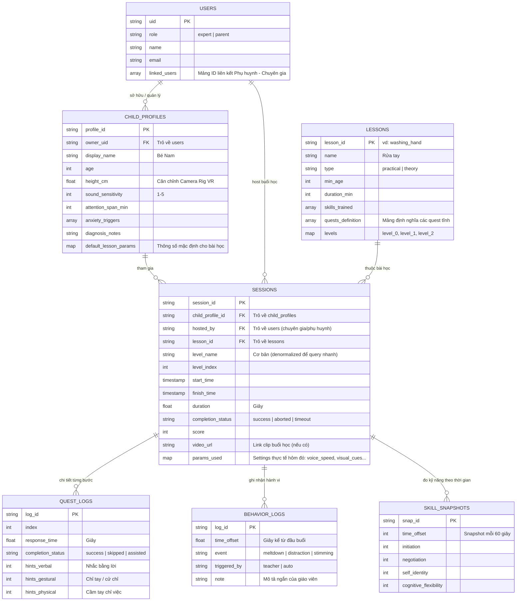
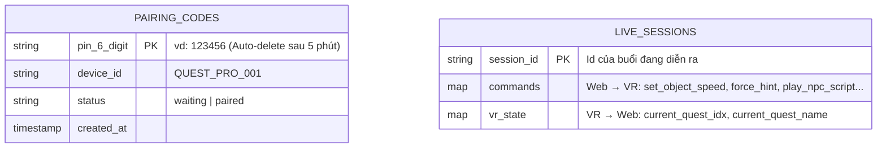

# 🌐 Ý tưởng phát triển Web Dashboard

> Xây dựng Web Dashboard để tạo hệ thống hoàn chỉnh với VR App

---

## 🎯 Tầm nhìn

```
┌─────────────────────────────────────────────────────────────────┐
│                    HỆ SINH THÁI HỖ TRỢ TRẺ TỰ KỶ               │
├─────────────────────────────────────────────────────────────────┤
│                                                                  │
│         👶 TRẺ                     👨‍⚕️ CHUYÊN GIA  │
│           │                              │                       │
│           ▼                              ▼                       │
│      ┌────────┐                   ┌──────────┐                  │
│      │VR App  │                   │   Web    │                  │
│      │Oculus  │                   │Dashboard │                  │
│      └────┬───┘                   └────┬─────┘                  │
│           │                            │                        │
│           └────────────┬───────────────┘                        │
│                        ▼                                         │
│                  ┌──────────┐                                    │
│                  │  CLOUD   │                                    │
│                  │ Firebase │                                    │
│                  └──────────┘                                    │
│                                                                  │
└─────────────────────────────────────────────────────────────────┘
```

---

## 👥 Đối tượng sử dụng

| Vai trò | Nhu cầu chính |
|---------|---------------|
| 👨‍👩‍👧 Phụ huynh | Xem tiến trình con |
| 👩‍🏫 Giáo viên/ Chuyên gia | Giám sát real-time, can thiệp, phân tích data, điều chỉnh bài học, quản lý nhiều trẻ, báo cáo |

---

## 📊 1. Dashboard Features

### Cho Phụ huynh

| Tính năng | Mô tả |
|-----------|-------|
| 📊 Xem tiến trình | Biểu đồ đơn giản, dễ hiểu |
| 📅 Lịch sử học | Xem lại từng buổi |
| 📩 Liên hệ chuyên gia | Gửi tin nhắn/đặt lịch |
| 🏆 Thành tích | Xem huy chương, điểm |

### Cho Chuyên gia

| Tính năng | Mô tả |
|-----------|-------|
| 👥 Quản lý bệnh nhân | Danh sách, lọc, sắp xếp |
| 📈 Phân tích chi tiết | Biểu đồ chuyên sâu, so sánh |
| ✏️ Ghi chú | Lưu nhận xét mỗi buổi |
| ⚙️ Điều chỉnh | Thay đổi độ khó, thời gian |
| 📋 Báo cáo | Xuất PDF cho hồ sơ bệnh án |
| 🔔 Cảnh báo | Thông báo khi có bất thường |

---

## 🎥 2. Real-time Monitoring

> Cho phép giáo viên giám sát và can thiệp trực tiếp

### Các tính năng

| Tính năng | Mô tả | Độ khó |
|-----------|-------|--------|
| 👁️ Live View | Video 480p, 15-30fps | ⭐⭐⭐ |
| 🎮 Remote Control | Điều khiển NPC, vật thể | ⭐⭐ |
| 🔊 Environment Control | Tăng/giảm tiếng ồn, tốc độ vật thể, âm lượng | ⭐⭐ |
| 💬 NPC Hints | Trigger NPC nói gợi ý từ danh sách có sẵn | ⭐⭐ |
| ✍️ NPC Script Live | Giáo viên gõ câu thoại, NPC đọc real-time (TTS) | ⭐⭐⭐ |
| 📹 Session Recording | Lưu clip ngắn (~30s) khi có sự kiện quan trọng | ⭐⭐⭐ |

### Kiến trúc

```
┌─────────────────────────────────────────────────────────────────┐
│  WEB DASHBOARD                                                   │
│  ┌─────────────────┐  ┌─────────────────┐                       │
│  │ 📺 Live View    │  │ 🎮 Controls     │                       │
│  │ (480p stream)   │  │ - NPC commands  │                       │
│  │                 │  │ - Volume        │                       │
│  └────────▲────────┘  └────────┬────────┘                       │
│           │ WebRTC             │ Firebase (Realtime DB)         │
└───────────┼────────────────────┼────────────────────────────────┘
            │                    │
┌───────────┼────────────────────┼────────────────────────────────┐
│  VR APP   ▼                    ▼                                 │
│  ┌─────────────────┐  ┌─────────────────┐                       │
│  │ Camera Stream   │  │ Remote Handler  │                       │
│  │ (Unity Render   │  │ (Bắt Event từ   │                       │
│  │  Streaming)     │  │  Firebase)      │                       │
│  └─────────────────┘  └────────┬────────┘                       │
│                                │                                │
│                       ┌────────▼────────┐                       │
│                       │ EventChannel.cs │ ← Internal Event Bus  │
│                       └─┬─────────────┬─┘                       │
│                         │             │                         │
│                  ┌──────▼─────┐ ┌─────▼──────┐                  │
│                  │ CarMover.cs│ │NPCController│ ← Subscribed     │
│                  └────────────┘ └────────────┘    GameObjects   │
└─────────────────────────────────────────────────────────────────┘
```

> **Ghi chú kỹ thuật (Implementation Idea):** 
> Ứng dụng VR sẽ sử dụng kiến trúc **Event-Driven**. Một Script Singleton (vd: `RemoteCommandHandler`) sẽ lắng nghe sự thay đổi nhánh `commands/` trên Firebase. Khi Web gạt Slider, Firebase cập nhật -> Handler bắt được tín hiệu và phát sóng sự kiện qua hệ thống `EventChannel.cs` sẵn có của Unity. Các GameObject (như ô tô, NPC) chỉ cần `AddListener` để tự động thay đổi hành vi (đi chậm lại, phát tiếng nói...) mà không bị hard-code chết với nhau.

## 🛡️ 3. AI Safety Philosophy

> **Nguyên tắc: AI hỗ trợ Giáo viên, KHÔNG thay thế Giáo viên**

### Phân loại AI theo mức độ rủi ro

| Mức độ | AI làm gì? | Áp dụng? |
|--------|------------|----------|
| 🟢 Phân tích | Xử lý data, tạo báo cáo | ✅ Có |
| 🟢 Gợi ý | Đề xuất cho giáo viên | ✅ Có |
| 🟡 Cảnh báo | Alert khi bất thường | ✅ Có |
| 🔴 Can thiệp | Tự động tương tác với trẻ | ❌ Không |

### Mô hình Human-in-the-Loop

```
AI Backend                          Giáo viên (Quyết định)
──────────                          ─────────────────────
📊 Phân tích data           →       👁️ Xem dashboard
💡 Đề xuất hành động        →       👆 Chấp nhận/Từ chối
⚠️ Cảnh báo bất thường      →       🎮 Can thiệp thủ công
📝 Tạo báo cáo              →       ✏️ Review & chỉnh sửa

         AI KHÔNG BAO GIỜ trực tiếp tương tác với trẻ
```

---

## 🤖 4. AI Features (Hỗ trợ, không can thiệp)

| Feature | Mô tả | Công nghệ |
|---------|-------|-----------|
| 📊 Progress Analytics | Phân tích pattern học tập | LLM API |
| 💡 Recommendation | Đề xuất bài học phù hợp | Rule-based / ML |
| ⚠️ Anomaly Detection | Phát hiện regression | Statistics / API |
| 📝 NL Reports | Tạo báo cáo tự động | GPT/Gemini |
| 🔔 Smart Alerts | Cảnh báo khi cần chú ý | Rule-based |

> Không cần tự build model - dùng API có sẵn!

---

## 🗄️ 5. Database Schema & Công nghệ

> **Công nghệ đề xuất: Hybrid Model (Kết hợp 2 loại Database)**
> 1. **Cloud Firestore:** Lưu trữ bền vững, query/filter phức tạp. Dùng cho Users, Profiles, Sessions, Lessons.
> 2. **Firebase Realtime Database:** Kênh truyền siêu tốc, độ trễ thấp cho dữ liệu tạm thời: PIN Pairing, Remote Commands.

> **Nguyên tắc thiết kế: Flat Structure with References** – Các collection đứng ngang hàng nhau ở cấp top-level, nối với nhau qua ID. Không lồng `sessions` vào `child_profiles` vì Chuyên gia cần query chéo nhiều trẻ cùng lúc mà không bị giới hạn bởi đường dẫn của một user cụ thể.

### 5.1 Quan hệ giữa các Collection (Firestore)



### 5.2 Chi tiết cấu trúc từng Collection

**`users`** – Tài khoản đăng nhập Web (Không có tài khoản cho trẻ)
```
uid: "uid_abc"
  role: "expert"
  name: "Dr. Lan"
  email: "lan@example.com"
  linked_users: ["uid_parent1", "uid_parent2"]
```

**`child_profiles`** – Hồ sơ của trẻ (Top-level, không nằm trong users)
```
profile_id: "profile_nam"
  owner_uid: "uid_parent1"
  display_name: "Bé Nam"
  age: 7
  height_cm: 110
  sound_sensitivity: 3
  attention_span_min: 10
  anxiety_triggers: ["đám đông", "tiếng ồn lớn"]
  diagnosis_notes: "ASD Level 1"
  default_lesson_params:
    npc_voice_speed: 0.8
    visual_cues: true
    reminder_interval: 10
    env_volume: 0.5
```

**`lessons`** – Danh mục bài học (Tĩnh, chỉ admin thêm)
```
lesson_id: "washing_hand"
  name: "Rửa tay"
  type: "practical"
  min_age: 4
  duration_min: 10
  skills_trained: ["self_care", "hygiene"]
  quests_definition: [
    { index: 0, name: "Bật vòi nước", required_action: "touch" },
    { index: 1, name: "Lấy xà phòng", required_action: "touch" }
  ]
  levels:
    0: { level_name: "Cơ bản", quest_count: 3 }
    1: { level_name: "Nâng cao", quest_count: 5 }
    2: { level_name: "Thành thục", quest_count: 7 }
```

**`sessions`** – Lịch sử buổi học (Top-level, tham chiếu qua ID)
```
session_id: "-NxYz123ABC"
  child_profile_id: "profile_nam"
  hosted_by: "uid_expert"
  lesson_id: "washing_hand"
  level_index: 0
  level_name: "Cơ bản"
  start_time: 2026-03-01T10:00:00
  finish_time: 2026-03-01T10:05:30
  duration: 330.5
  completion_status: "success"
  score: 85
  video_url: "https://storage.../clip.mp4"
  params_used:
    npc_voice_speed: 0.8
    visual_cues: true
    reminder_interval: 10

  Sub-collection: quest_logs/
    0:  response_time: 15.5
        completion_status: "success"
        hints_verbal: 1,  hints_gestural: 0,  hints_physical: 0

    1:  response_time: 20.3
        completion_status: "assisted"
        hints_verbal: 0,  hints_gestural: 1,  hints_physical: 1

  Sub-collection: behavior_logs/
    0:  time_offset: 45.2,  event: "distraction",  triggered_by: "teacher"
    1:  time_offset: 130.0, event: "meltdown",     note: "Trẻ khóc khi nghe tiếng còi"

  Sub-collection: skill_snapshots/
    0:  time_offset: 60,  initiation: 2, negotiation: 1, self_identity: 1, cognitive_flexibility: 0
    1:  time_offset: 120, initiation: 3, negotiation: 2, self_identity: 2, cognitive_flexibility: 1
```

### 5.2b Cấu trúc cây JSON đầy đủ (Firestore)

```json
// Collection: users
{
  "uid_abc": {
    "role": "expert",
    "name": "Dr. Lan",
    "email": "lan@example.com",
    "linked_users": ["uid_parent1"]
  }
}

// Collection: child_profiles  (top-level, KHÔNG nằm trong users)
{
  "profile_nam": {
    "owner_uid": "uid_parent1",
    "display_name": "Bé Nam",
    "age": 7,
    "height_cm": 110,
    "sound_sensitivity": 3,
    "attention_span_min": 10,
    "anxiety_triggers": ["đám đông", "tiếng ồn lớn"],
    "diagnosis_notes": "ASD Level 1",
    "default_lesson_params": {
      "npc_voice_speed": 0.8,
      "visual_cues": true,
      "reminder_interval": 10,
      "env_volume": 0.5
    }
  }
}

// Collection: lessons
{
  "washing_hand": {
    "name": "Rửa tay",
    "type": "practical",
    "min_age": 4,
    "duration_min": 10,
    "skills_trained": ["self_care", "hygiene"],
    "quests_definition": [
      { "index": 0, "name": "Bật vòi nước", "required_action": "touch" },
      { "index": 1, "name": "Lấy xà phòng", "required_action": "touch" }
    ],
    "levels": {
      "0": { "level_name": "Cơ bản",    "quest_count": 3 },
      "1": { "level_name": "Nâng cao",  "quest_count": 5 },
      "2": { "level_name": "Thành thục","quest_count": 7 }
    }
  }
}

// Collection: sessions  (top-level, KHÔNG nằm trong child_profiles)
{
  "-NxYz123ABC": {
    "child_profile_id": "profile_nam",
    "hosted_by": "uid_expert",
    "lesson_id": "washing_hand",
    "level_index": 0,
    "level_name": "Cơ bản",
    "start_time": "2026-03-01T10:00:00",
    "finish_time": "2026-03-01T10:05:30",
    "duration": 330.5,
    "completion_status": "success",
    "score": 85,
    "video_url": "https://storage.../clip.mp4",
    "params_used": {
      "npc_voice_speed": 0.8,
      "visual_cues": true,
      "reminder_interval": 10
    },

    // Sub-collection: quest_logs
    "quest_logs": {
      "0": {
        "response_time": 15.5,
        "completion_status": "success",
        "hints_verbal": 1,
        "hints_gestural": 0,
        "hints_physical": 0
      },
      "1": {
        "response_time": 20.3,
        "completion_status": "assisted",
        "hints_verbal": 0,
        "hints_gestural": 1,
        "hints_physical": 1
      }
    },

    // Sub-collection: behavior_logs
    "behavior_logs": {
      "0": { "time_offset": 45.2,  "event": "distraction", "triggered_by": "teacher", "note": "" },
      "1": { "time_offset": 130.0, "event": "meltdown",    "triggered_by": "teacher", "note": "Trẻ khóc khi nghe tiếng còi" }
    },

    // Sub-collection: skill_snapshots
    "skill_snapshots": {
      "0": { "time_offset": 60,  "initiation": 2, "negotiation": 1, "self_identity": 1, "cognitive_flexibility": 0 },
      "1": { "time_offset": 120, "initiation": 3, "negotiation": 2, "self_identity": 2, "cognitive_flexibility": 1 }
    }
  }
}
```

---

### 5.3 Firebase Realtime Database (Volatile – Tạm thời)

> Chỉ lưu dữ liệu "sống" trong buổi học. Tự động xóa sau khi kết thúc.



---

## 🔌 6. Luồng Kết nối (Pairing) & Tài khoản

> **Vấn đề cần giải quyết:** Gõ email/password trong kính VR (Quest) rất khó với trải nghiệm người dùng hiện tại, và Trẻ tự kỷ không thể tự đăng nhập.

### 6.1 Cơ chế Role-Based (Dành cho Web)
- **Tài khoản Web:** Chỉ cấp cho Người lớn (Chuyên gia hoặc Phụ huynh). Đăng nhập bằng Email/Password/Google qua Firebase Auth.
- **Hồ sơ Trẻ (Child Profile):** Trẻ không có tài khoản. Hồ sơ của trẻ đóng vai trò là "Data Container" nằm gọn trong tài khoản của Người lớn (tương tự như chọn User Icon trên Netflix).

### 6.2 Cơ chế PIN-Pairing (Dành cho VR)
Áp dụng cách kết nối như Smart TV để nối Web Dashboard và Kính VR:

1. **Khởi động VR:** App hiển thị chữ to: `Mã kết nối của bạn là: 123456` và ở trạng thái **Đang đợi** (Waiting). Kính tự đẩy mã PIN lên nhánh `pairing_codes` ở Firebase.
2. **Khởi động Web Dashboard:** 
   - Chuyên gia chọn hồ sơ "Bé Nam", bấm "Bắt đầu bài học".
   - Popup web đòi: *"Nhập mã PIN hiển thị trong màn hình VR"*.
   - Chuyên gia/Phụ huynh gõ `123456`.
3. **Thành công:** Firebase ghép đôi `vr_device_id` với `session_id` đang mở của bé Nam. Kính tải ngay Setting của bé Nam và vào Scene tương ứng. Web bật màn hình Remote Control.

### 6.3 Cơ chế Telehealth (Học từ xa - Tại nhà)
- Phụ huynh đeo kính VR cho bé tại nhà ➔ Lấy mã PIN.
- Phụ huynh đăng nhập Web ở nhà kết nối vào kính qua PIN ➔ Bấm nút **"Mời chuyên gia"** sinh ra một Share Link.
- Chuyên gia (đang ở cơ sở y tế) nhấp Link đó ➔ Trở thành "Coach", web tự kết nối xem video stream và hiện Remote Control để chuyên gia bấm nút hộ.


---

## 📋 7. Các tính năng khác

### Onboarding
- [ ] Đánh giá ban đầu (baseline)
- [ ] Thu thập thông tin trẻ
- [ ] Đề xuất bài học đầu tiên

### Thông báo
- [ ] Push notification
- [ ] Email báo cáo hàng tuần
- [ ] Cảnh báo regression

### Reporting
- [ ] Xuất PDF
- [ ] Tích hợp hệ thống y tế (tùy chọn)

### Privacy & Compliance
- [ ] COPPA compliance (dữ liệu trẻ em)
- [ ] Mã hóa dữ liệu nhạy cảm
- [ ] Chính sách lưu trữ/xóa

---
