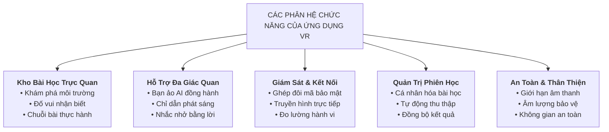
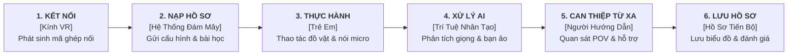
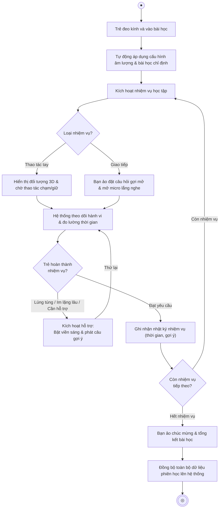
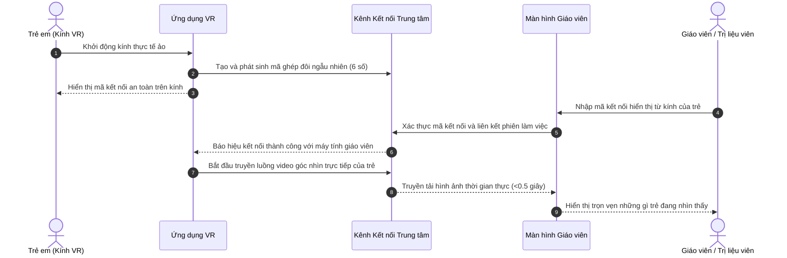
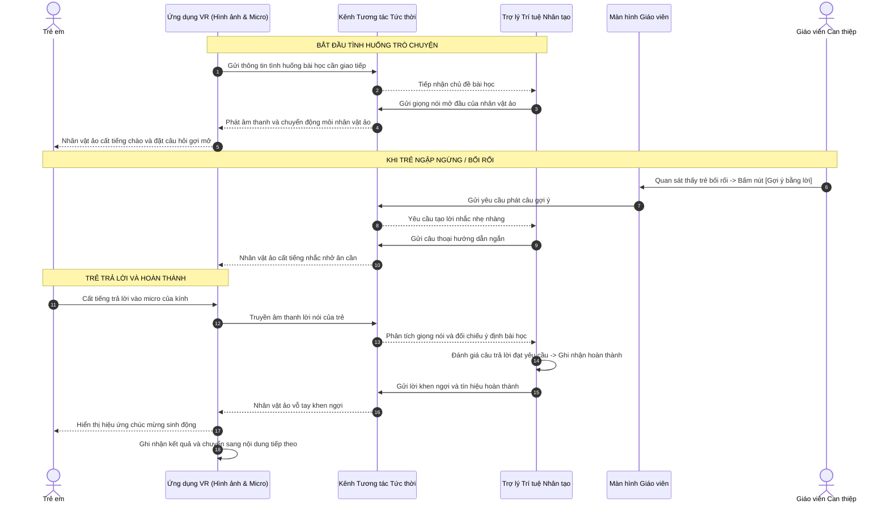

# BÁO CÁO TỔNG QUAN VÀ THIẾT KẾ VẬN HÀNH ỨNG DỤNG THỰC TẾ ẢO (VR)
**Hệ thống Can thiệp và Trị liệu Trực quan cho Trẻ Tự kỷ (VR-Autism Platform)**

---

## 1. Tổng quan về Ứng dụng Thực tế Ảo (VR)

Trong hệ sinh thái tổng thể của nền tảng hỗ trợ can thiệp cho trẻ tự kỷ, **Ứng dụng Thực tế Ảo (VR)** đóng vai trò là không gian tương tác trực tiếp của người học, tạo nên một môi trường mô phỏng ba chiều sinh động, an toàn và thân thiện.

Ứng dụng VR là điểm kết nối trung tâm giữa bốn chủ thể then chốt:
* **Trẻ em:** Trực tiếp trải nghiệm, tương tác với đồ vật, lắng nghe và giao tiếp trong các tình huống đời sống mô phỏng.
* **Người hướng dẫn / Trị liệu viên:** Theo dõi toàn bộ góc nhìn thực tế của trẻ qua màn hình quản trị, hỗ trợ từ xa và điều chỉnh nhịp độ bài học một cách kịp thời.
* **Trợ lý Trí tuệ Nhân tạo:** Lắng nghe, phân tích lời nói của trẻ và nhập vai người bạn đồng hành ảo để khuyến khích trẻ phản xạ ngôn ngữ.
* **Hệ thống Lưu trữ Trung tâm:** Tiếp nhận tự động các chỉ số hành vi, mức độ tập trung và kết quả can thiệp để hình thành bức tranh toàn diện về sự tiến bộ của trẻ theo thời gian.

Nhờ việc cá nhân hóa theo mức độ nhạy cảm âm thanh và khả năng tập trung của từng trẻ, ứng dụng mang lại một không gian học tập thân thiện, giảm thiểu tối đa cảm giác lo âu thường gặp ở trẻ tự kỷ khi tiếp xúc với các tình huống giao tiếp ngoài đời thực.

---

## 2. Mô tả Chi tiết Các Nhóm Chức năng



### 2.1. Kho Bài học Trị liệu và Rèn luyện Kỹ năng

Ứng dụng được xây dựng thành từng phân hệ học tập đa dạng, bám sát các mục tiêu can thiệp tâm lý và hành vi:

1. **Phân hệ Khám phá Môi trường:**
   * Mở ra các bối cảnh phong phú, chẳng hạn như không gian vườn thú tự nhiên hoặc đứng trong thuỷ cung rộng mở.
   * Cho phép trẻ tự do quan sát các loài vật, làm quen với hình ảnh chuyển động và âm thanh đặc trưng khi tiến lại gần, giúp trẻ làm dịu cảm xúc và khơi dậy trí tò mò tự nhiên.

2. **Phân hệ Trắc nghiệm và Đố vui Nhận biết:**
   * Tham gia bài học này sau mỗi chuyến tham quan nhằm giúp trẻ củng cố khả năng ghi nhớ và phân biệt sự vật.
   * Câu hỏi được đọc to với giọng đọc truyền cảm, đi kèm các lựa chọn hình ảnh ba chiều trực quan. Trẻ có thể đưa ra câu trả lời thông qua thao tác trỏ tia chỉ định trong không gian ảo.

3. **Phân hệ Bài tập Tương tác Chuỗi Hành động:**
    Với nguyên tắc thiết kế ưu tiên khả năng linh hoạt và tính mở rộng, các bài tập tập trung vào khả năng giao tiếp, hành động có thể dễ dàng phát triển đa dạng các kịch bản thông qua 3 loại hình thực hành (được gọi là các loại Quest) dưới đây:
   * **Thực hành tương tác:** Trẻ thực hiện các thao tác như chạm (Touch Quest), giữ lâu (Hold Touch Quest) để hoàn thành loại nhiệm vụ này.
    Ví dụ: Hướng dẫn trẻ thực hiện tuần tự các bước sinh hoạt thường ngày: Mở vòi nước -> Xoa xà phòng -> Rửa tay -> Lau khô tay.

   * **Luyện tập Ngôn ngữ và Giao tiếp - Voice Quest:** Sử dụng để xây dựng các kịch bản để trẻ cất tiếng chào hỏi, trả lời câu hỏi hoặc nhắc lại các từ ngữ quen thuộc. Hệ thống sử dụng AI xử lý giọng nói nhằm nỗ lực thấu hiểu giọng nói trẻ thơ, chấp nhận các phản âm ngắn, nói ngọng hoặc phát âm chưa tròn vành rõ chữ nhằm khích lệ tinh thần của trẻ.
     ```mermaid
     flowchart LR
         subgraph Buoc1["1. Khởi tạo"]
             A["Nạp ngữ cảnh bài học<br/>& câu thoại mẫu"]
         end
         subgraph Buoc2["2. Thu nhận"]
             B["Nhận diện giọng nói<br/>& lọc tạp âm"]
         end
         subgraph Buoc3["3. Đánh giá"]
             C["Chuyển thành văn bản<br/>& thấu hiểu ý định"]
         end
         subgraph Buoc4["4. Phản hồi"]
             D["Phát âm thanh đáp từ<br/>& đồng bộ khẩu hình môi"]
         end

         A --> B --> C --> D
     ```
   * **Rèn luyện Định hướng Ánh nhìn (Ý tưởng mở rộng):** Đo lường khả năng tập trung và duy trì ánh mắt hướng về mục tiêu cần quan sát, hỗ trợ trẻ rèn luyện thói quen chú ý thị giác và tương tác mắt.

---

### 2.2. Tính năng Hỗ trợ và Trợ năng Đa giác quan

* **Nhân vật ảo đồng hành thông minh:**
  * Nhân vật ảo đóng vai trò người giáo viên hoặc người bạn nhỏ hiện diện bên trong những bài học,có khả năng thể hiện khẩu hình tự nhiên theo giọng nói phát ra.
  * Giúp tạo cảm giác an tâm, thu hút sự chú ý và biến mỗi buổi học thành một cuộc trò chuyện thú vị thay vì một buổi kiểm tra căng thẳng.

* **Hệ thống Chỉ dẫn Đa giác quan:**
  * **Chỉ dẫn Bằng Hình ảnh:** Khi trẻ chưa nhận biết được vị trí đồ vật cần tương tác, đối tượng mục tiêu sẽ tự động phát ra viền sáng nhấp nháy, kèm âm thanh định hướng trong không gian.
  * **Nhắc nhở Bằng Lời nói:** Khi phát hiện trẻ im lặng quá lâu (theo thời gian chuyên gia thiết lập), nhân vật ảo sẽ nhẹ nhàng đưa ra lời gợi ý được thiết lập sẵn để tiếp thêm động lực cho trẻ tiếp tục hành động. Đây cũng là chức năng mà cơ chế can thiệp dành cho chuyên gia (mục 2.4) sử dụng.

---

### 2.3. Giám sát Đồng thời và Kết nối Thời gian thực

* **Ghép đôi Kính và Trang Quản trị An toàn:**
  * Mỗi khi khởi động, ứng dụng VR tự động tạo một mã kết nối ngẫu nhiên gồm 6 chữ số hiển thị trên kính. Người hướng dẫn chỉ cần nhập mã này lên trang web để kích hoạt buổi học, đảm bảo tính riêng tư và bảo mật tuyệt đối.
  * **Chú ý:** Một kính có thể sử dụng linh hoạt cho nhiều bạn nhỏ trong một buổi học, chỉ cần thay đổi hồ sơ trẻ trên ứng dụng Web.

* **Truyền phát Góc nhìn Trực tiếp:**
  * Toàn bộ những gì trẻ đang nhìn thấy trong kính ảo được truyền hình ảnh trực tiếp về màn hình máy tính của giáo viên với độ trễ cực thấp (dưới nửa giây).
  * Giúp giáo viên nắm bắt tức thì diễn biến tâm lý, biểu cảm và những khó khăn trẻ đang gặp phải mà không cần đứng sát làm trẻ mất tập trung.

* **Thu thập Tự động Dữ liệu Hành vi:**
  * Kính tự động đo lường độ chuyển động của đầu, hướng quan sát của mắt, khoảng cách di chuyển của hai tay tới mục tiêu và thời gian trẻ phản ứng từ khi có hiệu lệnh đến lúc thực hiện xong.
  * Các số liệu này được tổng hợp định kỳ mỗi 2 giây nhằm ghi nhận mức độ tập trung thực tế của trẻ trong suốt buổi học.

---

### 2.4. Quản trị Phiên học và Cá nhân hóa Trải nghiệm

* **Thích ứng Theo Hồ sơ Cá nhân:**
  * Điều chỉnh mức âm lượng tối đa phù hợp theo độ nhạy cảm âm thanh của từng trẻ nhằm tránh gây giật mình hay khó chịu trong không gian ảo.
  * Tự động áp dụng các ngưỡng chu kỳ nhắc nhở và bài học phù hợp với khả năng tập trung của từng trẻ.

* **Cơ chế Can thiệp Linh hoạt:**
  * Giáo viên có thể chủ động bấm nút can thiệp từ xa trên trang quản trị bất kỳ lúc nào: kích hoạt lời gợi ý tức thì, làm sáng đồ vật hoặc chuyển sang nhiệm vụ tiếp theo, sao cho phù hợp.
  * Mọi dữ liệu về số lần cần trợ giúp và thời gian hoàn thành đều được lưu trữ trọn vẹn vào hồ sơ tiến trình của trẻ sau khi kết thúc phiên học.

---

## 3. Luồng Hoạt động Tổng thể của Ứng dụng VR

Ứng dụng VR vận hành như một mắt xích phối hợp nhịp nhàng giữa các thành phần trong toàn bộ hệ thống:



1. **Khởi tạo và Thiết lập Môi trường:** Khi trẻ đeo kính, ứng dụng phát sinh mã kết nối và nhận lại toàn bộ thông số cá nhân hóa của trẻ từ hệ thống đám mây (giới hạn âm lượng, cấu hình bài học, bài học chỉ định).
2. **Kích hoạt Nhiệm vụ Bài học:** Hệ thống đưa trẻ vào bài tập, hiển thị các đối tượng ba chiều cần tương tác và chuẩn bị các kênh hỗ trợ sẵn sàng.
3. **Phối hợp Tương tác Đa phương thức:**
   * Nếu là nhiệm vụ thao tác tay: Hệ thống liên tục kiểm tra vị trí tay trẻ tiếp xúc với đồ vật ảo và cập nhật lên giao diện Web.
   * Nếu là nhiệm vụ giao tiếp: Micro trên kính thu nhận giọng nói của trẻ, chuyển đến Trí tuệ Nhân tạo để thấu hiểu ý định và kích hoạt người bạn ảo lên tiếng hoặc xác nhận hoàn thành Quest.
4. **Theo dõi và Hỗ trợ Liên tục:** Trong suốt quá trình, hình ảnh góc nhìn của trẻ liên tục được phát sóng về màn hình giáo viên. Nếu trẻ gặp trở ngại, cơ chế trợ giúp tự động hoặc lệnh can thiệp từ xa của giáo viên sẽ kích hoạt hiệu ứng thị giác và lời nhắc kịp thời.
5. **Tổng kết và Báo cáo:** Khi hoàn tất bài học, ứng dụng thống kê toàn bộ kết quả, mức độ tập trung và số lần trợ giúp để gửi về hệ thống hồ sơ trung tâm, hỗ trợ giáo viên lập kế hoạch can thiệp cho các buổi học tiếp theo.

---

## 4. Tình huống Sử dụng (Use Cases) & Sơ đồ Hoạt động

### 4.1. Bảng Đặc tả Chi tiết Các Ca Sử dụng (Use Cases)

#### **UC-01: Thiết lập Kết nối 2 Chiều & Đồng bộ Hồ sơ Trẻ**

| Thuộc tính | Mô tả chi tiết |
| :--- | :--- |
| **Tên ca sử dụng** | **Thiết lập kết nối 2 chiều & Đồng bộ hồ sơ trẻ** |
| **Mô tả** | Cho phép giáo viên ghép nối kính VR và Bảng điều khiển Web bằng mã PIN 6 chữ số qua Firebase RTDB, hỗ trợ nạp cấu hình và đồng bộ hồ sơ của bé tự động. |
| **Tác nhân kích hoạt** | Giáo viên mở Bảng điều khiển Web và nhập mã PIN hiển thị từ kính VR. |
| **Điều kiện tiên quyết** | • Kính VR đang chạy ở Scene sảnh chờ (Lobby/Waiting Area) và hiển thị mã PIN.<br>• Bảng điều khiển Web đang mở và giáo viên đã đăng nhập thành công. |
| **Điều kiện sau** | Kính VR và Bảng điều khiển Web ghép nối thành công; ID hồ sơ của trẻ và các cấu hình bài học được đồng bộ sang kính; Web nhận luồng video góc nhìn trực tiếp (POV). |
| **Luồng xử lý thông thường** | 1. Ứng dụng VR sinh mã PIN ngẫu nhiên 6 số, ghi lên nhánh `pairing_codes/{pin}` trên RTDB với trạng thái `waiting`.<br>2. Ứng dụng VR hiển thị mã PIN này lên màn hình Canvas trong không gian sảnh chờ.<br>3. Giáo viên chọn hồ sơ trẻ trên Bảng điều khiển Web và nhập mã PIN 6 số tương ứng.<br>4. Bảng điều khiển Web cập nhật trạng thái `paired`, lưu định danh của trẻ và định danh giáo viên vào node PIN.<br>5. Ứng dụng VR bắt được sự kiện thay đổi dữ liệu, nạp thông số của bé vào bộ nhớ phiên và chuyển sang trạng thái sẵn sàng bắt đầu bài học. |
| **Luồng xử lý thay thế / ngoại lệ** | • **Mã PIN sai hoặc hết hạn:** Nếu giáo viên nhập sai mã hoặc mã đã bị xóa do quá thời gian chờ, hệ thống Web hiển thị thông báo lỗi "Mã PIN không tồn tại hoặc đã hết hạn".<br>• **VR ngắt kết nối đột ngột:** Cơ sở dữ liệu tự động dọn dẹp và hủy node PIN nhờ cơ chế ngắt kết nối tự động đã đăng ký trước đó. |

---

#### **UC-02: Trải nghiệm Bài học Khám phá Môi trường (Vườn thú / Thủy cung)**

| Thuộc tính | Mô tả chi tiết |
| :--- | :--- |
| **Tên ca sử dụng** | **Trải nghiệm Bài học Khám phá Môi trường** |
| **Mô tả** | Trẻ ngồi trải nghiệm chuyến tham quan tự động trong không gian 3D (Vườn thú hoặc Thủy cung), quan sát các loài động vật chuyển động và lắng nghe âm thanh đặc trưng nhằm giải tỏa căng thẳng và khơi gợi trí tò mò tự nhiên. |
| **Tác nhân kích hoạt** | Giáo viên kích hoạt bài học khám phá từ Web Dashboard hoặc trẻ bắt đầu bài học từ sảnh chờ. |
| **Điều kiện tiên quyết** | • Kính VR đã tải scene Khám phá tương ứng.<br>• Giới hạn âm lượng an toàn đã được tự động áp dụng theo hồ sơ của trẻ. |
| **Điều kiện sau** | Trẻ hoàn thành chuyến tham quan và quay về sảnh chờ. |
| **Luồng xử lý thông thường** | 1. Hệ thống đưa trẻ vào không gian 3D, tự động điều hướng góc nhìn và di chuyển với tốc độ thiết lập theo lộ trình định sẵn quanh các khu vực loài vật.<br>2. Khi tiến lại gần một loài vật, hệ thống kích hoạt hoạt cảnh đặc trưng và phát âm thanh tiếng kêu tương ứng.<br>3. Bộ thu thập dữ liệu hành vi liên tục ghi nhận hướng nhìn và mức độ tập trung của trẻ trong suốt hành trình.<br>4. Sau khi tham quan hết các điểm mốc, hệ thống kết thúc chuyến đi và quay lại sảnh chờ. |
| **Luồng xử lý thay thế / ngoại lệ** | • **Trẻ cảm thấy sợ hãi hoặc khó chịu:** Giáo viên bấm nút thoát bài học để đưa trẻ về sảnh chờ. |

---

#### **UC-03: Thực hiện Bài tập Trắc nghiệm Đố vui Nhận biết**

| Thuộc tính | Mô tả chi tiết |
| :--- | :--- |
| **Tên ca sử dụng** | **Thực hiện Bài tập Trắc nghiệm Đố vui Nhận biết** |
| **Mô tả** | Trẻ củng cố kiến thức sau chuyến tham quan bằng cách lắng nghe câu hỏi và sử dụng tia Laser chỉ định từ tay cầm để lựa chọn đáp án đúng trong không gian ảo. |
| **Tác nhân kích hoạt** | Giáo viên chỉ định từ Web. |
| **Điều kiện tiên quyết** | • Trẻ đang ở giao diện Đố vui 3D.<br>• Tay cầm điều khiển hiển thị tia Laser trỏ tương tác sẵn sàng. |
| **Điều kiện sau** | Ghi nhận kết quả trả lời (đúng/sai, thời gian phản hồi) vào dữ liệu đánh giá phiên học. |
| **Luồng xử lý thông thường** | 1. Hệ thống phát âm thanh giọng đọc câu hỏi và hiển thị các ô đáp án hình ảnh ba chiều trực quan trước mắt trẻ.<br>2. Trẻ di chuyển tia Laser trỏ vào ô đáp án muốn chọn và bấm nút kích hoạt trên tay cầm.<br>3. Hệ thống kiểm tra đáp án: nếu đúng, phát hiệu ứng âm thanh chúc mừng sinh động; nếu sai, đưa ra lời động viên nhẹ nhàng và cho phép trẻ thử lại.<br>4. Hệ thống ghi nhận điểm số và chuyển sang câu hỏi kế tiếp cho đến khi hoàn thành bài đố vui. |
| **Luồng xử lý thay thế / ngoại lệ** | • **Trẻ không phản ứng sau thời gian quy định:** Nhân vật ảo phát câu nhắc nhở định sẵn hoặc tự động chuyển Quest tiếp theo. |

---

#### **UC-04: Thực hành Tương tác Thao tác Chuỗi Hành động (TouchQuest & HoldTouchQuest)**

| Thuộc tính | Mô tả chi tiết |
| :--- | :--- |
| **Tên ca sử dụng** | **Thực hành Tương tác Thao tác Chuỗi Hành động** |
| **Mô tả** | Hướng dẫn trẻ thực hiện các thao tác vận động sinh hoạt hàng ngày (như mở vòi nước, xoa xà phòng, rửa tay, lau khô) bằng cách chạm hoặc giữ tay vào vật thể ảo. |
| **Tác nhân kích hoạt** | Trình điều phối bài học kích hoạt nhiệm vụ thao tác kế tiếp trong chuỗi hành động. |
| **Điều kiện tiên quyết** | Vật thể tương tác 3D trong không gian ảo đã được kích hoạt vùng va chạm và hiển thị viền sáng chỉ dẫn. |
| **Điều kiện sau** | Hoàn thành nhiệm vụ thao tác, cập nhật tiến trình bài học và đồng bộ trạng thái lên Bảng điều khiển Web. |
| **Luồng xử lý thông thường** | 1. Trình điều phối bắt đầu nhiệm vụ (ví dụ: "Xoa xà phòng"), làm sáng viền đối tượng mục tiêu (nếu cấu hình).<br>2. Trẻ đưa tay cầm VR lại gần và chạm hoặc giữ tay vào vật thể ảo.<br>3. Hệ thống nhận diện tương tác: với thao tác chạm nhanh (`TouchQuest`), ghi nhận hoàn thành ngay khi tiếp xúc; với thao tác giữ lâu (`HoldTouchQuest`), tính toán thời gian giữ liên tục cho đến khi đầy thanh tiến trình.<br>4. Khi đạt yêu cầu, hệ thống phát hiệu ứng âm thanh hoàn thành, rung nhẹ phản hồi trên tay cầm và cập nhật trạng thái lên giao diện Web.<br>5. Hệ thống tự động chuyển tiếp sang bước hành động tiếp theo trong chuỗi. |
| **Luồng xử lý thay thế / ngoại lệ** | • **Trẻ buông tay giữa chừng khi đang thực hiện thao tác giữ:** Thanh tiến trình tự động đặt lại hoặc giảm dần, yêu cầu trẻ tiếp tục giữ lại để hoàn thành.<br>• **Trẻ ngập ngừng không thao tác:** Bộ đếm thời gian tự động kích hoạt viền sáng nhấp nháy hoặc giáo viên bấm nút hỗ trợ từ xa trên Web. |

---

#### **UC-05: Luyện tập Ngôn ngữ & Hội thoại cùng Bạn Ảo AI (VoiceQuest)**

| Thuộc tính | Mô tả chi tiết |
| :--- | :--- |
| **Tên ca sử dụng** | **Luyện tập Ngôn ngữ & Hội thoại cùng Bạn Ảo AI** |
| **Mô tả** | Trẻ lắng nghe câu hỏi/lời chào từ nhân vật ảo (NPC), quan sát cử động mấp máy môi tự nhiên và cất tiếng trả lời qua micro của kính để rèn luyện phản xạ ngôn ngữ. |
| **Tác nhân kích hoạt** | Trình điều phối bài học kích hoạt nhiệm vụ giọng nói (`VoiceQuest`). |
| **Điều kiện tiên quyết** | • Kính VR đã kết nối kênh âm thanh 2 chiều với Trợ lý AI qua hạ tầng mạng thời gian thực.<br>• Micro của kính đã được mở sẵn sàng thu âm. |
| **Điều kiện sau** | Ý định lời nói của trẻ được Trợ lý AI công nhận, nhân vật ảo phát âm thanh khen ngợi và ghi nhận hoàn thành nhiệm vụ. |
| **Luồng xử lý thông thường** | 1. Ứng dụng VR gửi tên nhiệm vụ và các câu thoại mẫu định hướng sang Trợ lý AI qua kênh dữ liệu thời gian thực.<br>2. Nhân vật ảo phát giọng nói mở đầu (mấp máy môi đồng bộ) để chào đón và đặt câu hỏi gợi mở cho trẻ.<br>3. Trẻ cất tiếng trả lời vào micro của kính.<br>4. Hệ thống AI tự động phát hiện giọng nói, chuyển đổi âm thanh thành văn bản và phân tích ý định theo cơ chế đánh giá nhẹ nhàng (chấp nhận nói ngắn, nói ngọng hoặc phát âm chưa chuẩn).<br>5. Khi nhận diện đúng ý định bài học, Trợ lý AI kích hoạt tín hiệu hoàn thành kèm lời khen ngợi, kính VR nhận tín hiệu và chuyển sang nhiệm vụ kế tiếp. |
| **Luồng xử lý thay thế / ngoại lệ** | • **Trẻ im lặng quá thời gian thiết lập:** Nhân vật ảo tự động phát câu gợi ý định sẵn hoặc giáo viên bấm nút "Gợi ý lời nói" trên Web.<br>• **Trẻ nói lặp từ vô nghĩa hoặc lạc đề:** Trợ lý AI phản hồi bằng một câu thoại ấm áp ngắn gọn để nhẹ nhàng định hướng trẻ quay lại chủ đề bài học. |

---

#### **UC-06: Tiếp nhận Trợ giúp & Can thiệp Từ xa từ Chuyên gia**

| Thuộc tính | Mô tả chi tiết |
| :--- | :--- |
| **Tên ca sử dụng** | **Tiếp nhận Trợ giúp & Can thiệp Từ xa từ Chuyên gia** |
| **Mô tả** | Cho phép kính VR tiếp nhận và thực thi các lệnh can thiệp thời gian thực từ giáo viên trên Web Dashboard (bật viền sáng đối tượng, phát câu nhắc nhở định sẵn, hoặc chuyển sang nhiệm vụ tiếp theo). |
| **Tác nhân kích hoạt** | Giáo viên quan sát màn hình trực tiếp và bấm nút can thiệp trên Bảng điều khiển Web. |
| **Điều kiện tiên quyết** | • Phiên học đang diễn ra trực tiếp.<br>• Kênh truyền phát dữ liệu thời gian thực giữa Web và kính VR đang kết nối ổn định. |
| **Điều kiện sau** | Kính VR thực thi lệnh can thiệp ngay lập tức mà không làm gián đoạn bài học; hành động can thiệp được lưu vào nhật ký phiên học. |
| **Luồng xử lý thông thường** | 1. Giáo viên phát hiện trẻ đang lúng túng hoặc mất tập trung qua màn hình giám sát góc nhìn trực tiếp (POV Stream).<br>2. Giáo viên chọn một thao tác can thiệp trên Bảng điều khiển Web:<br>&nbsp;&nbsp;&nbsp;&nbsp;• *Bật viền sáng:* Gửi lệnh làm nhấp nháy viền sáng đối tượng mục tiêu trong kính.<br>&nbsp;&nbsp;&nbsp;&nbsp;• *Gợi ý lời nói:* Gửi lệnh cho nhân vật ảo phát ngay câu nhắc nhở định sẵn/ đánh máy.<br>&nbsp;&nbsp;&nbsp;&nbsp;• *Chuyển tiếp:* Gửi lệnh chuyển sang nhiệm vụ tiếp theo sao cho phù hợp.<br>3. Kính VR tiếp nhận gói tin can thiệp và thực thi hành động tức thời trong không gian 3D.<br>4. Hệ thống tự động ghi nhận số lần can thiệp vào nhật ký đánh giá của phiên học. |
| **Luồng xử lý thay thế / ngoại lệ** | • **Lệnh can thiệp không khớp ngữ cảnh hiện tại:** Kính VR tự động bỏ qua lệnh không hợp lệ để tránh làm gián đoạn trải nghiệm của trẻ. |

---

### 4.2. Sơ đồ Hoạt động (Activity Diagram) — Trải nghiệm Một Bài học Tương tác



---

## 5. Sơ đồ Trình tự (Sequence Diagram)

### 5.1. Luồng Ghép đôi Thiết bị và Phát sóng Góc nhìn Trực tiếp



---

### 5.2. Luồng Trò chuyện cùng Trợ lý Ảo và Nhận Can thiệp từ Giáo viên



---

## 6. Đánh giá Tổng kết về Tính Khả thi và Trị liệu

Phân hệ **Ứng dụng Thực tế Ảo** trong Hệ thống VR-Autism đạt được sự cân bằng hài hòa giữa công nghệ hiện đại và tính ứng dụng thực tế trong can thiệp lâm sàng:

1. **Bảo đảm An toàn Tâm lý Tuyệt đối:** Nhờ môi trường mô phỏng an toàn và khả năng giới hạn mức âm lượng bảo vệ, ứng dụng mang đến trải nghiệm êm dịu, không gây sốc tâm lý cho trẻ tự kỷ.
2. **Hỗ trợ Đa chiều và Kịp thời:** Sự kết hợp nhịp nhàng giữa Trợ lý AI và Người hướng dẫn giúp trẻ luôn nhận được sự đồng hành đúng lúc, giảm thiểu cảm giác thất bại khi gặp bài tập khó.
3. **Dữ liệu Hóa Tiến trình Khoa học:** Mọi tương tác tự nhiên đều được chuyển hóa thành các chỉ số khách quan (độ tập trung, thời gian phản hồi, mức độ cần trợ giúp), tạo tiền đề vững chắc cho việc xây dựng lộ trình trị liệu cá nhân hóa dài hạn.
