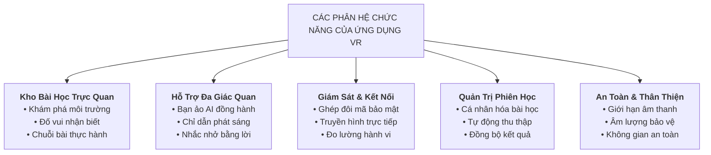
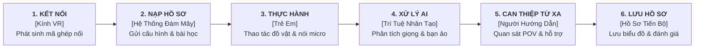
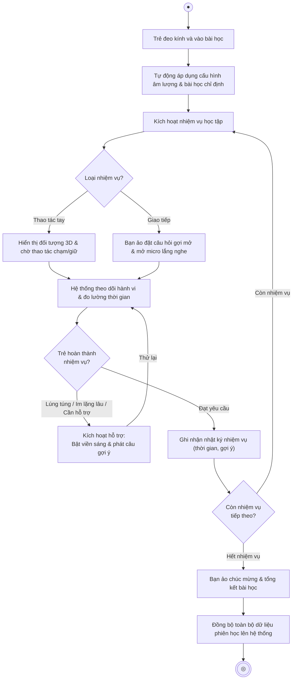
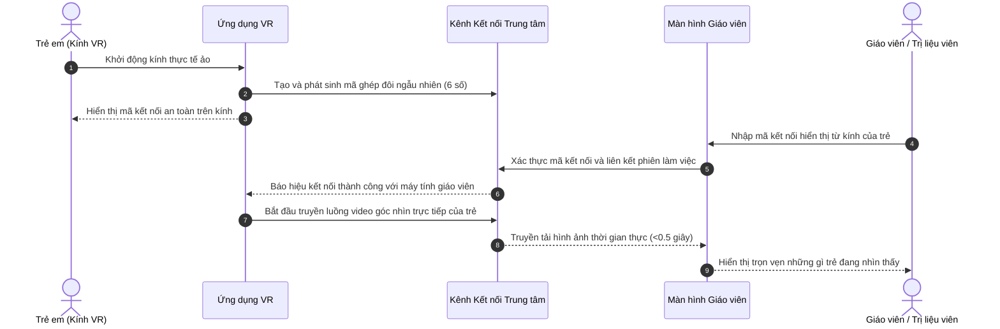
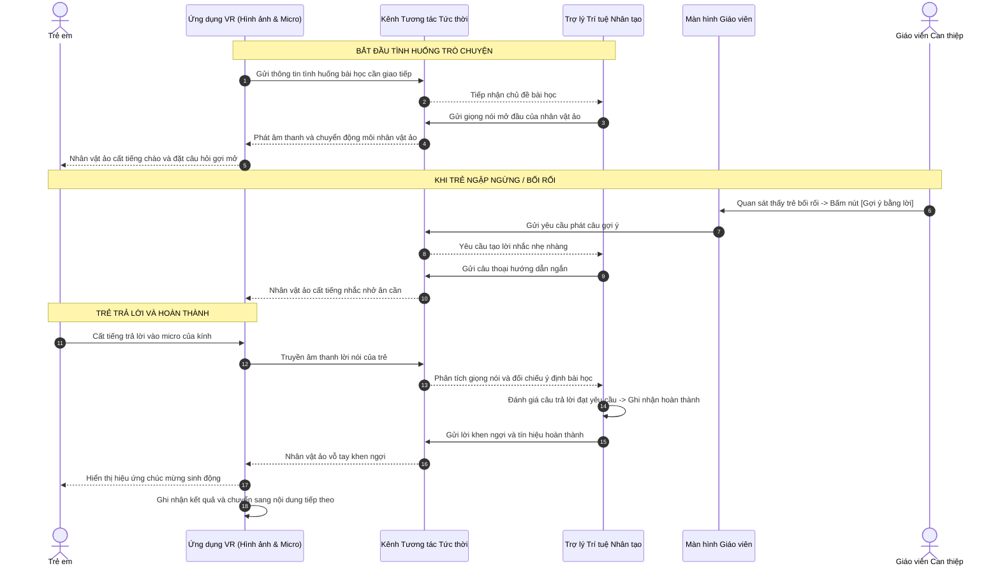

# BÁO CÁO TỔNG QUAN VÀ THIẾT KẾ VẬN HÀNH ỨNG DỤNG THỰC TẾ ẢO (VR)
**Hệ thống Can thiệp và Trị liệu Trực quan cho Trẻ Tự kỷ (VR-Autism Platform)**

---

## 1. Tổng quan về Ứng dụng Thực tế Ảo (VR)

Ứng dụng VR là không gian tương tác 3D mô phỏng sinh động, an toàn cho trẻ tự kỷ.

Điểm kết nối 4 chủ thể:
* **Trẻ em:** Trải nghiệm 3D, thao tác đồ vật, giao tiếp tình huống mô phỏng.
* **Người hướng dẫn / Trị liệu viên:** Theo dõi POV qua web, hỗ trợ từ xa, chỉnh nhịp độ bài học kịp thời.
* **Trợ lý Trí tuệ Nhân tạo:** Lắng nghe, phân tích giọng trẻ, đóng vai bạn ảo luyện phản xạ ngôn ngữ.
* **Hệ thống Lưu trữ Trung tâm:** Tự động nhận chỉ số hành vi, tập trung, kết quả can thiệp.

Cá nhân hóa theo độ nhạy âm thanh + khả năng tập trung từng trẻ. Giảm lo âu khi giao tiếp thực tế.

---

## 2. Mô tả Chi tiết Các Nhóm Chức năng



### 2.1. Kho Bài học Trị liệu và Rèn luyện Kỹ năng

Phân hệ học tập bám sát mục tiêu tâm lý và hành vi:

1. **Phân hệ Khám phá Môi trường:**
   * Bối cảnh 3D phong phú (vườn thú, thủy cung).
   * Tự do quan sát động vật, chuyển động, âm thanh khi lại gần. Giúp dịu cảm xúc, khơi tò mò.

2. **Phân hệ Trắc nghiệm và Đố vui Nhận biết:**
   * Củng cố ghi nhớ sau tham quan.
   * Câu hỏi đọc to, kèm lựa chọn 3D. Trẻ trỏ laser chọn đáp án.

3. **Phân hệ Bài tập Tương tác Chuỗi Hành động:**
   * **Thực hành tương tác:** Thao tác chạm (`TouchQuest`), giữ lâu (`HoldTouchQuest`).
     Ví dụ: Hướng dẫn chuỗi sinh hoạt: Mở vòi nước -> Xoa xà phòng -> Rửa tay -> Lau khô tay.
   * **Luyện tập Ngôn ngữ và Giao tiếp - Voice Quest:** Trẻ chào hỏi, trả lời, nhắc từ quen thuộc (`VoiceQuest`). AI xử lý giọng nói, chấp nhận nói ngắn, ngọng, chưa tròn vành để khích lệ tinh thần.
     ```mermaid
     flowchart LR
         subgraph Buoc1["1. Khởi tạo"]
             A["Nạp ngữ cảnh bài học<br/>& câu thoại mẫu"]
         end
         subgraph Buoc2["2. Thu nhận"]
             B["Nhận diện giọng nói<br/>& lọc tạp âm"]
         end
         subgraph Buoc3["3. Đánh giá"]
             C["Chuyển thành văn bản<br/>& thấu hiểu ý định"]
         end
         subgraph Buoc4["4. Phản hồi"]
             D["Phát âm thanh đáp từ<br/>& đồng bộ khẩu hình môi"]
         end

         A --> B --> C --> D
     ```
   * **Rèn luyện Định hướng Ánh nhìn (Ý tưởng mở rộng):** Đo thời gian tập trung nhìn mục tiêu.

---

### 2.2. Tính năng Hỗ trợ và Trợ năng Đa giác quan

* **Nhân vật ảo đồng hành thông minh:**
  * Đóng vai giáo viên hoặc bạn nhỏ, mấp máy môi khớp giọng nói.
  * Tạo an tâm, biến buổi học thành trò chuyện thoải mái.

* **Hệ thống Chỉ dẫn Đa giác quan:**
  * **Chỉ dẫn Bằng Hình ảnh:** Vật mục tiêu phát viền sáng nhấp nháy + âm thanh định hướng không gian khi trẻ chưa nhận biết.
  * **Nhắc nhở Bằng Lời nói:** Tự động phát câu thoại gợi ý khi trẻ im lặng quá lâu (hoặc chuyên gia bấm can thiệp ở mục 2.4).

---

### 2.3. Giám sát Đồng thời và Kết nối Thời gian thực

* **Ghép đôi Kính và Trang Quản trị An toàn:**
  * VR tạo mã PIN 6 số ngẫu nhiên. Giáo viên nhập PIN trên web để kích hoạt buổi học.
  * Dùng 1 kính cho nhiều trẻ bằng cách đổi profile trên web.

* **Truyền phát Góc nhìn Trực tiếp:**
  * Stream POV của trẻ về web giáo viên độ trễ < 0.5s.
  * Giúp giáo viên nắm bắt khó khăn từ xa không gây mất tập trung trẻ.

* **Thu thập Tự động Dữ liệu Hành vi:**
  * Tự động đo chuyển động đầu, hướng mắt, khoảng cách tay, thời gian phản hồi.
  * Tổng hợp định kỳ mỗi 2s ghi nhận mức độ tập trung.

---

### 2.4. Quản trị Phiên học và Cá nhân hóa Trải nghiệm

* **Thích ứng Theo Hồ sơ Cá nhân:**
  * Giới hạn âm lượng tối đa theo độ nhạy âm thanh trẻ.
  * Tự áp dụng chu kỳ nhắc nhở theo mức độ tập trung.

* **Cơ chế Can thiệp Linh hoạt:**
  * Giáo viên bấm can thiệp từ xa: bật viền sáng, phát gợi ý tức thì, chuyển nhiệm vụ kế tiếp.
  * Mọi dữ liệu số lần trợ giúp và thời gian hoàn thành lưu trọn vẹn vào hồ sơ tiến trình.

---

## 3. Luồng Hoạt động Tổng thể của Ứng dụng VR



1. **Khởi tạo và Thiết lập Môi trường:** VR sinh PIN, nhận cấu hình trẻ từ cloud (âm lượng, bài học).
2. **Kích hoạt Nhiệm vụ Bài học:** Vào bài tập 3D, chuẩn bị kênh hỗ trợ sẵn sàng.
3. **Phối hợp Tương tác Đa phương thức:**
   * Thao tác tay: Kiểm tra va chạm tay - vật thể, cập nhật lên web.
   * Giao tiếp: Thu âm micro, AI phân tích ý định, NPC phản hồi / xác nhận Quest.
4. **Theo dõi và Hỗ trợ Liên tục:** Stream POV về web. Tự động/thủ công kích hoạt viền sáng, câu nhắc khi trẻ gặp khó.
5. **Tổng kết và Báo cáo:** Gửi kết quả, mức tập trung, số lần trợ giúp về hệ thống trung tâm.

---

## 4. Tình huống Sử dụng (Use Cases) & Sơ đồ Hoạt động

### 4.1. Bảng Đặc tả Chi tiết Các Ca Sử dụng (Use Cases)

#### **UC-01: Thiết lập Kết nối 2 Chiều & Đồng bộ Hồ sơ Trẻ**

| Thuộc tính | Mô tả chi tiết |
| :--- | :--- |
| **Tên ca sử dụng** | **Thiết lập kết nối 2 chiều & Đồng bộ hồ sơ trẻ** |
| **Mô tả** | Ghép nối VR và Web Dashboard bằng PIN 6 số qua Firebase RTDB, nạp cấu hình + profile trẻ. |
| **Tác nhân kích hoạt** | Giáo viên mở Web Dashboard và nhập PIN hiển thị từ VR. |
| **Điều kiện tiên quyết** | • VR ở sảnh chờ (Lobby/Waiting Area) hiển thị PIN.<br>• Web Dashboard đã đăng nhập. |
| **Điều kiện sau** | Ghép nối thành công; profile trẻ đồng bộ sang VR; Web nhận luồng video POV. |
| **Luồng xử lý thông thường** | 1. VR sinh PIN 6 số, ghi `pairing_codes/{pin}` trên RTDB trạng thái `waiting`.<br>2. VR hiển thị PIN lên màn hình Canvas sảnh chờ.<br>3. Giáo viên chọn hồ sơ trẻ trên web, nhập PIN 6 số.<br>4. Web cập nhật trạng thái `paired`, lưu định danh trẻ + giáo viên vào node PIN.<br>5. VR nạp thông số vào bộ nhớ phiên, sẵn sàng bắt đầu bài học. |
| **Luồng xử lý thay thế / ngoại lệ** | • **PIN sai / hết hạn:** Web báo lỗi "Mã PIN không tồn tại hoặc đã hết hạn".<br>• **VR ngắt kết nối đột ngột:** RTDB tự động dọn dẹp và hủy node PIN. |

---

#### **UC-02: Trải nghiệm Bài học Khám phá Môi trường (Vườn thú / Thủy cung)**

| Thuộc tính | Mô tả chi tiết |
| :--- | :--- |
| **Tên ca sử dụng** | **Trải nghiệm Bài học Khám phá Môi trường** |
| **Mô tả** | Trẻ tham quan tự động trong 3D (Vườn thú / Thủy cung), xem động vật chuyển động và nghe tiếng kêu để giải tỏa căng thẳng, khơi tò mò. |
| **Tác nhân kích hoạt** | Giáo viên kích hoạt từ Web Dashboard hoặc trẻ bắt đầu từ sảnh chờ. |
| **Điều kiện tiên quyết** | • VR đã tải scene Khám phá.<br>• Giới hạn âm lượng an toàn đã áp dụng theo hồ sơ trẻ. |
| **Điều kiện sau** | Hoàn thành tham quan và quay về sảnh chờ. |
| **Luồng xử lý thông thường** | 1. Đưa trẻ vào không gian 3D, tự di chuyển theo lộ trình quanh khu vực loài vật.<br>2. Tiến lại gần loài vật: kích hoạt hoạt cảnh + âm thanh tiếng kêu.<br>3. Bộ đo hành vi ghi nhận hướng nhìn, mức độ tập trung suốt hành trình.<br>4. Tham quan hết điểm mốc: kết thúc chuyến đi, quay lại sảnh chờ. |
| **Luồng xử lý thay thế / ngoại lệ** | • **Trẻ sợ hãi / khó chịu:** Giáo viên bấm thoát bài học đưa trẻ về sảnh chờ. |

---

#### **UC-03: Thực hiện Bài tập Trắc nghiệm Đố vui Nhận biết**

| Thuộc tính | Mô tả chi tiết |
| :--- | :--- |
| **Tên ca sử dụng** | **Thực hiện Bài tập Trắc nghiệm Đố vui Nhận biết** |
| **Mô tả** | Trẻ nghe câu hỏi, dùng tia Laser từ tay cầm chọn đáp án 3D trong không gian ảo. |
| **Tác nhân kích hoạt** | Giáo viên chỉ định từ Web. |
| **Điều kiện tiên quyết** | • Trẻ ở giao diện Đố vui 3D.<br>• Tay cầm bật tia Laser tương tác. |
| **Điều kiện sau** | Ghi nhận kết quả trả lời (đúng/sai, thời gian phản hồi) vào dữ liệu đánh giá phiên học. |
| **Luồng xử lý thông thường** | 1. Phát giọng đọc câu hỏi, hiển thị các ô đáp án 3D.<br>2. Trẻ trỏ Laser vào đáp án, bấm nút kích hoạt tay cầm.<br>3. Đúng: phát âm thanh chúc mừng sinh động. Sai: phát động viên nhẹ nhàng, cho thử lại.<br>4. Ghi điểm số, chuyển câu hỏi kế tiếp đến khi hoàn thành. |
| **Luồng xử lý thay thế / ngoại lệ** | • **Trẻ không phản ứng:** Bạn ảo phát câu nhắc nhở định sẵn hoặc tự chuyển Quest tiếp theo. |

---

#### **UC-04: Thực hành Tương tác Thao tác Chuỗi Hành động (TouchQuest & HoldTouchQuest)**

| Thuộc tính | Mô tả chi tiết |
| :--- | :--- |
| **Tên ca sử dụng** | **Thực hành Tương tác Thao tác Chuỗi Hành động** |
| **Mô tả** | Hướng dẫn trẻ thao tác sinh hoạt (mở vòi nước, xoa xà phòng, rửa tay, lau khô) bằng cách chạm hoặc giữ vật thể 3D. |
| **Tác nhân kích hoạt** | Trình điều phối kích hoạt nhiệm vụ thao tác kế tiếp trong chuỗi hành động. |
| **Điều kiện tiên quyết** | Vật thể 3D kích hoạt vùng va chạm + viền sáng chỉ dẫn. |
| **Điều kiện sau** | Hoàn thành nhiệm vụ thao tác, cập nhật tiến trình bài học lên Bảng điều khiển Web. |
| **Luồng xử lý thông thường** | 1. Bắt đầu nhiệm vụ (vd: "Xoa xà phòng"), làm sáng viền đối tượng mục tiêu.<br>2. Trẻ đưa tay cầm lại gần chạm hoặc giữ vật thể ảo.<br>3. `TouchQuest`: chạm nhanh là hoàn thành. `HoldTouchQuest`: giữ liên tục đến khi đầy thanh tiến trình.<br>4. Đạt yêu cầu: phát âm thanh hoàn thành, rung nhẹ tay cầm, cập nhật trạng thái lên Web.<br>5. Tự động chuyển tiếp sang bước hành động tiếp theo. |
| **Luồng xử lý thay thế / ngoại lệ** | • **Buông tay giữa chừng:** Reset/giảm thanh tiến trình, yêu cầu giữ lại.<br>• **Trẻ ngập ngừng:** Bộ đếm tự kích hoạt viền nhấp nháy hoặc giáo viên bấm hỗ trợ từ xa trên Web. |

---

#### **UC-05: Luyện tập Ngôn ngữ & Hội thoại cùng Bạn Ảo AI (VoiceQuest)**

| Thuộc tính | Mô tả chi tiết |
| :--- | :--- |
| **Tên ca sử dụng** | **Luyện tập Ngôn ngữ & Hội thoại cùng Bạn Ảo AI** |
| **Mô tả** | Trẻ nghe nhân vật ảo (NPC) hỏi/chào, quan sát cử động môi, cất tiếng trả lời qua micro để rèn phản xạ ngôn ngữ. |
| **Tác nhân kích hoạt** | Trình điều phối bài học kích hoạt nhiệm vụ giọng nói (`VoiceQuest`). |
| **Điều kiện tiên quyết** | • Kính VR kết nối âm thanh 2 chiều với Trợ lý AI qua hạ tầng mạng realtime.<br>• Micro kính mở sẵn sàng thu âm. |
| **Điều kiện sau** | Ý định trẻ được Trợ lý AI công nhận, NPC khen ngợi, ghi nhận hoàn thành nhiệm vụ. |
| **Luồng xử lý thông thường** | 1. VR gửi tên nhiệm vụ + câu mẫu sang Trợ lý AI qua kênh realtime.<br>2. NPC phát giọng mở đầu (đồng bộ môi) chào đón, hỏi gợi mở.<br>3. Trẻ cất tiếng trả lời vào micro kính.<br>4. AI phát hiện giọng nói, chuyển text, phân tích ý định (chấp nhận nói ngắn, nói ngọng, chưa chuẩn).<br>5. Nhận diện đúng: AI gửi tín hiệu hoàn thành + khen ngợi, VR chuyển nhiệm vụ kế tiếp. |
| **Luồng xử lý thay thế / ngoại lệ** | • **Trẻ im lặng quá lâu:** NPC tự phát câu gợi ý hoặc giáo viên bấm "Gợi ý lời nói" trên Web.<br>• **Lặp từ / lạc đề:** AI phản hồi câu thoại ấm áp, định hướng trẻ quay lại bài học. |

---

#### **UC-06: Tiếp nhận Trợ giúp & Can thiệp Từ xa từ Chuyên gia**

| Thuộc tính | Mô tả chi tiết |
| :--- | :--- |
| **Tên ca sử dụng** | **Tiếp nhận Trợ giúp & Can thiệp Từ xa từ Chuyên gia** |
| **Mô tả** | Kính VR tiếp nhận và thực thi lệnh can thiệp realtime từ giáo viên trên Web Dashboard (bật viền sáng, phát câu nhắc, chuyển nhiệm vụ). |
| **Tác nhân kích hoạt** | Giáo viên quan sát màn hình trực tiếp (POV Stream) và bấm can thiệp trên Web. |
| **Điều kiện tiên quyết** | • Phiên học đang diễn ra trực tiếp.<br>• Kênh dữ liệu realtime Web - VR kết nối ổn định. |
| **Điều kiện sau** | Kính VR thực thi lệnh can thiệp tức thời; lưu hành động vào nhật ký phiên học. |
| **Luồng xử lý thông thường** | 1. Giáo viên thấy trẻ lúng túng / mất tập trung qua màn hình POV Stream.<br>2. Giáo viên chọn thao tác can thiệp trên Web:<br>&nbsp;&nbsp;&nbsp;&nbsp;• *Bật viền sáng:* Nhấp nháy viền sáng đối tượng mục tiêu trong kính.<br>&nbsp;&nbsp;&nbsp;&nbsp;• *Gợi ý lời nói:* Lệnh cho NPC phát ngay câu nhắc định sẵn/đánh máy.<br>&nbsp;&nbsp;&nbsp;&nbsp;• *Chuyển tiếp:* Chuyển sang nhiệm vụ tiếp theo phù hợp.<br>3. Kính VR nhận packet can thiệp, thực thi tức thời trong 3D.<br>4. Tự động ghi nhận số lần can thiệp vào nhật ký đánh giá phiên học. |
| **Luồng xử lý thay thế / ngoại lệ** | • **Lệnh can thiệp không khớp ngữ cảnh:** Kính VR tự bỏ qua lệnh không hợp lệ. |

---

### 4.2. Sơ đồ Hoạt động (Activity Diagram) — Trải nghiệm Một Bài học Tương tác



---

## 5. Sơ đồ Trình tự (Sequence Diagram)

### 5.1. Luồng Ghép đôi Thiết bị và Phát sóng Góc nhìn Trực tiếp



---

### 5.2. Luồng Trò chuyện cùng Trợ lý Ảo và Nhận Can thiệp từ Giáo viên



---

## 6. Đánh giá Tổng kết về Tính Khả thi và Trị liệu

Phân hệ **Ứng dụng Thực tế Ảo** trong Hệ thống VR-Autism đạt cân bằng công nghệ và can thiệp lâm sàng:

1. **Bảo đảm An toàn Tâm lý Tuyệt đối:** Môi trường 3D an toàn, giới hạn âm lượng bảo vệ, không gây sốc tâm lý cho trẻ tự kỷ.
2. **Hỗ trợ Đa chiều và Kịp thời:** Kết hợp Trợ lý AI và Người hướng dẫn đồng hành đúng lúc, giảm cảm giác thất bại khi gặp bài khó.
3. **Dữ liệu Hóa Tiến trình Khoa học:** Chuyển tương tác tự nhiên thành chỉ số khách quan (tập trung, phản hồi, trợ giúp), tạo tiền đề lộ trình trị liệu cá nhân hóa dài hạn.
