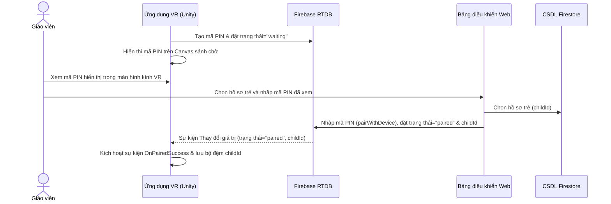
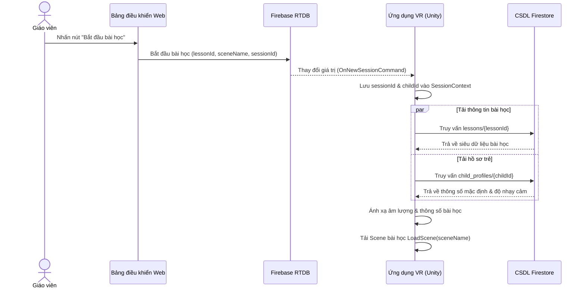
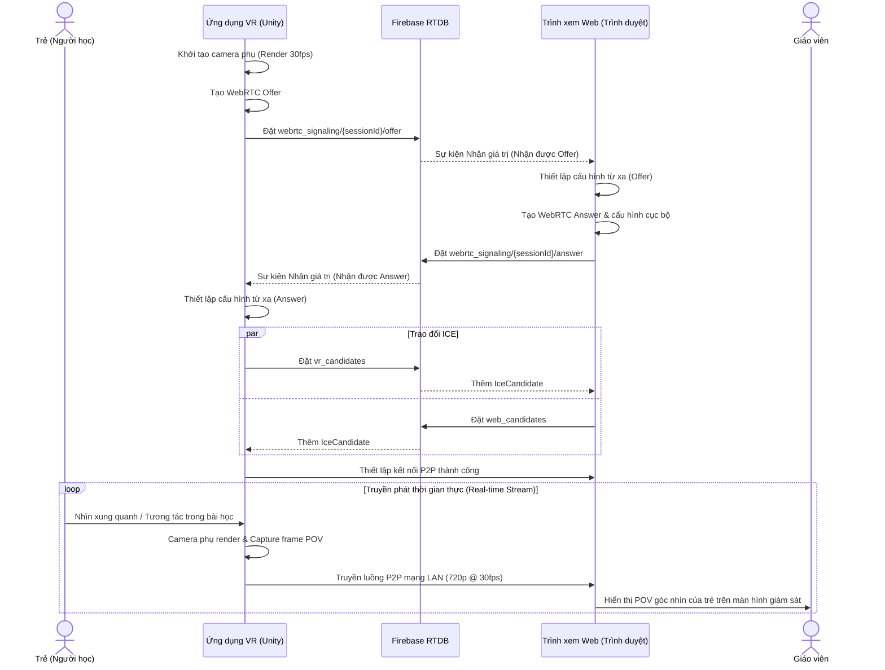
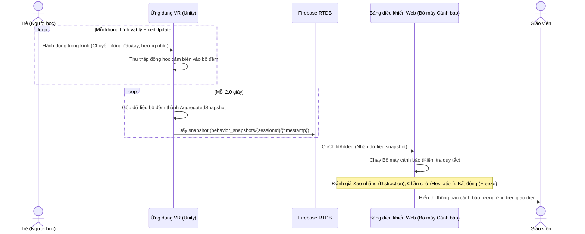
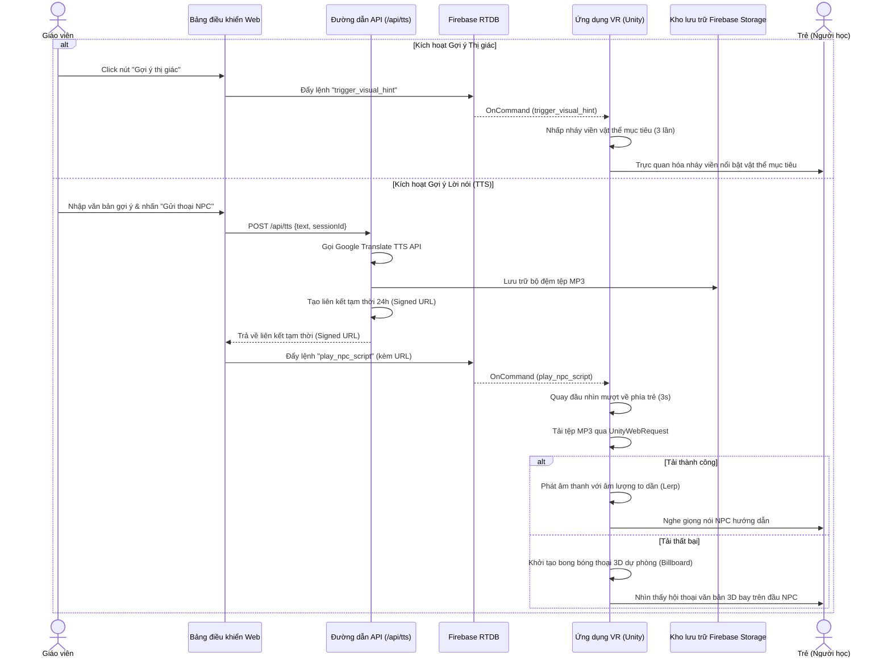
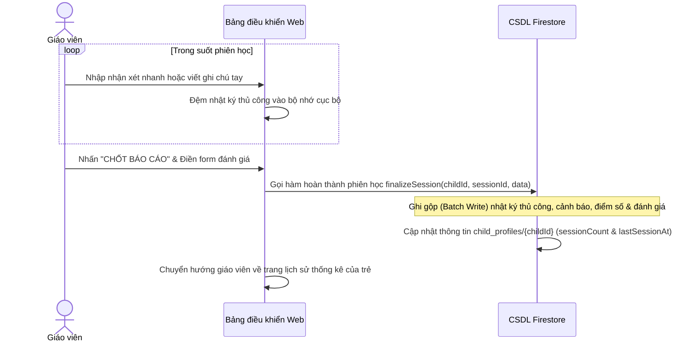
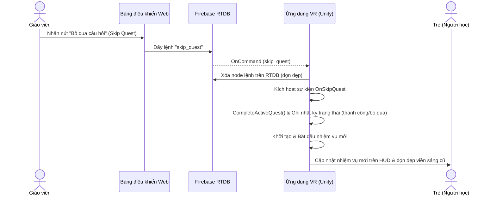

# Đồng bộ hóa tính năng thời gian thực giữa Ứng dụng VR và Nền tảng Web

---

## 1. Thiết lập kết nối 2 chiều

Giáo viên chỉ cần thiết lập kết nối ban đầu giữa kính thực tế ảo chạy ứng dụng VR và Web dashboard của giáo viên, mọi thao tác tiếp theo giáo viên có thể điều khiển trên web như: cấu hình các thông số thiết lập, lựa chọn bài học, giám sát quá trình học của trẻ, ...

Hồ sơ của trẻ sẽ được đồng bộ trực tiếp tới ứng dụng VR kể cả khi giáo viên chuyển từ hồ sơ trẻ A sang hồ sơ trẻ B. Điều này giúp giảm thao tác kết nối, chỉ cần 1 lần duy nhất.

*   **Đồng bộ hồ sơ trẻ:** Khi đổi hồ sơ, mã PIN được bảo toàn kết nối (`ResumeListening`). Khi bắt đầu bài học, ứng dụng tự động tải dữ liệu profile từ Firestore để đồng bộ các giới hạn an toàn.
*   **Quy đổi mức độ nhạy cảm âm thanh:** Thuộc tính `sound_sensitivity` (1-5) của trẻ được tự động quy đổi thành âm lượng tối đa an toàn `MaxVolume` theo công thức:
    $$\text{MaxVolume} = \text{Clamp}(1.0 - (\text{sensitivity} \times 0.15), 0.1, 1.0)$$
    Giá trị này áp dụng trực tiếp lên `AudioListener.volume` toàn cục của Unity.

### Ca sử dụng: Thiết lập kết nối 2 chiều & Đồng bộ hồ sơ
| Thuộc tính | Mô tả chi tiết |
| :--- | :--- |
| **Tên ca sử dụng** | Thiết lập kết nối 2 chiều & Đồng bộ hồ sơ trẻ |
| **Mô tả** | Cho phép giáo viên ghép nối kính VR và Bảng điều khiển Web bằng mã PIN 6 chữ số qua Firebase RTDB, hỗ trợ đồng bộ hồ sơ cấu hình của bé tự động. |
| **Tác nhân kích hoạt** | Giáo viên mở Bảng điều khiển Web và nhập mã PIN hiển thị từ kính VR. |
| **Điều kiện tiên quyết** | • Kính VR đang chạy ở Scene sảnh chờ (Lobby) và hiển thị mã PIN. • Bảng điều khiển Web đang mở và giáo viên đã đăng nhập. |
| **Điều kiện sau** | Kính VR và Bảng điều khiển Web ghép nối thành công; ID hồ sơ của trẻ được đồng bộ trực tiếp sang kính. |
| **Luồng xử lý thông thường** | 1. Ứng dụng VR sinh mã PIN ngẫu nhiên 6 số, ghi đè lên nhánh `pairing_codes/{pin}` trên RTDB với `status = "waiting"`. 2. Ứng dụng VR hiển thị mã PIN này lên màn hình Canvas VR. 3. Giáo viên chọn hồ sơ trẻ trên Bảng điều khiển Web và nhập mã PIN 6 số. 4. Bảng điều khiển Web gọi hàm `pairWithDevice` cập nhật `status = "paired"`, lưu `current_child_id` và `host_id` vào node PIN. 5. Lớp `PairingManager` trên VR bắt được sự kiện thay đổi dữ liệu, kích hoạt `OnPairedSuccess` và chuyển sang trạng thái chờ lệnh chạy bài học. |
| **Luồng xử lý thay thế** | • **Mã PIN sai hoặc hết hạn:** Nếu giáo viên nhập sai mã hoặc mã đã bị xóa do timeout, hệ thống web hiển thị thông báo lỗi "Mã PIN không tồn tại hoặc đã hết hạn". • **VR ngắt kết nối đột ngột:** Firebase tự động dọn dẹp xóa node PIN nhờ đăng ký luật `OnDisconnect().RemoveValue()` trước đó. |

### Sơ đồ tuần tự (Sequence Diagram): Quy trình bắt tay kết nối bằng PIN

---

## 2. Áp dụng cấu hình động vào bài học

Cho phép tuỳ chọn các chức năng cho từng trẻ từ Web dashboard ghi đè lên bài học (sử dụng cơ chế Sentinel `-1f` tại Unity để tự động fallback về thông số mặc định của Inspector):

-   **EnableAutoHint:** Bật/tắt tự động nhắc nhở của hệ thống.
-   **EnableVisualGuidance:** Có bật sẵn hiệu ứng viền phát sáng (Outline) cho vật thể mục tiêu hay không.
-   **EnableBubbleHints:** Có bật sẵn bong bóng câu hỏi 3D nổi cạnh vật thể mục tiêu hay không.
-   **ActionReminderCycle (Chu kỳ nhắc nhở):** Chu kỳ tự động kích hoạt gợi ý thị giác (giây).
-   **CameraMoveSpeed:** Tốc độ di chuyển camera trong bài học khám phá thế giới động vật.
-   **MaxVolume:** Ngưỡng âm lượng tối đa được tính từ mức độ nhạy cảm hoặc chỉnh tay.

### Ca sử dụng: Áp dụng cấu hình bài học động
| Thuộc tính | Mô tả chi tiết |
| :--- | :--- |
| **Tên ca sử dụng** | Áp dụng cấu hình bài học động |
| **Mô tả** | Áp dụng các cấu hình riêng biệt của từng trẻ từ Firestore vào bài học VR lúc bắt đầu, cho phép thay đổi trải nghiệm phù hợp với mức độ nhạy cảm của trẻ. |
| **Tác nhân kích hoạt** | Giáo viên nhấn nút "Bắt đầu bài học" trên Bảng điều khiển Web. |
| **Điều kiện tiên quyết** | • Kính VR và Bảng điều khiển Web đã ghép nối thành công. • Hồ sơ của bé đã được chọn và thiết lập cấu hình tham số từ trước trên Web. |
| **Điều kiện sau** | Ứng dụng VR chuyển sang Scene bài học và nạp thành công các tham số cấu hình động. |
| **Luồng xử lý thông thường** | 1. Giáo viên nhấn nút "Bắt đầu bài học" trên Bảng điều khiển Web. 2. Bảng điều khiển Web sinh mã `sessionId` mới, ghi thông tin `current_lesson_id`, `current_session_id`, `target_scene_name` vào RTDB. 3. Ứng dụng VR nhận sự kiện `OnNewSessionCommand`, chuyển tiếp dữ liệu đến `SceneMenuController`. 4. Ứng dụng VR gửi yêu cầu truy vấn Firestore để lấy siêu dữ liệu bài học và thông tin hồ sơ của trẻ (`default_lesson_params`, `sound_sensitivity`). 5. Ứng dụng VR tính toán âm lượng an toàn, phân tích cú pháp từ điển Firestore sang `LessonParameters` qua hàm `FromDictionary`. 6. Ứng dụng VR thực hiện chuyển Scene (`SceneManager.LoadScene`) và nạp các tham số này vào `SessionContext.Instance.CurrentParams` để các Bộ điều khiển (Controller) trong game sử dụng. |
| **Luồng xử lý thay thế** | • **Lỗi truy cập Firestore:** Nếu mất mạng hoặc Firestore trả về lỗi, ứng dụng VR tự động sử dụng cấu hình mặc định (`LessonParameters.Default`) từ giá trị thiết lập tĩnh trên Inspector để buổi học không bị gián đoạn. |

### Sơ đồ tuần tự (Sequence Diagram): Quy trình nạp cấu hình bài học động

---

## 3. Truyền phát hình ảnh trực tiếp (Live POV)

Khi giáo viên bắt đầu bài học và trẻ đã được chuyển đến môi trường của bài học, góc nhìn của trẻ sẽ được truyền trực tiếp lên Web thông qua chuẩn Web RTC, kết nối P2P qua mạng LAN, chất lượng 720p 30fps.

*   **Tối ưu hóa hiệu năng VR:** Để tránh giật lag khung hình trên kính Quest 2, ứng dụng sử dụng một **Camera phụ (Secondary Camera)** bám theo góc nhìn của trẻ, đẩy hình ảnh ra màn hình ảo (`targetDisplay = 8`) và tắt tự động render (`enabled = false`).
*   **Render thủ công:** Một Coroutine chạy ở tần suất $1/30$ giây sẽ gọi lệnh render thủ công `captureCamera.Render()` và nạp vào VideoStreamTrack của WebRTC.
*   **Signaling qua RTDB:** Các gói SDP Offer, Answer và ICE Candidates được truyền nhận trực tiếp qua nhánh `webrtc_signaling/{sessionId}` trên Firebase Realtime Database.

### Ca sử dụng: Truyền phát hình ảnh trực tiếp qua WebRTC
| Thuộc tính | Mô tả chi tiết |
| :--- | :--- |
| **Tên ca sử dụng** | Truyền phát hình ảnh trực tiếp qua WebRTC |
| **Mô tả** | Truyền tải hình ảnh góc nhìn thứ nhất (POV) thời gian thực của trẻ từ kính VR lên Bảng điều khiển Web của giáo viên với độ trễ thấp qua kết nối mạng LAN P2P. |
| **Tác nhân kích hoạt** | Ứng dụng VR hoàn thành việc chuyển đổi vào Scene bài học. |
| **Điều kiện tiên quyết** | • Phiên học (`sessionId`) đang hoạt động. • Thiết bị kính VR và máy tính của giáo viên kết nối chung mạng nội bộ (hoặc qua STUN Server). |
| **Điều kiện sau** | Luồng video góc nhìn của trẻ hiển thị mượt mà trên giao diện Bảng điều khiển Web của giáo viên. |
| **Luồng xử lý thông thường** | 1. Ứng dụng VR chuyển vào Scene bài học, khởi chạy `WebRTCManager` và khởi tạo camera phụ chụp ảnh góc nhìn. 2. Ứng dụng VR tạo WebRTC SDP Offer và đẩy lên node `webrtc_signaling/{sessionId}/offer` trên RTDB. 3. Bảng điều khiển Web lắng nghe node Offer, khởi tạo `RTCPeerConnection` của trình duyệt, thiết lập Remote Description. 4. Bảng điều khiển Web tạo SDP Answer và đẩy lên node `webrtc_signaling/{sessionId}/answer` trên RTDB. 5. Ứng dụng VR nhận được Answer và thiết lập Remote Description cho chính nó. 6. Hai bên bắt đầu trao đổi các địa chỉ ICE Candidates qua RTDB. 7. Trình duyệt kết nối trực tiếp P2P với ứng dụng VR, kích hoạt sự kiện `ontrack` và hiển thị luồng video nhận được lên component `POVMonitor`. |
| **Luồng xử lý thay thế** | • **Lỗi kết nối WebRTC:** Nếu quá 15 giây không hoàn thành bắt tay (Signaling Timeout), ứng dụng VR sẽ thực hiện thử lại (Retry) tối đa 3 lần. Nếu vẫn thất bại, ứng dụng VR tự động thoát ra màn hình Lobby để đảm bảo tính ổn định. |

### Sơ đồ tuần tự (Sequence Diagram): Quy trình bắt tay truyền phát WebRTC

---

## 4. Giám sát hành vi và cảnh báo tự động

Hệ thống liên tục thu thập dữ liệu tương tác từ kính VR mỗi 2 giây. Khi phát hiện các dấu hiệu bất thường, thông tin cảnh báo (Alert) sẽ ngay lập tức được đẩy lên màn hình Web giám sát để người lớn ứng phó kịp thời.

Các dữ liệu được kính thu thập trong từng khung hình và tổng kết thành các chỉ số sau, sau mỗi 2 giây và gửi lên web:

| **Trường** | **Mô tả** | **Cách tổng hợp từ buffer (100 mẫu / 2s)** |
| --- | --- | --- |
| `time_offset` | Giây thứ mấy của buổi học | Thời điểm kết thúc cửa sổ 2s (elapsed seconds) |
| `head_vel_peak` | Vận tốc tịnh tiến đầu đỉnh (m/s) | Cực đại (`Max`) của 100 mẫu `headVelocity` |
| `ang_vel_x_peak` | Vận tốc góc Pitch đỉnh (°/s) | Cực đại (`Max`) của 100 mẫu `angularVelX` |
| `ang_vel_y_peak` | Vận tốc góc Yaw đỉnh (°/s) | Cực đại (`Max`) của 100 mẫu `angularVelY` |
| `left_hand_vel_peak` | Vận tốc tay trái đỉnh (m/s) | Cực đại (`Max`) của 100 mẫu `leftHandVel` |
| `right_hand_vel_peak` | Vận tốc tay phải đỉnh (m/s) | Cực đại (`Max`) của 100 mẫu `rightHandVel` |
| `focus_object` | Vật trẻ nhìn nhiều nhất trong 2s | Đếm tần suất `focusObjectName`, lấy vật có count cao nhất |
| `expected_target` | Quest mục tiêu đang yêu cầu | Lấy từ `_currentQuestTarget` tại thời điểm aggregate |
| `focus_ratio` | Tỷ lệ tập trung (0.0–1.0) | Số mẫu `isInGazeCone == true` ÷ tổng số mẫu |
| `hand_near_ratio` | Tỷ lệ tay gần mục tiêu (0.0–1.0) | Số mẫu có `handDistance <= 0.3m` ÷ tổng số mẫu |
| `min_hand_dist` | Khoảng cách gần nhất tay→target (m) | Cực tiểu (`Min`) của 100 mẫu `handDistance` (bỏ qua -1) |
| `response_time_since_last_hint` | Thời gian phản hồi kể từ gợi ý gần nhất (giây) | Tính bằng hiệu số giữa thời điểm hoàn thành/tương tác và thời điểm gửi gợi ý cuối cùng |

Các thông báo được web tính toán ra từ công thức Rule-based:

| **Cảnh báo** | Điều kiện phát hiện | Chi tiết bộ lọc (Grace Period) |
| --- | --- | --- |
| **Distraction (Xao nhãng)** | `focus_ratio < 0.3` | Kéo dài liên tục trong $\ge 6$ giây (3 cửa sổ 2s) |
| **Freeze (Bất động)** | `ang_vel_y_peak < ε` + `head_vel_peak < ε` + `hand_vel_peak < ε` | Trẻ không cử động đầu và tay (ngưỡng $\epsilon \approx 0.05$m/s hoặc 2°/s) |
| **Hesitation (Chần chừ)** | `hand_near_ratio > 0.3` + `min_hand_dist > 0.05` | Tay trẻ để gần vật nhưng chưa chạm hẳn trong $\ge 6$ giây (bộ lọc chống nhiễu 2s) |
| **Đã lâu không phản hồi** | `time_offset - last_hint_time > threshold` | Dựa trên cấu hình thời gian không tương tác kể từ lần gợi ý cuối cùng |

Trong quá trình giám sát, nếu giáo viên có thể trực tiếp theo dõi liên tục, có thể tắt tính năng thông báo này nhưng dữ liệu vẫn được lưu lại sau khi session kết thúc.

### Cụ thể về Thuật toán Theo dõi Ánh mắt:
*   **Focus Ratio** được đo bằng cách kiểm tra vật thể mục tiêu của task hiện tại có nằm trong phạm vi **Gaze Cone** (nón thị giác) hay không với tần suất 60 fps.
*   **Nón thị giác động (Dynamic Gaze Cone):** Nhằm hỗ trợ trẻ tốt nhất, góc mở của nón thị giác được tự động co giãn từ $5^\circ - 15^\circ$ dựa trên khoảng cách $d$ từ mắt đến vật thể và bán kính bao phủ $R$ của vật thể mục tiêu:
    $$\theta_{\text{half}} = \text{Clamp}\left(\arctan\left(\frac{R}{d}\right) \times \frac{180}{\pi}, 5^\circ, 15^\circ\right)$$
    *   *Ở khoảng cách gần:* Góc nón mở rộng ra (lên tới $15^\circ$) do kích thước góc (kích thước biểu kiến) của vật thể lớn hơn trong trường nhìn của trẻ.
    *   *Ở khoảng cách xa:* Góc nón thu hẹp lại (còn $5^\circ$) do kích thước biểu kiến của vật thể nhỏ đi, giúp trẻ tập trung chuẩn xác vào vật thể ở xa.

### Ca sử dụng: Giám sát hành vi & Cảnh báo tự động
| Thuộc tính | Mô tả chi tiết |
| :--- | :--- |
| **Tên ca sử dụng** | Giám sát hành vi & Cảnh báo tự động |
| **Mô tả** | Hệ thống tự động thu thập và phân tích dữ liệu động học (kinematics) của trẻ trong kính VR định kỳ mỗi 2 giây, đánh giá và hiển thị cảnh báo hành vi bất thường lên Bảng điều khiển Web để hỗ trợ giáo viên theo dõi mức độ tập trung / căng thẳng của trẻ. |
| **Tác nhân kích hoạt** | Thời gian chạy của phiên học bắt đầu đếm. |
| **Điều kiện tiên quyết** | • Kính VR đang ở trong Scene bài học và đã bật truyền phát dữ liệu. • Bảng điều khiển Web đang mở và lắng nghe sự kiện telemetry. |
| **Điều kiện sau** | Các cảnh báo hành vi được hiển thị trực quan theo dạng dòng thời gian (timeline) thời gian thực trên Bảng điều khiển Web. |
| **Luồng xử lý thông thường** | 1. Cứ mỗi khung hình vật lý (`FixedUpdate`), lớp `SensorHarvester` lưu các thông số cảm biến vào một struct đệm RawSample. 2. Định kỳ mỗi 2 giây, `TelemetryStreamer` lấy dữ liệu đã gộp, tính toán Average, Peak và Ratios từ bộ đệm, sau đó gọi `TelemetryUploader` đẩy gói JSON lên RTDB node `behavior_snapshots/{sessionId}/{timestamp}`. 3. Web hook `useLiveTelemetry.ts` bắt được dữ liệu snapshot mới của bé. 4. Hook chạy qua các khối logic quy tắc (Rule Engine) kiểm tra các ngưỡng Distraction (Xao nhãng), Hesitation (Chần chừ) và Freeze (Bất động). 5. Nếu các chỉ số vượt quá ngưỡng quy định liên tục trong thời gian lọc nhiễu (Grace Period) thiết lập, hệ thống khởi tạo một Alert và thêm vào danh sách hiển thị trên giao diện của giáo viên. |
| **Luồng xử lý thay thế** | • **Giáo viên tắt cảnh báo:** Giáo viên có thể tùy chọn tắt hiển thị popups cảnh báo trên giao diện web để tránh phân tâm (Alert Suppression), tuy nhiên dữ liệu telemetry thô vẫn được lưu trữ bình thường dưới nền cơ sở dữ liệu. |

### Sơ đồ tuần tự (Sequence Diagram): Quy trình truyền Telemetry & Đánh giá cảnh báo

---

## 5. Cơ chế nhắc nhở (Hint) linh hoạt và tự động

Web cung cấp tính năng giúp thầy cô trong quá trình giám sát có thể đưa gợi ý trong game cho trẻ.

*   **Gợi ý thị giác (Visual Hint):** Nhấn nút trên web gửi lệnh `trigger_visual_hint`, vật thể mục tiêu của task trong game sẽ tự động nháy sáng viền (chớp tắt 3 lần mỗi 0.3 giây bằng component `Outline`). Tính năng này cũng có thể cấu hình sẵn để sáng ngay khi trẻ bắt đầu nhiệm vụ.
*   **Gợi ý âm thanh (Verbal Hint - TTS):** 
    1.  Giáo viên nhập câu nói trực tiếp trên Web.
    2.  Hệ thống gọi API Route `/api/tts` chuyển chuỗi văn bản thành file âm thanh thông qua **Google Translate TTS API**.
    3.  File MP3 được lưu trữ trên Firebase Storage và sinh ra một đường dẫn bảo mật tạm thời (Pre-signed URL 24h).
    4.  Lệnh `play_npc_script` kèm URL được gửi tới kính VR qua Firebase RTDB.
    5.  Kính VR tải xuống bằng `UnityWebRequestMultimedia` và phát âm thanh.
*   **Chống giật mình & Tương tác:** Âm thanh của nhân vật NPC được lập trình to dần một cách mượt mà (`Mathf.Lerp` âm lượng từ 0 lên `MaxVolume` trong 0.5s). Đồng thời, NPC sẽ xoay đầu nhìn về phía trẻ (`SmoothLookAtPlayer` trong 3.0s).
*   **Bong bóng thoại fallback:** Nếu kết nối mạng không ổn định khiến việc tải âm thanh thất bại, hệ thống tự động sinh ra một bong bóng thoại dạng 3D Canvas nổi phía trên NPC (có Billboard Effect luôn xoay về phía trẻ) hiển thị nội dung văn bản.
*   **Nhắc nhở tự động:** Cơ chế tự động chỉ hoạt động với các gợi ý thị giác (nháy viền). Sau mỗi chu kỳ thiết lập sẵn (`ActionReminderCycle`), nếu trẻ chưa hoàn thành nhiệm vụ, gợi ý thị giác sẽ tự kích hoạt.

### Ca sử dụng: Kích hoạt gợi ý Lời nói & Thị giác
| Thuộc tính | Mô tả chi tiết |
| :--- | :--- |
| **Tên ca sử dụng** | Kích hoạt gợi ý Lời nói & Thị giác |
| **Mô tả** | Cho phép giáo viên gửi các chỉ dẫn thị giác (nhấp nháy viền vật thể) hoặc chỉ dẫn lời nói (Chuyển đổi văn bản thành giọng nói - TTS phát ra từ nhân vật NPC) từ xa để điều hướng, định hướng cho trẻ làm bài. |
| **Tác nhân kích hoạt** | Giáo viên nhấn nút "Gợi ý thị giác" hoặc nhập chữ rồi nhấn "Gửi thoại NPC" trên Bảng điều khiển Web. |
| **Điều kiện tiên quyết** | • Phiên học đang ở trạng thái chạy thực tế và trẻ đang gặp khó khăn trong việc tìm kiếm hoặc thực hiện tác vụ. |
| **Điều kiện sau** | Trẻ nhìn thấy viền sáng của vật nhấp nháy hoặc nghe thấy nhân vật NPC nói chỉ dẫn to dần một cách êm ái. |
| **Luồng xử lý thông thường** | 1. Giáo viên nhấn nút "Gợi ý thị giác" trên Bảng điều khiển Web. 2. Bảng điều khiển Web gửi lệnh `trigger_visual_hint` lên RTDB commands. 3. Ứng dụng VR nhận lệnh, `QuestController` bắt sự kiện và gọi hàm `activeQuest.BlinkHintOutline(true)`. Vật thể nhấp nháy viền sáng 3 lần, tăng biến đếm `hints_visual`. |
| **Luồng xử lý thay thế** | • **Mất mạng khi tải âm thanh:** Nếu ứng dụng VR gặp lỗi mạng khi tải file MP3 của NPC, nó sẽ tự động sinh ra một **bong bóng hội thoại 3D Canvas** hiển thị nội dung văn bản phía trên đầu NPC như một phương án thế thế. |

### Sơ đồ tuần tự (Sequence Diagram): Quy trình phát gợi ý & Chuyển đổi giọng nói TTS

---

## 6. Ghi chú và đánh giá trực tiếp

Giáo viên có thể ghi chú ngay trong buổi học (sử dụng các nút nhanh hoặc nhập liệu), ghi chú tổng kết sau buổi học để lưu lại các dữ liệu ngoài phạm vi hệ thống có thể đo lường.

*   **Lưu trữ đồng bộ cuối buổi:** Toàn bộ lịch sử cảnh báo tự động (`auto_alerts`) và ghi chú thủ công của giáo viên (`behavior_logs`) được gom lại và lưu trữ một lần duy nhất bằng Transaction Batch (`merge: true`) vào collection `sessions/{sessionId}` trên Firestore khi kết thúc buổi học.

### Ca sử dụng: Ghi chú trực tiếp & Đánh giá tổng kết
| Thuộc tính | Mô tả chi tiết |
| :--- | :--- |
| **Tên ca sử dụng** | Ghi chú trực tiếp & Đánh giá tổng kết |
| **Mô tả** | Cho phép giáo viên ghi chú nhanh các quan sát phi cấu trúc trong buổi học và thực hiện biểu mẫu đánh giá tổng kết cuối buổi, lưu toàn bộ vào lịch sử học tập của bé trên Firestore. |
| **Tác nhân kích hoạt** | Giáo viên nhấn nút ghi chú nhanh hoặc nhấn "Chốt báo cáo" khi buổi học kết thúc. |
| **Điều kiện tiên quyết** | • Buổi học đang diễn ra hoặc vừa kết thúc. |
| **Điều kiện sau** | Bản ghi phiên học chi tiết được tạo trên Firestore, cập nhật lịch sử và số lượng buổi học của trẻ. |
| **Luồng xử lý thông thường** | 1. Trong buổi học, giáo viên có thể nhấn các nút sự kiện nhanh hoặc gõ ghi chú và bấm Lưu. 2. Khi buổi học kết thúc, giáo viên nhấn "Chốt báo cáo" trên thanh Header. 3. Hệ thống hiển thị Modal tổng kết gồm các trường: thời lượng, điểm số, trạng thái hoàn thành và đánh giá nhận xét. 4. Giáo viên hoàn thành biểu mẫu và nhấn Lưu Báo Cáo. 5. Bảng điều khiển Web gọi server action `finalizeSession` gộp toàn bộ nhật ký ghi chú (`manualLogs`), cảnh báo tự động (`auto_alerts`), điểm số và nhận xét ghi đè vào Firestore document `sessions/{sessionId}`. 6. Hệ thống cập nhật tăng `sessionCount` của trẻ trong `child_profiles` thêm 1 đơn vị, lưu ngày học gần nhất và chuyển hướng giáo viên về trang lịch sử thống kê. |
| **Luồng xử lý thay thế** | • **Mất mạng giữa chừng:** Báo cáo được đệm tạm thời ở bộ nhớ cục bộ (local state) của trình duyệt, giáo viên có thể nhấn nút Lưu lại khi mạng ổn định trở lại. |

### Sơ đồ tuần tự (Sequence Diagram): Quy trình ghi nhật ký trực tiếp & Chốt báo cáo

---

## 7. Điều hướng phiên học (Session Navigation)

Khi thấy trẻ quá khó khăn trong một quest, giáo viên có thể nhấn nút bỏ qua câu hỏi đó đưa trẻ đến câu hỏi tiếp theo (gửi lệnh `skip_quest` qua RTDB), kính VR lập tức kích hoạt hàm `CompleteActiveQuest()` để kết thúc và chuyển quest, tránh việc phải hủy toàn bộ bài học.

### Ca sử dụng: Bỏ qua nhiệm vụ hiện tại
| Thuộc tính | Mô tả chi tiết |
| :--- | :--- |
| **Tên ca sử dụng** | Bỏ qua nhiệm vụ hiện tại (Skip Quest) |
| **Mô tả** | Cho phép giáo viên can thiệp trực tiếp từ xa để bỏ qua Quest (nhiệm vụ) hiện tại mà trẻ đang bế tắc và chuyển ngay sang nhiệm vụ kế tiếp, tránh gián đoạn/hủy bỏ cả buổi học. |
| **Tác nhân kích hoạt** | Giáo viên nhấn nút "Bỏ qua câu hỏi" (Skip Quest) trên giao diện điều khiển Bảng điều khiển Web. |
| **Điều kiện tiên quyết** | • Bài học đang diễn ra trong Scene bài học và có ít nhất một nhiệm vụ (Quest) chưa hoàn thành. |
| **Điều kiện sau** | Kính VR kết thúc nhiệm vụ hiện tại và chuyển tiếp sang thiết lập nhiệm vụ mới ngay lập tức. |
| **Luồng xử lý thông thường** | 1. Giáo viên nhận thấy trẻ không thể làm được nhiệm vụ hiện tại (sau khi đã xem hình ảnh POV hoặc nhận cảnh báo Hesitation/Distraction). 2. Giáo viên nhấn nút "Bỏ qua câu hỏi" trên giao diện Bảng điều khiển Web. 3. Bảng điều khiển Web gọi hàm `pushRemoteCommand` đẩy lệnh `skip_quest` lên RTDB commands. 4. Lớp `RemoteCommandListener` của ứng dụng VR nhận được command, xóa node lệnh trên RTDB và kích hoạt sự kiện C# `OnSkipQuest`. 5. `QuestController` nhận sự kiện này, ghi nhận kết quả nhiệm vụ là đã bỏ qua, và gọi hàm `CompleteActiveQuest()`. Target outline và progress UI của nhiệm vụ cũ biến mất, nhiệm vụ mới được khởi động. |
| **Luồng xử lý thay thế** | • **Quest cuối cùng:** Nếu giáo viên thực hiện bỏ qua nhiệm vụ cuối cùng của bài học, ứng dụng VR tự động hoàn thành bài học, mở giao diện Canvas chúc mừng (Congratulation UI) và kích hoạt sự kiện kết thúc bài học gửi về cho Web. |

### Sơ đồ tuần tự (Sequence Diagram): Quy trình điều hướng bỏ qua nhiệm vụ từ xa
