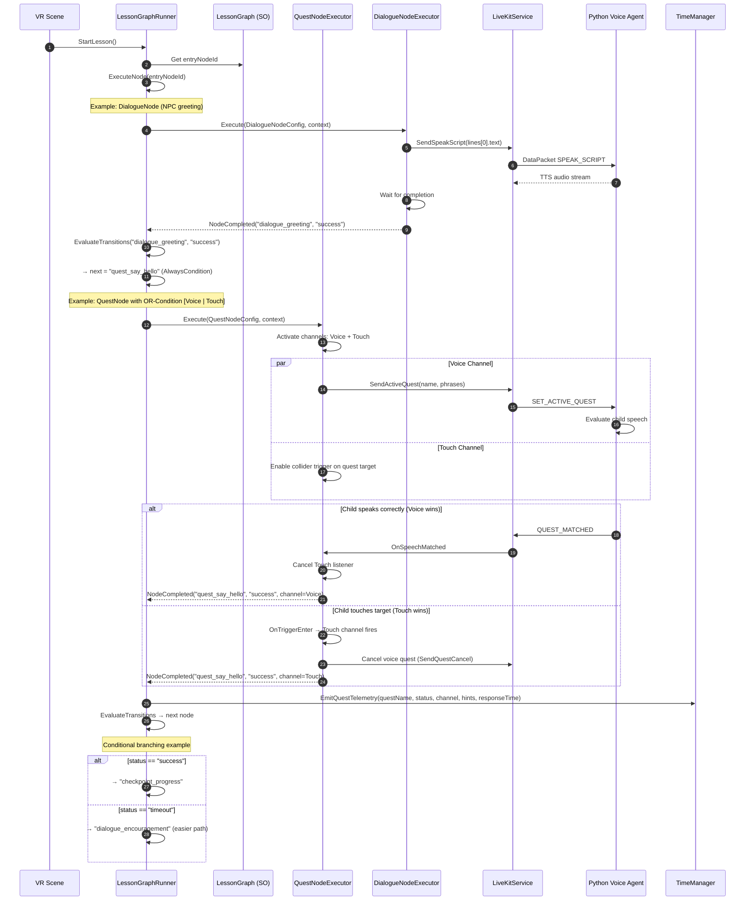

# Lesson Flow Engine v2 — Node Graph Architecture Design

> **Goal**: Nâng cấp luồng bài học từ tuyến tính cứng (ActionManager → QuestController) sang **Node Graph Engine** linh hoạt, hỗ trợ Scripted Dialogue xen kẽ, OR-Condition multi-modal quest completion, và mở rộng dễ dàng.

## Tóm tắt quyết định đã xác nhận

| Quyết định | Lựa chọn |
|---|---|
| Mức non-linear | Full node graph — Quest, Dialogue, Timeline, Checkpoint đều là node |
| Graph storage | ScriptableObject trong Unity Inspector |
| OR-Condition | Configurable per-quest — designer chọn completion channels |
| Migration | Song song — engine mới cho scene mới, scene cũ giữ nguyên |

---

## Phương án A: Flat ScriptableObject Graph + Central Executor

### Mô tả

Mỗi **Lesson** là 1 ScriptableObject (`LessonGraph`) chứa danh sách `LessonNode` (SO) + danh sách `LessonEdge` (SO). Một `LessonGraphRunner` MonoBehaviour đọc graph, quản lý state, và thực thi node hiện tại.

### Kiến trúc

```
LessonGraph (SO)
├── nodes: LessonNode[] (SO assets)
│   ├── QuestNode (wraps Quest logic + OR-condition channels)
│   ├── DialogueNode (scripted TTS lines via LiveKit SPEAK_SCRIPT)
│   ├── TimelineNode (plays Unity Timeline + waits for signal)
│   ├── CheckpointNode (save/restore point, telemetry marker)
│   ├── WaitNode (delay, condition gate)
│   └── ParallelNode (runs multiple child nodes concurrently)
├── edges: LessonEdge[] (SO assets)
│   ├── from: LessonNode
│   ├── to: LessonNode
│   └── condition: EdgeCondition (SO — e.g., "status == success", "timeout > 30s")
└── entryNode: LessonNode
```

`LessonGraphRunner` (MonoBehaviour):
- Trên `Start()`: tìm `entryNode`, gọi `node.Execute(context)`
- Khi node hoàn thành: đánh giá tất cả outgoing edges, chọn edge đầu tiên match condition → transition sang node tiếp
- Nếu không edge nào match: log warning, dừng
- Nếu không còn node tiếp: bắn `OnLessonCompleted`

### Ưu điểm
- **Đơn giản hiểu**: Flat list, dễ debug trong Inspector
- **Serialization tự nhiên**: Unity SO reference graph, không cần custom editor phức tạp
- **Familiar pattern**: Giống Finite State Machine, dễ onboard

### Nhược điểm
- **Inspector UX kém với graph lớn**: SO reference list không trực quan cho 20+ node
- **Thiếu visual editor**: Không thấy flow dạng đồ thị, phải đọc edge list
- **Edge explosion**: Graph phức tạp → nhiều edge SO assets → khó quản lý

### Khả năng scale
⚠️ Trung bình. Hoạt động tốt cho 5-15 node/lesson. Trên 20 node bắt đầu khó quản lý trong Inspector thuần.

---

## Phương án B: Embedded Node Graph + Custom Inspector (Recommended ✅)

### Mô tả

Mỗi **Lesson** là 1 ScriptableObject (`LessonGraph`) chứa danh sách node **embedded** (SerializeReference). Node và edge data nằm trong cùng 1 asset file — không cần SO riêng cho từng node/edge. Kết hợp **Custom Inspector/Property Drawer** để hiển thị dạng list có kết nối trực quan.

### Kiến trúc

```
LessonGraph (ScriptableObject)
├── nodes: List<LessonNodeData> [SerializeReference]
│   ├── id: string (GUID)
│   ├── nodeType: enum (Quest, Dialogue, Timeline, Checkpoint, Wait, Parallel, Gate)
│   ├── position: Vector2 (for future visual editor)
│   └── config: INodeConfig [SerializeReference]
│       ├── QuestNodeConfig
│       │   ├── questPrefab: Quest (MonoBehaviour ref)
│       │   ├── completionChannels: CompletionChannel[] (Voice, Touch, Hold, Raycast, Custom)
│       │   ├── orCondition: bool (true = any channel wins)
│       │   └── timeoutSeconds: float (-1 = no timeout)
│       ├── DialogueNodeConfig
│       │   ├── lines: DialogueLine[] (speaker, text, emotion, delay)
│       │   ├── useVoiceAgent: bool (true = SPEAK_SCRIPT qua LiveKit, false = local AudioClip)
│       │   └── waitForCompletion: bool
│       ├── TimelineNodeConfig
│       │   ├── timeline: PlayableAsset
│       │   └── waitForSignal: string (signal name)
│       ├── CheckpointNodeConfig
│       │   ├── checkpointId: string
│       │   └── emitTelemetry: bool
│       ├── WaitNodeConfig
│       │   ├── duration: float
│       │   └── condition: BooleanVariable (optional gate)
│       ├── GateNodeConfig
│       │   ├── gateType: enum (AND, OR, XOR)
│       │   └── inputs: string[] (node IDs to wait for)
│       └── ParallelNodeConfig
│           └── childNodeIds: string[]
├── edges: List<LessonEdgeData>
│   ├── fromNodeId: string
│   ├── toNodeId: string
│   ├── priority: int (lower = evaluated first)
│   └── condition: EdgeConditionData [SerializeReference]
│       ├── AlwaysCondition (default edge)
│       ├── StatusCondition (questStatus == "success" / "skipped" / "timeout")
│       ├── VariableCondition (BooleanVariable / IntVariable threshold)
│       └── CompositeCondition (AND/OR of sub-conditions)
└── entryNodeId: string
```

### Runtime Architecture

```
LessonGraphRunner (MonoBehaviour) — Central Executor
├── Holds: LessonGraph (SO reference)
├── Holds: LessonExecutionContext (runtime state bag)
│   ├── currentNodeId: string
│   ├── nodeStates: Dictionary<string, NodeExecutionState>
│   ├── variables: Dictionary<string, object> (runtime variables)
│   ├── sessionContext: SessionContext
│   ├── questController: IQuestFlowController (adapter for legacy compat)
│   └── liveKitService: LiveKitService
├── Methods:
│   ├── StartLesson()
│   ├── ExecuteNode(nodeId) → async
│   ├── EvaluateTransitions(fromNodeId, status) → nextNodeId
│   └── CompleteLesson()
└── Events:
    ├── OnNodeEntered(nodeId, nodeType)
    ├── OnNodeCompleted(nodeId, status, telemetry)
    └── OnLessonCompleted(lessonResult)
```

### OR-Condition Multi-modal Design

```
CompletionChannel (enum flags):
├── Voice      = 1 << 0   // VoiceQuest via LiveKit
├── Touch      = 1 << 1   // Collider trigger (instant)
├── HoldTouch  = 1 << 2   // Collider hold (duration)
├── Raycast    = 1 << 3   // Gaze/pointer raycast
├── Custom     = 1 << 4   // UnityEvent callback

QuestNodeExecutor:
├── Spawns active completion listeners based on channels bitmask
├── First channel to fire → records completionMethod in telemetry
├── Immediately cancels all other listeners
├── Reports to LessonGraphRunner: NodeCompleted(status, completionMethod)
```

### Ưu điểm
- **Single asset per lesson**: 1 SO file = toàn bộ graph. Dễ version control, dễ duplicate
- **SerializeReference polymorphism**: Node configs mở rộng không cần SO mới
- **Visual editor ready**: `position: Vector2` sẵn sàng cho custom GraphView editor sau này
- **OR-Condition native**: `CompletionChannel` flags enum tích hợp sẵn trong QuestNodeConfig
- **Backward compatible**: `LessonGraphRunner` chạy song song với `ActionManager`/`QuestController` cũ

### Nhược điểm
- **Custom Inspector cần viết**: SerializeReference list cần Property Drawer để UX tốt
- **Phức tạp hơn Phương án A**: Nhiều abstraction layer hơn
- **SerializeReference gotcha**: Rename class = mất data nếu không có `[MovedFrom]`

### Khả năng scale
✅ Cao. Single-file graph scale tốt đến 50+ node. Visual editor có thể xây sau mà không thay đổi data model.

---

## So sánh tổng quan

| Tiêu chí | Phương án A (Flat SO) | Phương án B (Embedded Graph) ✅ |
|---|---|---|
| Độ phức tạp triển khai | Thấp | Trung bình |
| Inspector UX (không custom editor) | Kém (nhiều SO assets) | Trung bình (list + drawer) |
| Version control | Kém (nhiều file) | Tốt (1 file/lesson) |
| Mở rộng node type | Cần tạo SO mới | SerializeReference, chỉ thêm class |
| Visual editor tương lai | Khó retrofit | Sẵn sàng (có position data) |
| OR-Condition | Phải thêm bên ngoài | Native trong QuestNodeConfig |
| Backward compat | Tốt | Tốt |
| Scale (node count) | 5-15 | 50+ |

**Khuyến nghị: Phương án B** — phù hợp yêu cầu full graph, expandable, và migration song song.

---

## Kiến trúc chi tiết (Phương án B)

### Sequence Diagram — Lesson Execution Flow



### DataPacket Contract (JSON) — Additions

Hiện tại đã có: `SET_ACTIVE_QUEST`, `QUEST_MATCHED`, `VERBAL_HINT`, `ON_REMINDER`, `SPEAK_SCRIPT`, `QUEST_STATUS`.

Cần thêm cho Lesson Flow v2:

```jsonc
// Unity → Agent: Cancel active voice quest (khi Touch/Hold channel win trước)
{
  "event": "CANCEL_ACTIVE_QUEST",
  "quest_name": "say_hello",
  "reason": "completed_by_touch"  // telemetry: ghi nhận channel nào thắng
}

// Unity → Agent: Scripted dialogue sequence
// (Đã có SPEAK_SCRIPT, mở rộng thêm metadata)
{
  "event": "SPEAK_SCRIPT",
  "text": "Chào con! Hôm nay mình sẽ học cách chào hỏi nhé!",
  "emotion": "happy",           // [NEW] cho agent điều chỉnh giọng
  "blocking": true,             // [NEW] Unity chờ agent nói xong
  "sequence_id": "greeting_01"  // [NEW] tracking cho telemetry
}

// Agent → Unity: Confirm script speech completed
{
  "event": "SPEAK_SCRIPT_DONE",
  "sequence_id": "greeting_01"
}

// Unity → Agent: Lesson state update (agent context awareness)
{
  "event": "LESSON_STATE",
  "current_node": "quest_say_hello",
  "node_type": "quest",
  "progress": 3,       // node thứ 3
  "total": 8            // tổng 8 nodes
}
```

### Node Executor Pattern — Class Hierarchy

```
INodeExecutor (interface)
├── Task<NodeResult> Execute(LessonNodeData node, LessonExecutionContext ctx)
├── void Cancel()
└── bool IsRunning { get; }

NodeResult
├── string nodeId
├── string status ("success" | "skipped" | "timeout" | "failed")
├── string completionChannel (nullable — chỉ cho QuestNode)
├── Dictionary<string, object> telemetry
└── float elapsedTime

NodeExecutorFactory (static)
├── Create(NodeType type) → INodeExecutor
│   ├── Quest    → QuestNodeExecutor
│   ├── Dialogue → DialogueNodeExecutor
│   ├── Timeline → TimelineNodeExecutor
│   ├── Checkpoint → CheckpointNodeExecutor
│   ├── Wait     → WaitNodeExecutor
│   ├── Gate     → GateNodeExecutor
│   └── Parallel → ParallelNodeExecutor
```

### State Management

```
LessonExecutionContext
├── Runtime State:
│   ├── currentNodeId: string
│   ├── nodeStates: Dictionary<string, NodeExecutionState>
│   │   └── NodeExecutionState { Status, EnterTime, ExitTime, Result }
│   ├── visitedNodes: HashSet<string>     // cycle detection
│   ├── variables: Dictionary<string, object>  // runtime variables for conditions
│   └── parallelTasks: Dictionary<string, Task>  // for ParallelNode
│
├── Service References (injected):
│   ├── SessionContext
│   ├── LiveKitService
│   ├── TimeManager
│   └── LessonParameters
│
├── Telemetry Accumulator:
│   ├── List<NodeTelemetryEntry> entries
│   └── Flush() → FirebaseManager
│
└── Cancellation:
    └── CancellationTokenSource (lesson-level cancel)
```

### Workflow chi tiết: Voice Sync giữa Scripted Dialogue và Voice Quest

**Luồng Scripted Dialogue (DialogueNode)**:
1. `DialogueNodeExecutor` nhận `DialogueNodeConfig` với danh sách `DialogueLine[]`
2. Mỗi line: gửi `SPEAK_SCRIPT` DataPacket qua LiveKit kèm `blocking: true`
3. Python Agent nhận `SPEAK_SCRIPT` → gọi `session.say(text)` → TTS stream ra NPC AudioSource
4. Agent gửi `SPEAK_SCRIPT_DONE` khi phát xong
5. Unity chờ `SPEAK_SCRIPT_DONE` → delay theo `line.pauseAfter` → chuyển line tiếp
6. Hết lines → `NodeCompleted("success")`

**Luồng Voice Quest (QuestNode với Voice channel)**:
1. `QuestNodeExecutor` kích hoạt Voice channel → gửi `SET_ACTIVE_QUEST`
2. Agent chuyển sang quest evaluation mode (dynamic prompt)
3. Agent tự chào trẻ (greeting từ cache) rồi lắng nghe
4. Trẻ nói → STT → LLM evaluate → `complete_quest()` → `QUEST_MATCHED`

**Chuyển tiếp (Dialogue → Quest)**:
- Graph engine đảm bảo DialogueNode hoàn thành trước khi QuestNode bắt đầu
- Agent nhận `SET_ACTIVE_QUEST` → tự động chuyển từ script mode sang quest evaluation mode
- Không có race condition vì graph runner sequential per-path

**Fallback logic**:
- `SPEAK_SCRIPT_DONE` timeout: 30 giây không nhận → force advance (log warning)
- `QUEST_MATCHED` timeout: configurable `timeoutSeconds` trên QuestNodeConfig → bắn `NodeCompleted("timeout")` → graph edge điều hướng sang node khác (gợi ý, bài dễ hơn, skip)
- LiveKit disconnect: `LessonGraphRunner` detect → pause lesson → retry connect → resume từ current node

### Phân chia trách nhiệm

| Thành phần | Trách nhiệm | KHÔNG làm |
|---|---|---|
| **LessonGraph (SO)** | Chứa data: nodes, edges, configs | Không chứa logic runtime |
| **LessonGraphRunner** | Đọc graph, quản lý state, điều phối node execution, evaluate transitions | Không biết logic cụ thể của từng node type |
| **INodeExecutor** | Thực thi 1 node, báo cáo kết quả | Không biết graph structure hay edge conditions |
| **QuestNodeExecutor** | OR-Condition channels, spawn/cancel listeners | Không gọi trực tiếp LiveKit (dùng qua service interface) |
| **DialogueNodeExecutor** | Phát scripted lines qua LiveKit SPEAK_SCRIPT | Không evaluate speech |
| **LiveKitService** | Transport: gửi/nhận DataPacket, manage mic/audio | Không biết quest logic hay graph |
| **Python Voice Agent** | STT → LLM evaluate → TTS, handle SPEAK_SCRIPT | Không biết graph structure, chỉ phản ứng theo DataPacket |
| **TimeManager** | Telemetry timing, Firestore write | Không điều khiển flow |

### File Structure (mới)

```
Assets/Project/Scripts/Gameplay/LessonGraph/
├── Data/                              [NEW]
│   ├── LessonGraph.cs                 (SO — chứa nodes + edges)
│   ├── LessonNodeData.cs              (serializable node data)
│   ├── LessonEdgeData.cs              (serializable edge data)
│   ├── NodeConfigs/
│   │   ├── QuestNodeConfig.cs
│   │   ├── DialogueNodeConfig.cs
│   │   ├── TimelineNodeConfig.cs
│   │   ├── CheckpointNodeConfig.cs
│   │   ├── WaitNodeConfig.cs
│   │   ├── GateNodeConfig.cs
│   │   └── ParallelNodeConfig.cs
│   └── EdgeConditions/
│       ├── IEdgeCondition.cs
│       ├── AlwaysCondition.cs
│       ├── StatusCondition.cs
│       ├── VariableCondition.cs
│       └── CompositeCondition.cs
├── Runtime/                           [NEW]
│   ├── LessonGraphRunner.cs           (central executor MonoBehaviour)
│   ├── LessonExecutionContext.cs      (state bag)
│   ├── NodeResult.cs
│   ├── Executors/
│   │   ├── INodeExecutor.cs
│   │   ├── NodeExecutorFactory.cs
│   │   ├── QuestNodeExecutor.cs
│   │   ├── DialogueNodeExecutor.cs
│   │   ├── TimelineNodeExecutor.cs
│   │   ├── CheckpointNodeExecutor.cs
│   │   ├── WaitNodeExecutor.cs
│   │   ├── GateNodeExecutor.cs
│   │   └── ParallelNodeExecutor.cs
│   └── CompletionChannels/
│       ├── CompletionChannel.cs       (flags enum)
│       ├── ICompletionListener.cs
│       ├── VoiceCompletionListener.cs
│       ├── TouchCompletionListener.cs
│       ├── HoldTouchCompletionListener.cs
│       ├── RaycastCompletionListener.cs
│       └── CustomCompletionListener.cs
├── Editor/                            [NEW]
│   ├── LessonGraphInspector.cs        (custom inspector)
│   └── NodeConfigDrawer.cs            (property drawer)
└── Models/
    ├── DialogueLine.cs                [NEW]
    └── NodeTelemetryEntry.cs          [NEW]
```

### Python Agent Changes

```
LiveKitAgent/src/agent.py — additions:
├── Handle CANCEL_ACTIVE_QUEST: Reset quest_state, revert to WAITING_INSTRUCTIONS
├── Handle SPEAK_SCRIPT (extended): Process emotion, blocking, sequence_id
│   └── After TTS done: publish SPEAK_SCRIPT_DONE DataPacket
├── Handle LESSON_STATE: Log context (optional, for future agent awareness)
```

---

## User Review Required

> [!IMPORTANT]
> **OR-Condition race safety**: Khi Voice và Touch channel chạy song song, cần mutex/flag `_completed` trong `QuestNodeExecutor` để tránh double-complete. First channel set flag → cancel others → report result. Cần test kỹ edge case: Voice `QUEST_MATCHED` arrive cùng frame với `OnTriggerEnter`.

> [!IMPORTANT]  
> **SPEAK_SCRIPT_DONE là DataPacket mới**: Python Agent hiện chỉ gửi `QUEST_MATCHED` và `QUEST_STATUS`. Cần thêm `SPEAK_SCRIPT_DONE` packet trong `agent.py` để DialogueNode biết khi nào agent nói xong. Nếu không có, phải dùng timing estimate (kém chính xác).

> [!WARNING]
> **Custom Editor scope**: Design này intentionally chỉ yêu cầu Custom Inspector (Property Drawer cho node list). Full visual GraphView editor (drag-drop nodes, draw edges) là phase 2 — không nằm trong scope implementation đầu tiên. Đồng ý?

## Open Questions

> [!IMPORTANT]
> 1. **ParallelNode**: Có cần hỗ trợ chạy nhiều node đồng thời trong phase 1 không? (Ví dụ: NPC nói + hiệu ứng visual cùng lúc). Hay defer sang phase 2?

> [!IMPORTANT]
> 2. **GateNode** (AND/OR merge): Nếu 2 nhánh parallel hội tụ, cần GateNode chờ tất cả/bất kỳ hoàn thành. Có cần phase 1 không?

> [!NOTE]
> 3. **Telemetry granularity**: `NodeTelemetryEntry` nên ghi từng node hay chỉ QuestNode? Ghi hết = data nhiều nhưng insight tốt hơn.

## Verification Plan

### Automated Tests
- Unit test cho `EvaluateTransitions()` logic: edge priority, condition matching, cycle detection
- Unit test cho OR-Condition: concurrent channel fire, first-win, cancel others
- Integration test: DialogueNode → SPEAK_SCRIPT → SPEAK_SCRIPT_DONE round-trip
- Integration test: QuestNode với Voice + Touch → race condition scenarios

### Manual Verification
- Tạo sample LessonGraph SO cho HelloFriend scene (3 DialogueNode + 2 QuestNode + 1 CheckpointNode)
- Play trong Unity Editor, verify flow chạy đúng sequence
- Test branching: force timeout → verify redirect sang "easier" node
- Test OR-Condition: hoàn thành bằng Voice, rồi test lại bằng Touch
- Verify scene cũ (Bathroom, Farm) vẫn hoạt động bình thường với ActionManager/QuestController
---
 
## Phase 1 — Scope đã chốt
 
Phase 1 tạo engine chạy được cho scene mới; không migrate tự động scene cũ.
`ActionManager`, `QuestController`, `QuestRemoteBridge` legacy giữ nguyên hành vi.
 
### Node được triển khai
 
- `QuestNode`: chạy một hoặc nhiều `Quest` source theo OR-condition.
- `DialogueNode`: phát thoại blocking qua LiveKit.
- `WaitNode`: chờ thời gian cấu hình.
- `CheckpointNode`: telemetry marker; chưa resume sau restart.
 
Không thuộc Phase 1: `TimelineNode`, `ParallelNode`, `GateNode`, `VariableCondition`, `CompositeCondition`, full GraphView editor, checkpoint resume.
 
### Quy tắc runtime
 
- Graph Phase 1 là DAG: validation từ chối cycle và node re-entry.
- Edge chỉ gồm `AlwaysCondition` và `StatusCondition`.
- Status chuẩn: `success`, `skipped`, `timeout`, `failed`.
- QuestNode kích hoạt toàn bộ `Quest` source; source hoàn thành đầu tiên thắng bằng mutex/flag atomic, rồi cleanup source còn lại.
- QuestNode có thể gồm một `VoiceQuest` và một `TouchQuest`/`HoldTouchQuest`; telemetry ghi `completion_channel`.
- Remote Skip, Verbal Hint, Visual Hint route duy nhất vào QuestNode active qua `LessonGraphRemoteBridge`.
- Dialogue timeout trả `timeout` để graph đi edge fallback; không force-success.
 
### LiveKit contract Phase 1
 
Unity phải serialise packet bằng DTO/JSON serializer, không nối chuỗi JSON thủ công.
 
```jsonc
// Unity -> Agent
{ "event": "CANCEL_ACTIVE_QUEST", "quest_name": "say_hello", "reason": "completed_by_touch" }
 
// Unity -> Agent
{ "event": "SPEAK_SCRIPT", "sequence_id": "greeting_01", "text": "Chào con!", "blocking": true }
 
// Agent -> Unity
{ "event": "SPEAK_SCRIPT_DONE", "sequence_id": "greeting_01", "status": "success" }
```
 
Python Agent serialize command handling bằng lock/queue; `CANCEL_ACTIVE_QUEST` reset `QuestState`; `SPEAK_SCRIPT_DONE` chỉ publish sau khi `session.say()` hoàn tất. Không thêm `emotion` hoặc `LESSON_STATE` khi Agent chưa có consumer rõ ràng.
 
### Telemetry Phase 1
 
- Thêm `NodeLogData` vào `SessionData.node_logs`.
- Mọi node ghi node ID, type, index, entered/exited time, elapsed, status.
- QuestNode ghi thêm completion channel và counters hints.
- Tiếp tục ghi `QuestLogData` cho QuestNode để schema/dashboard cũ không vỡ.
- `LessonGraphRunner` publish activity tương thích `Action_<questName>`; `SessionSyncTracker` subscribe V2 source.
 
### Tests Phase 1
 
- Unity NUnit: graph validation, edge priority/status, dialogue/quest timeout, OR first-win, source cleanup, remote command routing.
- Unity integration: Dialogue -> `SPEAK_SCRIPT_DONE`; Voice/Touch race; legacy ActionManager/QuestController scene.
- Python pytest: cancel reset, script-done payload, packet ordering, TTS failure.
- Firestore model test: `node_logs` serialize cùng `quest_logs`.
 
---
 
## Phase 2 — Advanced Graph Engine
 
Phase 2 mở rộng data model Phase 1, không đổi ID, status, telemetry hay packet contract đã phát hành.
 
### Node và transition mới
 
- `TimelineNode`: phát `PlayableAsset`; complete khi nhận Unity Timeline Signal tên cấu hình; timeout đi edge `timeout`.
- `ParallelNode`: khởi chạy child node IDs đồng thời. Policy cấu hình: `AllSuccess` hoặc `FirstCompleted`; khi node cha kết thúc phải cancel/cleanup child còn lại.
- `GateNode`: merge nhánh `AND` hoặc `OR`; chỉ theo dõi result của input node IDs, không tự chạy Quest/Dialogue.
- `VariableCondition`: đọc duy nhất `bool`, `int`, `float`, `string` trong execution context.
- `CompositeCondition`: `AND`/`OR` condition con; reject empty composite.
 
### Loop và checkpoint resume
 
- Cho phép edge cycle khi cả graph và edge có `maxVisits > 0`.
- Runner đếm visit theo node/edge; vượt giới hạn trả `failed`, ghi telemetry, không loop vô hạn.
- Checkpoint lưu snapshot local: graph ID/version hash, current node, node states, variables primitive, pending telemetry.
- Resume chỉ hợp lệ khi graph ID và hash khớp; mismatch xóa snapshot, start entry node, ghi warning telemetry.
- Không persist Unity object reference, `Task`, `CancellationToken`, LiveKit room state, AudioSource hoặc Quest runtime state.
 
### Graph editor
 
- Thêm Unity GraphView editor: node palette, drag/drop, edge creation, reorder priority, minimap, validation realtime.
- Editor chỉ sửa `LessonGraph` embedded data hiện có; không tạo asset node/edge rời.
- Inspector list Phase 1 vẫn là fallback khi GraphView unavailable.
 
### Dashboard và telemetry
 
- RTDB low-frequency state thêm current node ID/type, active parallel children, branch result, checkpoint/resume status.
- Firestore `NodeLogData` thêm parent parallel node ID, visit count, checkpoint ID khi áp dụng.
- Không stream telemetry frame-level qua RTDB; giữ LiveKit DataPacket cho event realtime.
 
### Tests Phase 2
 
- `TimelineNode`: signal đúng, signal sai, timeout, cancel.
- `ParallelNode`: all-success, first-complete, child failure, cancellation race.
- `GateNode`: AND/OR merge, duplicate input, child result out-of-order.
- Conditions: type comparison, composite nesting, missing variable, invalid config.
- Loop: valid bounded loop, exhausted max visits, telemetry visit count.
- Checkpoint: save/resume, corrupted snapshot, graph-version mismatch, no stale LiveKit/Quest state restore.
- GraphView: serialize/deserialize round-trip, node/edge edit persistence, validation parity với runtime.
---
 
## Design Amendments — Quyết định bắt buộc trước implementation
 
Phần này override mọi nội dung mâu thuẫn phía trên.
 
### 1. Scope và schema
 
- Phase 1 chỉ có `QuestNode`, `DialogueNode`, `WaitNode`, `CheckpointNode`, `AlwaysCondition`, `StatusCondition`; graph phải là DAG.
- `TimelineNode`, `ParallelNode`, `GateNode`, variable/composite condition, loop, checkpoint resume, GraphView thuộc Phase 2.
- `LessonGraph` có `schemaVersion`; serialized types giữ tên ổn định và dùng `[MovedFrom]` khi rename. Editor migration phải duplicate/backup asset, validate rồi mới save.
 
### 2. Quest source và first-win
 
- `QuestNodeConfig` dùng duy nhất `List<Quest> completionSources`; bỏ `questPrefab`, `completionChannels`, `orCondition` khỏi thiết kế Phase 1.
- Mỗi source khai báo channel type. Validator cấm source null, source lặp, nhiều Voice source, source không hỗ trợ lifecycle chuẩn.
- `QuestNodeExecutor` là owner duy nhất của source lifecycle và implement `IQuestFlowController`; first completion thắng bằng interlocked/guard một lần, cancel rồi `End()` toàn bộ source còn lại.
- Hint remote route vào source active hỗ trợ hint; không broadcast mù tới mọi source.
 
### 3. LiveKit command state machine
 
- Mỗi Voice activation sinh `activation_id` GUID. Unity gửi ID trong `SET_ACTIVE_QUEST` và `CANCEL_ACTIVE_QUEST`; Agent echo ID trong `QUEST_MATCHED`, `QUEST_STATUS`.
- Unity chỉ xử lý packet có `activation_id` trùng active quest; packet thiếu hoặc stale bị log và bỏ.
- Agent giữ command state `Idle`, `SpeakingScript`, `ListeningQuest`, `Cancelling`, cùng generation token. Background LLM/TTS/hint chỉ publish nếu token vẫn active.
- `CANCEL_ACTIVE_QUEST` phải invalidate token, reset state và ngăn `QUEST_MATCHED` trễ.
- `SPEAK_SCRIPT` có `sequence_id`; `SPEAK_SCRIPT_DONE` luôn gồm `sequence_id`, `status` (`success|failed|cancelled`) và optional `reason`.
- Trước implementation phải xác minh LiveKit Agents API nào báo audio playback thật sự xong. Không được coi return của `session.say()` là playback-complete nếu API chỉ enqueue audio.
- Runner không activate voice quest khi Dialogue còn `SpeakingScript`; node cancel/timeout phải chuyển transport về state xác định trước transition.
 
### 4. Runner và failure lifecycle
 
- Lesson có một `CancellationTokenSource`; mỗi node có linked token. `OnDisable`, scene unload, disconnect abort phải cancel node, unsubscribe event, cleanup source, ghi status `failed` hoặc `aborted`.
- `NodeResult` immutable: node ID, status, elapsed monotonic seconds, completion channel, telemetry event ID. Callback sau cancellation/destroy bị bỏ.
- LiveKit disconnect: pause lesson, retry theo policy cấu hình; retry exhausted trả node/lesson `failed`. Không resume tự động từ object runtime stale.
 
### 5. Telemetry và cross-stack contract
 
- Tạo một V2 telemetry adapter làm đường ghi duy nhất cho `NodeLogData`; QuestNode adapter tạo thêm `QuestLogData` legacy. Không để `TimeManager` và runner cùng ghi một event.
- Mỗi node event có GUID idempotency key, UTC timestamp và monotonic elapsed. Firestore retry theo key, không append duplicate.
- RTDB V2 path: `live_sessions/{sessionId}/lesson_graph`; fields: `current_node_id`, `current_node_type`, `status`, `active_parallel_node_ids`, `checkpoint_id`, `updated_at`. Chỉ update khi node/state thay đổi.
- Trước đổi RTDB/DataPacket schema, cập nhật Unity DTO, Python handler và VRA-web TypeScript consumer trong cùng task.
 
### 6. Phase 2 structured concurrency
 
- `ParallelNode` owns child execution. Child không tự evaluate outgoing edge; parent gom result rồi evaluate edge của parent.
- `AllSuccess`: success khi mọi child success; bất kỳ failed/timeout/skipped theo policy node kết thúc parent cùng status đó. `FirstCompleted`: result đầu tiên thắng, cancel/cleanup tất cả child còn lại.
- `GateNode` chỉ là join của named completed branches; validator cấm duplicate/missing input và graph deadlock.
- Loop chỉ Phase 2; node/edge cycle phải có `maxVisits > 0`. Runner đếm node và edge visits, vượt giới hạn trả `failed`.
 
### 7. Checkpoint và editor Phase 2
 
- Snapshot lưu dưới `Application.persistentDataPath`, bind theo session ID, graph ID, schema version và content hash; có TTL.
- Snapshot chỉ chứa primitive variables, node states, current node, pending event IDs. Không chứa Unity references, task/token, LiveKit state, AudioSource hoặc Quest runtime state.
- Xóa snapshot khi complete/abort; hash/version mismatch xóa snapshot và start entry node, đồng thời ghi telemetry warning.
- Chỉ dùng GraphView nếu Unity version project hỗ trợ ổn định. Nếu không, triển khai UI Toolkit editor; Inspector list luôn là fallback.
 
### Acceptance flow bắt buộc
 
Sample graph version-controlled: `Dialogue` -> `Voice|Touch Quest` -> timeout branch -> `Checkpoint` -> complete. Test phải chứng minh packet stale không complete node mới, source cleanup đúng, telemetry không duplicate, scene legacy vẫn chạy.
---
 
## Quest V2 Supersession
 
Phần này override mọi reference V2 tới `Gameplay.Actions.Quest`, `QuestController`, `IQuestFlowController`, `VoiceQuest`, `TouchQuest`, `HoldTouchQuest`, `questPrefab`, hoặc `List<Quest> completionSources`. Legacy giữ nguyên, không bị sửa hay dùng bởi LessonGraph V2.
 
### Data và scene binding
 
- `QuestNodeConfig` chỉ lưu `completionBindingIds: List<string>`, `timeoutSeconds`, `voicePrompt`.
- `LessonGraph` không reference scene `MonoBehaviour`.
- `LessonGraphBindings` trong scene map unique binding ID sang `QuestSourceV2`; `Awake()` reject null/duplicate ID.
- Missing, duplicate, disabled source làm `StartLesson()` fail `invalid_graph` trước khi activate bất kỳ source nào.
 
### Quest subsystem mới
 
`QuestSourceV2` là `MonoBehaviour` abstract độc lập trong `VRAutism.Gameplay.LessonGraphV2.Questing`:
 
```text
Activate(QuestActivationContext context)
Cancel(QuestCancellationReason reason)
event Action<QuestCompletionResult> Completed
 
Inactive -> Activating -> Active -> Completing -> Completed
                         -> Cancelled | Failed
```
 
- `QuestCompletionResult` immutable: activation ID, binding ID, completion channel, status, UTC time, monotonic elapsed.
- Derived source Phase 1: `VoiceQuestSourceV2`, `TouchQuestSourceV2`, `HoldTouchQuestSourceV2`. Raycast/Custom defer nếu chưa có scene requirement.
- `QuestNodeExecutor` tạo activation ID, activate sources, first completion thắng, cancel/cleanup sources khác, và emit exactly one `NodeResult`.
- Source disabled/destroyed khi active emit `Failed(binding_unavailable)`; runner cancel active node trước scene unload.
 
### Voice transport
 
`VoiceQuestSourceV2` chỉ phụ thuộc `IVoiceQuestTransport`:
 
```csharp
event Action<VoiceQuestSignal> SignalReceived;
void Activate(VoiceQuestRequest request);
void Cancel(string activationId, QuestCancellationReason reason);
```
 
- `VoiceQuestRequest` chứa activation ID, quest name, phrases, NPC `AudioSource`.
- `LiveKitVoiceQuestTransport` owns packet DTO, audio binding, publish/subscribe/cancel, stale packet filter, Unity main-thread dispatch.
- `SET_ACTIVE_QUEST`, `CANCEL_ACTIVE_QUEST`, `QUEST_MATCHED`, `QUEST_STATUS` bắt buộc `activation_id`. Agent echo ID; Unity bỏ packet thiếu/stale.
- Executor owns quest timeout; transport chỉ trả matched/status/error signal.
 
### Tests và cross-stack map
 
- Unity test folders: `LessonGraphV2/Tests/Editor` và `LessonGraphV2/Tests/PlayMode`; không thêm internal asmdef.
- Test: binding validator, state transitions, first-win, timeout, double complete, stale activation, disable/destroy, scene unload, adapter mock.
- Contract update cùng task: `Cloud/LiveKit/LiveKitService.cs`, `LiveKitAgent/src/agent.py`, `LiveKitAgent/src/quest_transport.py`, `VRA-web/src/hooks/useLiveKitDataChannel.ts`, `VRA-web/src/lib/firebase/rtdb.ts`.
