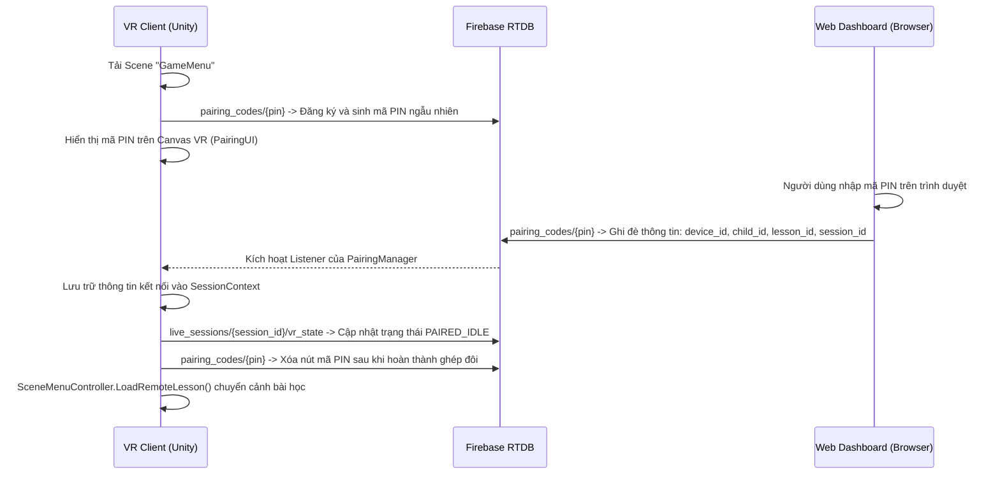
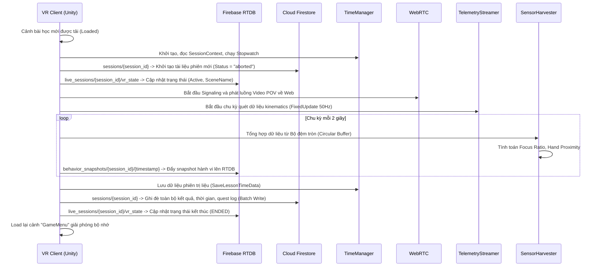
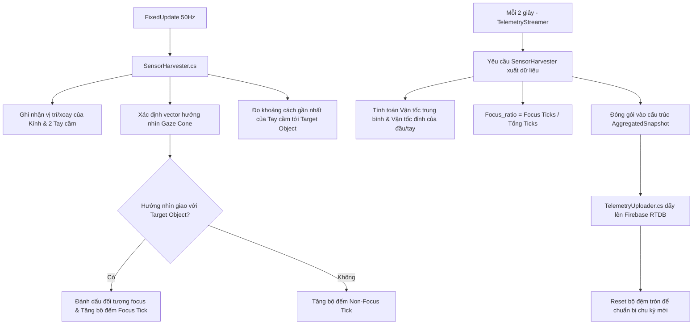
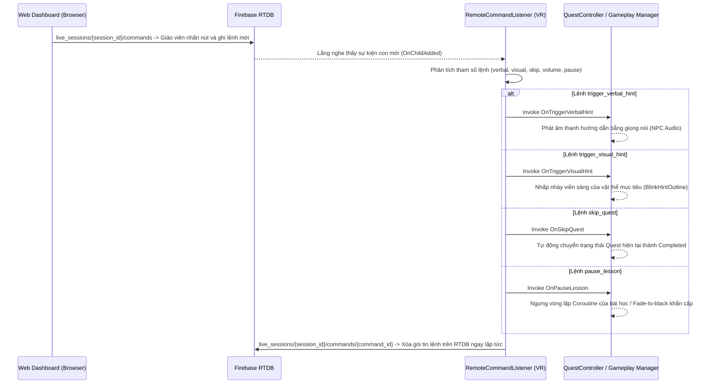

# Kiến Trúc Hệ Thống VR-Autism (Unity Client)
Tài liệu phân tích cấu trúc mã nguồn, vai trò kỹ thuật của từng thành phần và mô tả các luồng nghiệp vụ (workflows) cốt lõi của ứng dụng VR.

---

## 1. Bản Đồ Mã Nguồn & Chức Năng Các Thành Phần

Hệ thống được tổ chức theo mô hình phân lớp rõ ràng nhằm phân tách độc lập giữa **Logic Gameplay (Unity)**, **Xử lý Dữ liệu/Kết nối (Firebase/Cloud)**, và **Hệ thống Cốt lõi (Core)**.

### 1.1 Lớp Cloud & Realtime Database (RTDB)
Nằm tại thư mục `Assets/Project/Scripts/Cloud/`. Chịu trách nhiệm đồng bộ trạng thái, kết nối P2P và ghi nhận log phiên trị liệu về Firestore/RTDB.

*   `FirebaseManager.cs`: Singleton quản lý tích hợp Firebase SDK. Thực hiện khởi tạo cấu trúc phiên (`SessionData`), tích lũy log hành động (`QuestLogData`), và thực hiện cơ chế ghi dữ liệu hàng loạt (Batch Write) lên Cloud Firestore khi kết thúc phiên nhằm tối ưu hóa số lượng truy vấn.
*   `FirebasePaths.cs`: Chứa các hằng số định nghĩa đường dẫn tĩnh (static paths) cho các Document và Collection trên Firestore và các Node trên RTDB.
*   `SessionSyncTracker.cs`: Cầu nối trung gian (Bridge) lắng nghe các sự kiện hoạt động của Quest/Quiz để phát tín hiệu cập nhật chỉ số Quest hiện tại về lớp RTDB.
*   `Models/SessionData.cs`: Lớp mô hình dữ liệu (Data Model) đại diện cho một phiên chạy trị liệu lưu trữ trên Firestore. Bao gồm: ID phiên, ID trẻ, thông tin bài học, kết quả đánh giá (score), thời gian bắt đầu/kết thúc, trạng thái hoàn thành (`aborted`/`completed`) và mảng quest log chi tiết.
*   `Models/QuestLogData.cs`: Cấu trúc lưu trữ dữ liệu của từng quest: ID Quest, thời gian phản hồi (response time), trạng thái hoàn thành, số lượng gợi ý dạng nói (verbal), gợi ý trực quan (visual) và gợi ý vật lý (physical).
*   `Models/PairingData.cs`: Mô hình ánh xạ dữ liệu ghép đôi qua RTDB bao gồm thiết bị kết nối, trạng thái ghép đôi, thông tin bài học được chọn, và ID phiên kết nối.
*   `RTDB/RTDBConnection.cs`: Quản lý kết nối trung tâm và giữ tham chiếu đến Firebase Database Reference.
*   `RTDB/PairingManager.cs`: Máy trạng thái (State Machine) quản lý quy trình ghép đôi mã PIN ( PIN Pairing). Sinh mã PIN 6 số, lắng nghe sự thay đổi trên node `pairing_codes/{pin}` để hoàn thành kết nối giữa Web Dashboard và VR Client.
*   `RTDB/LiveSessionReporter.cs`: Đồng bộ hóa trạng thái ứng dụng VR lên RTDB (`live_sessions/{session_id}/vr_state`) bao gồm trạng thái kết nối, trạng thái WebRTC, trạng thái bài học hiện tại để phục vụ tính năng giám sát thời gian thực trên Web.
*   `RTDB/RemoteCommandListener.cs`: Lắng nghe lệnh điều khiển thời gian thực từ giáo viên gửi qua RTDB (`live_sessions/{session_id}/commands`), thực hiện phân tách các lệnh như kích hoạt gợi ý (`trigger_verbal_hint`/`trigger_visual_hint`), tạm dừng (`pause_lesson`), bỏ qua bước (`skip_quest`), điều hòa âm lượng (`set_volume`) và chuyển tiếp lệnh bằng các C# Static Events (`OnTriggerVerbalHint`, `OnTriggerVisualHint`, `OnSkipQuest`, `OnPauseLesson`, `OnResumeLesson`, etc.) để các Controller trong phân cảnh xử lý. Hỗ trợ phím tắt Editor (H = Visual Hint, V = Verbal Hint, S = Skip, P = Pause, R = Resume).
*   `RTDB/TelemetryUploader.cs`: Đẩy các gói dữ liệu hành vi đã được tổng hợp (`AggregatedSnapshot`) lên node `behavior_snapshots/{session_id}/{timestamp}` định kỳ mỗi 2 giây.
*   `RTDB/WebRTCManager.cs`: Thiết lập và quản lý vòng đời kết nối WebRTC Peer-to-Peer nội bộ (LAN) để truyền video góc nhìn thứ nhất (POV Streaming) từ kính về Web Dashboard. Điều khiển luồng khởi tạo, tắt kết nối và cơ chế thử lại (retry) tối đa 3 lần.
*   `RTDB/WebRTCSignaling.cs`: Xử lý quá trình trao đổi tín hiệu (Offer, Answer, ICE Candidates) giữa Web Dashboard và VR Client thông qua RTDB làm trung gian truyền tải gói tin SDP.

### 1.2 Hệ Thống Cốt Lõi (Core Systems)
Nằm tại thư mục `Assets/Project/Scripts/Core/`. Cung cấp hạ tầng xử lý sự kiện, đo đạc dữ liệu kinematics và quản lý tài nguyên âm thanh.

*   `Manager/TimeManager.cs`: Singleton đo đạc thời gian chính xác của phiên và từng Quest thông qua lớp `System.Diagnostics.Stopwatch`. Kích hoạt luồng Firebase Firestore, RTDB và WebRTC POV khi tải cảnh bài học mới, tính toán chính xác thời gian phản hồi (`responseTime`) của trẻ.
*   `Manager/SessionContext.cs`: Lớp lưu trữ thông tin phiên hiện tại (Session ID, Child ID, Lesson ID, Host ID) tồn tại xuyên suốt qua các Scene (`DontDestroyOnLoad`).
*   `Models/LessonParameters.cs`: Tham số cấu hình bài học động, cho phép ghi đè từ Firestore (Story 2.3). Thiết kế theo mô hình **Composition (Thành phần)** phân rã thành 3 lớp con chuyên biệt (`Actions`, `Quiz`, `Exploration`) giúp tách biệt biến cấu hình cho từng loại bài học, đồng thời tương thích hoàn hảo với cơ chế Serialization mặc định của Unity/Firestore.
*   `Manager/SoundManager.cs`: Quản lý tài nguyên âm thanh động vật, nhạc nền và các đoạn lồng tiếng hướng dẫn. Lắng nghe tín hiệu âm thanh thông qua `EventChannel.cs`.
*   `Observer/EventChannel.cs`: Hệ thống phát và đăng ký sự kiện trung tâm dạng Pub/Sub dựa trên kiểu Enum `EventID`. Giúp tách biệt hoàn toàn sự phụ thuộc trực tiếp (decoupling) giữa các hệ thống âm thanh, tương tác 3D và lớp mạng Cloud.
*   `Events/BooleanVariable.cs`, `IntVariable.cs`, `DoubleVariable.cs`: Các biến trạng thái dựa trên nền tảng ScriptableObject, hoạt động như các kênh chia sẻ dữ liệu dùng chung (ví dụ: cờ báo hoàn thành điều kiện kịch bản của Quest).
*   `BaseSO.cs`: Lớp cơ sở (Base Class) cho các ScriptableObject cấu hình, định nghĩa mã định danh ID duy nhất toàn hệ thống.
*   `Utils/TimeUtils.cs`: Cung cấp các tiện ích xử lý định dạng thời gian và lấy mốc thời gian hệ thống dạng UNIX timestamp.
*   `Telemetry/TelemetryStreamer.cs`: Bộ đếm thời gian coroutine thực hiện kích hoạt tiến trình thu hoạch và đẩy dữ liệu kinematic từ thiết bị VR lên RTDB theo tần suất cố định (2.0s).
*   `Telemetry/SensorHarvester.cs`: Bộ thu hoạch dữ liệu vật lý chạy trong chu kỳ `FixedUpdate` (50Hz) để ghi nhận tọa độ, vận tốc, gia tốc góc của Đầu (Head Tracker) và 2 Tay cầm (Hand Controller). Tính toán các chỉ số hành vi như tỉ lệ hội tụ ánh nhìn (`focus_ratio`), khoảng cách tiệm cận tay (`hand_near_ratio`), và đối tượng đang tập trung nhìn (`focus_object`) thông qua cấu trúc bộ đệm tròn (Circular Buffer) không cấp phát rác bộ nhớ (Zero GC Alloc).
*   `Models/AggregatedSnapshot.cs`: Mô hình dữ liệu nén tổng hợp các chỉ số kinematic để gửi lên Cloud.

### 1.3 Lớp Gameplay & Điều Phối Kịch Bản
Nằm tại thư mục `Assets/Project/Scripts/Gameplay/`. Triển khai cụ thể kịch bản và cách thức tương tác của trẻ.

*   `Actions/Controllers/ActionManager.cs`: Điều phối chuỗi kịch bản tuyến tính của bài học dạng **Actions (Thực hành)**. Sử dụng một vòng lặp coroutine để duyệt qua danh sách các `ActionEvent` được cấu hình sẵn trong Inspector, kiểm soát thời gian trễ và các điều kiện kích hoạt.
*   `Actions/Controllers/QuestController.cs`: Quản lý một mảng các đối tượng Quest cụ thể trong phân cảnh. Kích hoạt Quest tiếp theo, quản lý việc ghi nhận thời gian bắt đầu Quest qua `TimeManager` và báo cáo hoàn thành Quest để chuyển tiếp kịch bản.
*   `Actions/Models/Quest.cs`: Máy trạng thái (Disable ➔ Enable ➔ Start ➔ Completed) đi kèm với Collider kích hoạt tương tác (Click, Touch, HoldTouch). Quản lý chu kỳ nhắc nhở cục bộ (`reminderCycle`), kích hoạt sự kiện viền sáng (`Outline`) và điều phối hiển thị giao diện bong bóng hỗ trợ.
*   `Actions/Models/QuestEventData.cs`: ScriptableObject định nghĩa các delegate sự kiện của Quest.
*   `Actions/UI/QuestProgressUI.cs`: Quản lý hiển thị thanh tiến trình (ProgressBar) dạng 3D world-space nổi bên cạnh vật thể khi trẻ tương tác dạng nhấn giữ (HoldTouch).
*   `Quizzes/Controllers/QuizController.cs`: Điều phối các bài học dạng **Quizzes (Trắc nghiệm)**. Nhận sự kiện chọn câu trả lời từ giao diện, đối chiếu tính đúng sai, phát âm thanh chúc mừng/sửa sai, chuyển tiếp câu hỏi và kích hoạt kết thúc bài học.
*   `Quizzes/Models/QuizConfig.cs`: ScriptableObject lưu trữ danh sách các câu hỏi trắc nghiệm cùng với tham chiếu trực tiếp đến các Prefab mô hình 3D tương ứng.
*   `Quizzes/Models/QuizQuestionData.cs`: Lớp lưu trữ cấu trúc câu hỏi, đáp án, đáp án đúng và khóa định danh mô hình 3D.
*   `Quizzes/UI/QuizUIController.cs`: Quản lý Canvas 3D trong không gian ảo hiển thị câu hỏi, các nút bấm đáp án và trạng thái đúng sai.
*   `Exploration/AnimalLessonManager.cs`: Điều khiển kịch bản bài học dạng **Exploration (Tham quan thụ động)**. Sử dụng Coroutine điều khiển camera di chuyển qua lại giữa các chuồng thú bằng phương thức Lerp, phối hợp phát âm thanh giới thiệu và tiếng kêu động vật tương ứng theo mốc thời gian hardcode.
*   `WaitingArea/SceneMenuController.cs`: Lớp điều khiển phòng chờ (Lobby). Lắng nghe sự kiện tải bài học từ `PairingManager`, truy vấn thông tin Metadata bài học từ Firestore qua ID được truyền và chuyển cảnh (`SceneManager.LoadScene`).

### 1.4 Thực Thể & Trình Nhận Diện Giọng Nói
Nằm tại thư mục `Assets/Project/Scripts/Entities/` và `Assets/Project/Scripts/Player/`.

*   `NPC/NPCController.cs`: Lớp điều khiển các nhân vật ảo hỗ trợ (như chú gấu chỉ dẫn). Đếm số lần gợi ý và phát âm thanh chỉ dẫn tương ứng.
*   `Player/Player/SpeechResponser.cs`: Hệ thống theo dõi khoảng lặng (silence timeout). Nếu trẻ im lặng và không tương tác quá `timeBeforePrompt` giây, hệ thống sẽ tự động kích hoạt gợi ý chỉ dẫn của giáo viên/NPC.
*   `Player/Player/ReminderData.cs`: ScriptableObject chứa tập hợp các clip âm thanh nhắc nhở.

---

## 2. Luồng Nghiệp Vụ Hệ Thống (Workflows)

### 2.1 Luồng Khởi Tạo & Ghép Đôi Kính (PIN Pairing Handshake)

### 2.2 Luồng Vòng Đời Phiên Trị Liệu & Stream Dữ Liệu (Session Lifecycle & Telemetry)

### 2.3 Luồng Thu Hoạch & Tổng Hợp Telemetry (Kinematics Aggregation Pipeline)

### 2.4 Luồng Xử Lý Lệnh Điều Khiển Từ Xa (Remote Control Command Bridge)

### 2.5 Cơ Chế Vận Hành Chi Tiết Của 3 Dạng Bài Học (Execution Models)

#### 1. Dạng bài Actions (Thực hành hành vi)
*   **Thành phần vận hành:** `ActionManager` (Quản lý kịch bản chung) ➔ `QuestController` (Quản lý các bước trong kịch bản) ➔ `Quest` (Thực thể 3D nhận tương tác).
*   **Vận hành:**
    *   `ActionManager` duyệt qua mảng `actionEvents`. Khi một event có trigger tương tác, nó gọi `QuestController.StartRunningQuest()`.
    *   `QuestController` bật Quest mục tiêu. Quest chuyển sang `State.Enable`. Lúc này, hệ thống sẽ kích hoạt **hiệu ứng viền phát sáng (Outline)** của vật thể và hiển thị **bong bóng chỉ dẫn (Bubble)** nếu được bật trong cấu hình trị liệu.
    *   Trẻ tiến hành tương tác vật lý (Chạm - `Touch` hoặc Giữ - `HoldTouch`). Nếu là `HoldTouch`, Quest chuyển sang `State.Start`, hiển thị thanh tiến trình 3D (`QuestProgressUI`) tăng dần theo thời gian giữ.
    *   Khi tương tác đạt yêu cầu (100% thời gian giữ hoặc chạm thành công), Quest chuyển sang `State.Completed`. Kích hoạt sự kiện ẩn viền sáng, ẩn bong bóng câu hỏi, và ghi log lại thời gian hoàn thành lên bộ nhớ tạm của `FirebaseManager`. Kịch bản chuyển sang bước kế tiếp.

#### 2. Dạng bài Quizzes (Lý thuyết / Nhận diện)
*   **Thành phần vận hành:** `QuizController` ➔ `QuizUIController` ➔ `QuizConfig`.
*   **Vận hành:**
    *   `QuizController` nạp cấu hình câu hỏi từ `QuizConfig` (ScriptableObject).
    *   Hệ thống sinh câu hỏi trên giao diện Canvas 3D ảo (`QuizUIController`) trong phòng, đồng thời khởi tạo mô hình 3D tương ứng của con vật/vật thể cần nhận diện tại tọa độ định sẵn.
    *   Trẻ nghe câu hỏi thuyết minh bằng tiếng nói phát ra từ kính, sau đó sử dụng tay cầm chỉ và chọn đáp án tương ứng trên Canvas 3D.
    *   Khi trẻ chọn đáp án, sự kiện `OnAnswerSelected` gửi về `QuizController`. Hệ thống đối chiếu kết quả:
        *   Nếu đúng: Phát âm thanh chúc mừng, cộng điểm, log trạng thái thành công.
        *   Nếu sai: Phát âm thanh chỉ lỗi sai, yêu cầu trẻ chọn lại (hoặc chuyển câu tùy cấu hình).
    *   Kết thúc chuỗi câu hỏi, hệ thống tiến hành đẩy dữ liệu ghi nhận điểm số về `TimeManager` để thực hiện Batch Write lưu lại lên Firestore.

#### 3. Dạng bài Exploration (Tham quan, thư giãn)
*   **Thành phần vận hành:** `AnimalLessonManager` ➔ `SoundManager`.
*   **Vận hành:**
    *   Trẻ ở trạng thái thụ động (Passive), chỉ cần ngồi yên xem.
    *   `AnimalLessonManager` điều khiển Camera (điểm nhìn của kính) di chuyển trượt tuyến tính (`Lerp`) lần lượt đi qua các vị trí chuồng của từng loài động vật định sẵn.
    *   Tại mỗi chuồng thú, hệ thống tạm dừng camera, kích hoạt bảng tên giới thiệu động vật, phát âm thanh lồng tiếng mô tả thông tin đặc trưng của loài thú đó qua `SoundManager`.
    *   Sau khi phát xong thông tin, hệ thống phát âm thanh tiếng kêu thực tế của con vật để trẻ nhận diện âm thanh, sau đó tắt bảng thông tin và tiếp tục di chuyển camera sang khu vực tiếp theo.
    *   Sau khi tham quan đầy đủ danh sách động vật có trong cảnh bài học, hệ thống tự động lưu kết thúc phiên trị liệu thụ động và đưa trẻ trở lại phòng chờ `GameMenu`.
