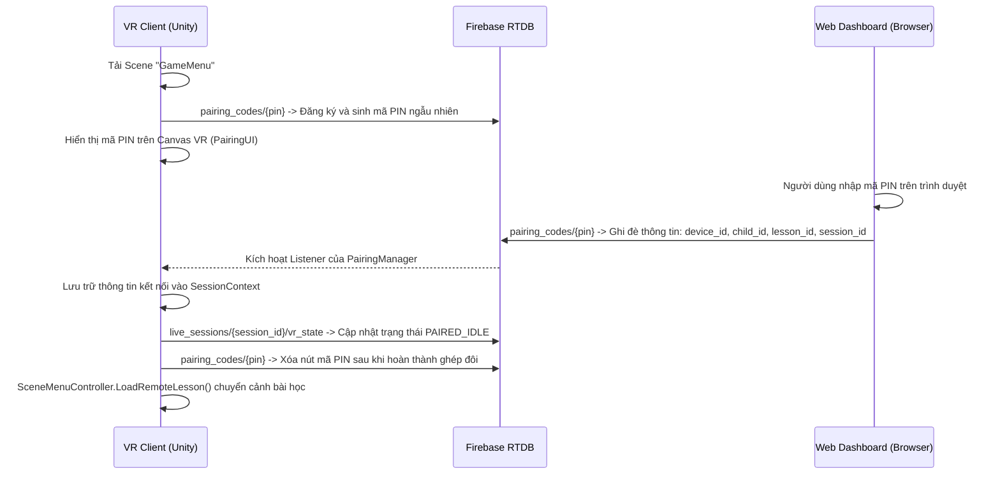
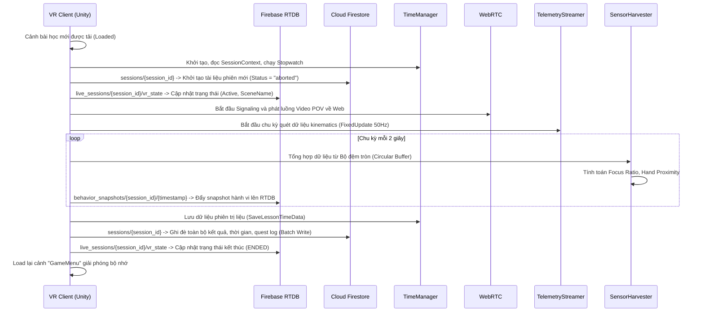
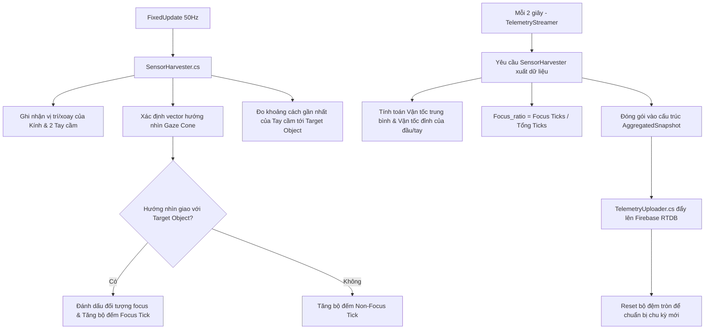
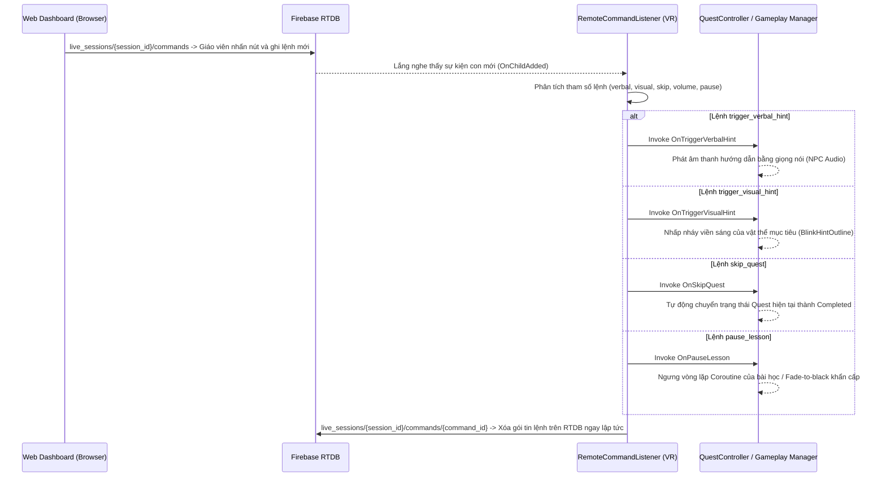

# Kiến Trúc Hệ Thống VR-Autism (Unity Client)
Tài liệu phân tích cấu trúc mã nguồn, vai trò kỹ thuật của từng thành phần và mô tả các luồng nghiệp vụ (workflows) cốt lõi của ứng dụng VR.

---

## 1. Bản Đồ Mã Nguồn & Chức Năng Các Thành Phần

Hệ thống được tổ chức theo mô hình phân lớp rõ ràng nhằm phân tách độc lập giữa **Logic Gameplay (Unity)**, **Xử lý Dữ liệu/Kết nối (Firebase/Cloud)**, và **Hệ thống Cốt lõi (Core)**.

### 1.1 Lớp Cloud & Realtime Database (RTDB)
Nằm tại thư mục `Assets/Project/Scripts/Cloud/`. Chịu trách nhiệm đồng bộ trạng thái, kết nối P2P và ghi nhận log phiên trị liệu về Firestore/RTDB.

*   `FirebaseManager.cs`: Singleton quản lý tích hợp Firebase SDK. Thực hiện khởi tạo cấu trúc phiên (`SessionData`), tích lũy log hành động (`QuestLogData`), và thực hiện cơ chế ghi dữ liệu hàng loạt (Batch Write) lên Cloud Firestore khi kết thúc phiên nhằm tối ưu hóa số lượng truy vấn.
*   `FirebasePaths.cs`: Chứa các hằng số định nghĩa đường dẫn tĩnh (static paths) cho các Document và Collection trên Firestore và các Node trên RTDB.
*   `SessionSyncTracker.cs`: Cầu nối trung gian (Bridge) lắng nghe các sự kiện hoạt động của Quest/Quiz để phát tín hiệu cập nhật chỉ số Quest hiện tại về lớp RTDB.
*   `Models/SessionData.cs`: Lớp mô hình dữ liệu (Data Model) đại diện cho một phiên chạy trị liệu lưu trữ trên Firestore. Bao gồm: ID phiên, ID trẻ, thông tin bài học, kết quả đánh giá (score), thời gian bắt đầu/kết thúc, trạng thái hoàn thành (`aborted`/`completed`) và mảng quest log chi tiết.
*   `Models/QuestLogData.cs`: Cấu trúc lưu trữ dữ liệu của từng quest: ID Quest, thời gian phản hồi (response time), trạng thái hoàn thành, số lượng gợi ý dạng nói (verbal), gợi ý trực quan (visual) và gợi ý vật lý (physical).
*   `Models/PairingData.cs`: Mô hình ánh xạ dữ liệu ghép đôi qua RTDB bao gồm thiết bị kết nối, trạng thái ghép đôi, thông tin bài học được chọn, và ID phiên kết nối.
*   `RTDB/RTDBConnection.cs`: Quản lý kết nối trung tâm và giữ tham chiếu đến Firebase Database Reference.
*   `RTDB/PairingManager.cs`: Máy trạng thái (State Machine) quản lý quy trình ghép đôi mã PIN ( PIN Pairing). Sinh mã PIN 6 số, lắng nghe sự thay đổi trên node `pairing_codes/{pin}` để hoàn thành kết nối giữa Web Dashboard và VR Client.
*   `RTDB/LiveSessionReporter.cs`: Đồng bộ hóa trạng thái ứng dụng VR lên RTDB (`live_sessions/{session_id}/vr_state`) bao gồm trạng thái kết nối, trạng thái WebRTC, trạng thái bài học hiện tại để phục vụ tính năng giám sát thời gian thực trên Web.
*   `RTDB/RemoteCommandListener.cs`: Lắng nghe lệnh điều khiển thời gian thực từ giáo viên gửi qua RTDB (`live_sessions/{session_id}/commands`), thực hiện phân tách các lệnh như kích hoạt gợi ý (`trigger_verbal_hint`/`trigger_visual_hint`), tạm dừng (`pause_lesson`), bỏ qua bước (`skip_quest`), điều hòa âm lượng (`set_volume`) và chuyển tiếp lệnh bằng các C# Static Events (`OnTriggerVerbalHint`, `OnTriggerVisualHint`, `OnSkipQuest`, `OnPauseLesson`, `OnResumeLesson`, etc.) để các Controller trong phân cảnh xử lý. Hỗ trợ phím tắt Editor (H = Visual Hint, V = Verbal Hint, S = Skip, P = Pause, R = Resume).
*   `RTDB/TelemetryUploader.cs`: Cung cấp chức năng Đẩy các gói dữ liệu hành vi đã được tổng hợp (`AggregatedSnapshot`) lên node `behavior_snapshots/{session_id}/{timestamp}` định kỳ mỗi 2 giây.
*   `RTDB/WebRTCManager.cs`: Thiết lập và quản lý vòng đời kết nối WebRTC Peer-to-Peer nội bộ (LAN) để truyền video góc nhìn thứ nhất (POV Streaming) từ kính về Web Dashboard. Điều khiển luồng khởi tạo, tắt kết nối và cơ chế thử lại (retry) tối đa 3 lần.
*   `RTDB/WebRTCSignaling.cs`: Xử lý quá trình trao đổi tín hiệu (Offer, Answer, ICE Candidates) giữa Web Dashboard và VR Client thông qua RTDB làm trung gian truyền tải gói tin SDP.

### 1.2 Hệ Thống Cốt Lõi (Core Systems)
Nằm tại thư mục `Assets/Project/Scripts/Core/`. Cung cấp hạ tầng xử lý sự kiện, đo đạc dữ liệu kinematics và quản lý tài nguyên âm thanh.

*   `Manager/TimeManager.cs`: Singleton đo đạc thời gian chính xác của phiên và từng Quest thông qua lớp `System.Diagnostics.Stopwatch`. Kích hoạt luồng Firebase Firestore, RTDB và WebRTC POV khi tải cảnh bài học mới, tính toán chính xác thời gian phản hồi (`responseTime`) của trẻ.
*   `Manager/SessionContext.cs`: Lớp lưu trữ thông tin phiên hiện tại (Session ID, Child ID, Lesson ID, Host ID) tồn tại xuyên suốt qua các Scene (`DontDestroyOnLoad`).
*   `Models/LessonParameters.cs`: Tham số cấu hình bài học động, cho phép ghi đè từ Firestore (Story 2.3). Thiết kế theo mô hình **Composition (Thành phần)** phân rã thành 3 lớp con chuyên biệt (`Actions`, `Quiz`, `Exploration`) giúp tách biệt biến cấu hình cho từng loại bài học, đồng thời tương thích hoàn hảo với cơ chế Serialization mặc định của Unity/Firestore.
*   `Manager/SoundManager.cs`: Quản lý tài nguyên âm thanh động vật, nhạc nền và các đoạn lồng tiếng hướng dẫn. Lắng nghe tín hiệu âm thanh thông qua `EventChannel.cs`.
*   `Observer/EventChannel.cs`: Hệ thống phát và đăng ký sự kiện trung tâm dạng Pub/Sub dựa trên kiểu Enum `EventID`. Giúp tách biệt hoàn toàn sự phụ thuộc trực tiếp (decoupling) giữa các hệ thống âm thanh, tương tác 3D và lớp mạng Cloud.
*   `Events/BooleanVariable.cs`, `IntVariable.cs`, `DoubleVariable.cs`: Các biến trạng thái dựa trên nền tảng ScriptableObject, hoạt động như các kênh chia sẻ dữ liệu dùng chung (ví dụ: cờ báo hoàn thành điều kiện kịch bản của Quest).
*   `BaseSO.cs`: Lớp cơ sở (Base Class) cho các ScriptableObject cấu hình, định nghĩa mã định danh ID duy nhất toàn hệ thống.
*   `Utils/TimeUtils.cs`: Cung cấp các tiện ích xử lý định dạng thời gian và lấy mốc thời gian hệ thống dạng UNIX timestamp.
*   `Telemetry/TelemetryStreamer.cs`: Bộ đếm thời gian coroutine thực hiện kích hoạt tiến trình thu hoạch và đẩy dữ liệu kinematic từ thiết bị VR lên RTDB theo tần suất cố định (2.0s).
*   `Telemetry/SensorHarvester.cs`: Bộ thu hoạch dữ liệu vật lý chạy trong chu kỳ `FixedUpdate` (50Hz) để ghi nhận tọa độ, vận tốc, gia tốc góc của Đầu (Head Tracker) và 2 Tay cầm (Hand Controller). Tính toán các chỉ số hành vi như tỉ lệ hội tụ ánh nhìn (`focus_ratio`), khoảng cách tiệm cận tay (`hand_near_ratio`), và đối tượng đang tập trung nhìn (`focus_object`) thông qua cấu trúc bộ đệm tròn (Circular Buffer) không cấp phát rác bộ nhớ (Zero GC Alloc).
*   `Models/AggregatedSnapshot.cs`: Mô hình dữ liệu nén tổng hợp các chỉ số kinematic để gửi lên Cloud.

### 1.3 Lớp Gameplay & Điều Phối Kịch Bản (Actions)
Nằm tại thư mục `Assets/Project/Scripts/Gameplay/`. Triển khai cụ thể kịch bản và cách thức tương tác của trẻ.

#### Gameplay Actions Controllers:
*   `Actions/Controllers/ActionManager.cs`: Điều phối chuỗi kịch bản tuyến tính của bài học dạng **Actions (Thực hành)**. Sử dụng một vòng lặp coroutine để duyệt qua danh sách các `ActionEvent` được cấu hình sẵn trong Inspector, kiểm soát thời gian trễ và các điều kiện kích hoạt.
*   `Actions/Controllers/IQuestFlowController.cs`: Giao diện tối giản định nghĩa luồng điều khiển Quest mà các lớp Quest con có thể nhìn thấy để báo cáo trạng thái hoàn thành Quest (`CompleteActiveQuest`) và truy xuất Quest đang hoạt động (`GetCurQuest`), đảm bảo nguyên lý thiết kế ISP (Interface Segregation Principle).
*   `Actions/Controllers/QuestController.cs`: Bộ điều phối trung tâm của các Quest trong phân cảnh. Theo dõi va chạm vật lý giữa trẻ (tay cầm) và Collider nhiệm vụ, quản lý trạng thái kích hoạt, tính toán chu kỳ gợi ý/nhắc nhở tự động, xử lý ghi đè tham số bài học động và quản lý chuyển đổi giữa các bước kịch bản.
*   `Actions/Controllers/QuestRemoteBridge.cs`: Thành phần cầu nối trung gian, đăng ký và lắng nghe sự kiện từ xa từ `RemoteCommandListener` (như bỏ qua nhiệm vụ `OnSkipQuest`, gợi ý âm thanh `OnTriggerVerbalHint`, gợi ý ánh sáng `OnTriggerVisualHint`) và chuyển tiếp cuộc gọi đến các phương thức xử lý trong `QuestController`.
*   `Actions/Controllers/QuestUIController.cs`: Quản lý hiển thị các thành phần giao diện 3D world-space trong màn chơi như bong bóng câu hỏi (Question Bubble), thanh tiến trình khi bé nhấn giữ (Quest Progress Bar) và UI chúc mừng khi hoàn thành nhiệm vụ, dựa trên việc đăng ký các sự kiện tương tác (`OnUIStarted`, `OnUIProgressChanged`, `OnUIFinished`) của Quest.
*   `Actions/Controllers/TutorialController.cs`: Điều phối chuỗi hướng dẫn (Tutorial) ban đầu cho trẻ thông qua việc phát các đoạn Timeline ngắn (`PlayableDirector`) giới thiệu cách thức tương tác.

#### Gameplay Actions Models & UI:
*   `Actions/Models/ActionEvent.cs`: Lớp mô hình dữ liệu chứa thông tin của một bước kịch bản (tên, trạng thái kích hoạt, thời gian trễ, sự kiện `onStart`/`onFinished` và liên kết điều kiện logic `BooleanVariable`).
*   `Actions/Models/Quest.cs`: Lớp cơ sở trừu tượng (abstract base class) định nghĩa cấu trúc của một nhiệm vụ tương tác vật lý trong VR. Lưu trữ cấu hình ID, tên, thời lượng, âm thanh gợi ý, các UnityEvents và quản lý hiển thị viền phát sáng (`Outline`) hỗ trợ trẻ định vị vật thể.
*   `Actions/Models/TouchQuest.cs`: Kế thừa từ `Quest`, đại diện cho nhiệm vụ tương tác một chạm đơn giản (Click/Touch), tự động hoàn thành ngay khi nhận được tín hiệu bắt đầu tương tác vật lý.
*   `Actions/Models/HoldTouchQuest.cs`: Kế thừa từ `Quest`, đại diện cho nhiệm vụ yêu cầu bé phải chạm và nhấn giữ vật thể trong một khoảng thời gian nhất định (Duration). Tính toán tiến trình (`progress`) tăng dần theo thời gian thực và kích hoạt các sự kiện cập nhật UI tương ứng trước khi báo cáo hoàn thành.
*   `Actions/UI/QuestProgressUI.cs`: Quản lý hiển thị thanh tiến trình (ProgressBar) dạng 3D world-space nổi bên cạnh vật thể khi trẻ tương tác dạng nhấn giữ (HoldTouch).

*   `Quizzes/Controllers/QuizController.cs`: Điều phối các bài học dạng **Quizzes (Trắc nghiệm)**. Nhận sự kiện chọn câu trả lời từ giao diện, đối chiếu tính đúng sai, phát âm thanh chúc mừng/sửa sai, chuyển tiếp câu hỏi và kích hoạt kết thúc bài học.
*   `Quizzes/Models/QuizConfig.cs`: ScriptableObject lưu trữ danh sách các câu hỏi trắc nghiệm cùng với tham chiếu trực tiếp đến các Prefab mô hình 3D tương ứng.
*   `Quizzes/Models/QuizQuestionData.cs`: Lớp lưu trữ cấu trúc câu hỏi, đáp án, đáp án đúng và khóa định danh mô hình 3D.
*   `Quizzes/UI/QuizUIController.cs`: Quản lý Canvas 3D trong không gian ảo hiển thị câu hỏi, các nút bấm đáp án và trạng thái đúng sai.
*   `Exploration/AnimalLessonManager.cs`: Điều khiển kịch bản bài học dạng **Exploration (Tham quan thụ động)**. Sử dụng Coroutine điều khiển camera di chuyển qua lại giữa các chuồng thú bằng phương thức Lerp, phối hợp phát âm thanh giới thiệu và tiếng kêu động vật tương ứng theo mốc thời gian hardcode.
*   `WaitingArea/SceneMenuController.cs`: Lớp điều khiển phòng chờ (Lobby). Lắng nghe sự kiện tải bài học từ `PairingManager`, truy vấn thông tin Metadata bài học từ Firestore qua ID được truyền và chuyển cảnh (`SceneManager.LoadScene`).

### 1.4 Thực Thể & Trình Nhận Diện Giọng Nói
Nằm tại thư mục `Assets/Project/Scripts/Entities/` và `Assets/Project/Scripts/Player/`.

*   `NPC/NPCController.cs`: Lớp điều khiển các nhân vật ảo hỗ trợ (như chú gấu chỉ dẫn). Đếm số lần gợi ý và phát âm thanh chỉ dẫn tương ứng.
*   `Player/Player/SpeechResponser.cs`: Hệ thống theo dõi khoảng lặng (silence timeout). Nếu trẻ im lặng và không tương tác quá `timeBeforePrompt` giây, hệ thống sẽ tự động kích hoạt gợi ý chỉ dẫn của giáo viên/NPC.
*   `Player/Player/ReminderData.cs`: ScriptableObject chứa tập hợp các clip âm thanh nhắc nhở.

---

## 2. Luồng Nghiệp Vụ Hệ Thống (Workflows)

### 2.1 Luồng Khởi Tạo & Ghép Đôi Kính (PIN Pairing Handshake)

```mermaid
sequenceDiagram
    participant VR as VR Client (Unity)
    participant RTDB as Firebase RTDB
    participant Web as Web Dashboard (Browser)
    
    VR->>VR: Tải Scene "GameMenu"
    VR->>RTDB: pairing_codes/{pin} -> Đăng ký và sinh mã PIN ngẫu nhiên
    VR->>VR: Hiển thị mã PIN trên Canvas VR (PairingUI)
    Web->>Web: Người dùng nhập mã PIN trên trình duyệt
    Web->>RTDB: pairing_codes/{pin} -> Ghi đè thông tin: device_id, child_id, lesson_id, session_id
    RTDB-->>VR: Kích hoạt Listener của PairingManager
    VR->>VR: Lưu trữ thông tin kết nối vào SessionContext
    VR->>RTDB: live_sessions/{session_id}/vr_state -> Cập nhật trạng thái PAIRED_IDLE
    VR->>RTDB: pairing_codes/{pin} -> Xóa nút mã PIN sau khi hoàn thành ghép đôi
    VR->>VR: SceneMenuController.LoadRemoteLesson() chuyển cảnh bài học
```

### 2.2 Luồng Vòng Đời Phiên Trị Liệu & Stream Dữ Liệu (Session Lifecycle & Telemetry)

```mermaid
sequenceDiagram
    participant VR as VR Client (Unity)
    participant RTDB as Firebase RTDB
    participant FS as Cloud Firestore
    
    VR->>VR: Cảnh bài học mới được tải (Loaded)
    VR->>TimeManager: Khởi tạo, đọc SessionContext, chạy Stopwatch
    VR->>FS: sessions/{session_id} -> Khởi tạo tài liệu phiên mới (Status = "aborted")
    VR->>RTDB: live_sessions/{session_id}/vr_state -> Cập nhật trạng thái (Active, SceneName)
    VR->>WebRTC: Bắt đầu Signaling và phát luồng Video POV về Web
    VR->>TelemetryStreamer: Bắt đầu chu kỳ quét dữ liệu kinematics (FixedUpdate 50Hz)
    
    loop Chu kỳ mỗi 2 giây
        VR->>SensorHarvester: Tổng hợp dữ liệu từ Bộ đệm tròn (Circular Buffer)
        SensorHarvester->>SensorHarvester: Tính toán Focus Ratio, Hand Proximity
        VR->>RTDB: behavior_snapshots/{session_id}/{timestamp} -> Đẩy snapshot hành vi lên RTDB
    end
    
    VR->>TimeManager: Lưu dữ liệu phiên trị liệu (SaveLessonTimeData)
    VR->>FS: sessions/{session_id} -> Ghi đè toàn bộ kết quả, thời gian, quest log (Batch Write)
    VR->>RTDB: live_sessions/{session_id}/vr_state -> Cập nhật trạng thái kết thúc (ENDED)
    VR->>VR: Load lại cảnh "GameMenu" giải phóng bộ nhớ
```

### 2.3 Luồng Thu Hoạch & Tổng Hợp Telemetry (Kinematics Aggregation Pipeline)

```mermaid
graph TD
    A[FixedUpdate 50Hz] --> B[SensorHarvester.cs]
    B --> C[Ghi nhận vị trí/xoay của Kính & 2 Tay cầm]
    B --> D[Xác định vector hướng nhìn Gaze Cone]
    D --> E{Hướng nhìn giao với Target Object?}
    E -- Có --> F[Đánh dấu đối tượng focus & Tăng bộ đếm Focus Tick]
    E -- Không --> G[Tăng bộ đếm Non-Focus Tick]
    B --> H[Đo khoảng cách gần nhất của Tay cầm tới Target Object]
    
    I[Mỗi 2 giây - TelemetryStreamer] --> J[Yêu cầu SensorHarvester xuất dữ liệu]
    J --> K[Tính toán Vận tốc trung bình & Vận tốc đỉnh của đầu/tay]
    J --> L[Focus_ratio = Focus Ticks / Tổng Ticks]
    J --> M[Đóng gói vào cấu trúc AggregatedSnapshot]
    M --> N[TelemetryUploader.cs đẩy lên Firebase RTDB]
    N --> O[Reset bộ đệm tròn để chuẩn bị chu kỳ mới]
```

### 2.4 Luồng Xử Lý Lệnh Điều Khiển Từ Xa (Remote Control Command Bridge)

```mermaid
sequenceDiagram
    participant Web as Web Dashboard (Browser)
    participant RTDB as Firebase RTDB
    participant Listener as RemoteCommandListener (VR)
    participant Gameplay as QuestController / Gameplay Manager
    
    Web->>RTDB: live_sessions/{session_id}/commands -> Giáo viên nhấn nút và ghi lệnh mới
    RTDB-->>Listener: Lắng nghe thấy sự kiện con mới (OnChildAdded)
    Listener->>Listener: Phân tích tham số lệnh (verbal, visual, skip, volume, pause)
    
    alt Lệnh trigger_verbal_hint
        Listener->>Gameplay: Invoke OnTriggerVerbalHint
        Gameplay-->>Gameplay: Phát âm thanh hướng dẫn bằng giọng nói (NPC Audio)
    else Lệnh trigger_visual_hint
        Listener->>Gameplay: Invoke OnTriggerVisualHint
        Gameplay-->>Gameplay: Nhấp nháy viền sáng của vật thể mục tiêu (BlinkHintOutline)
    else Lệnh skip_quest
        Listener->>Gameplay: Invoke OnSkipQuest
        Gameplay-->>Gameplay: Tự động chuyển trạng thái Quest hiện tại thành Completed
    else Lệnh pause_lesson
        Listener->>Gameplay: Invoke OnPauseLesson
        Gameplay-->>Gameplay: Ngưng vòng lặp Coroutine của bài học / Fade-to-black khẩn cấp
    end
    
    Listener->>RTDB: live_sessions/{session_id}/commands/{command_id} -> Xóa gói tin lệnh trên RTDB ngay lập tức
```

### 2.5 Cơ Chế Vận Hành Chi Tiết Của 3 Dạng Bài Học (Execution Models)

#### 1. Dạng bài Actions (Thực hành hành vi)
*   **Thành phần vận hành:** `ActionManager` (Điều phối kịch bản chung) ➔ `QuestController` (Quản lý và kích hoạt các Quest) ➔ `IQuestFlowController` (Interface bảo vệ luồng) ➔ `Quest` (Lớp cơ sở trừu tượng tương tác) ➔ `TouchQuest` / `HoldTouchQuest` (Các lớp con tương tác cụ thể) ➔ `QuestUIController` (Quản lý UI).
*   **Vận hành:**
    *   `ActionManager` duyệt qua danh sách `actionEvents`. Khi đến bước yêu cầu trẻ thực hiện nhiệm vụ tương tác, nó gọi `QuestController.StartRunningQuest()`.
    *   `QuestController` xác định đối tượng Quest hiện tại và kích hoạt trạng thái của nó. Đồng thời phối hợp với `QuestUIController` để bật **hiệu ứng viền phát sáng (Outline)** và hiển thị **bong bóng câu hỏi (Question Bubble)** tại vị trí `BubblePosition` cấu hình trên Quest (nếu được bật trong tham số bài học `LessonParameters` tải về).
    *   Trẻ tiến hành tương tác vật lý thông qua tay cầm ảo (Virtual Hand Controller) chạm vào Collider của Quest. Cơ chế tương tác phụ thuộc vào lớp con cụ thể:
        *   **Với `TouchQuest` (Một chạm):** Ngay khi nhận tín hiệu bắt đầu tương tác (`OnStartInteraction`), nó lập tức gọi `controller.CompleteActiveQuest()` để hoàn thành nhiệm vụ mà không yêu cầu thời gian giữ.
        *   **Với `HoldTouchQuest` (Nhấn giữ):** Khi tương tác bắt đầu, nó kích hoạt sự kiện UI và trong mỗi khung hình (`OnUpdateInteraction`), nó tăng chỉ số tiến trình `_progress` dựa trên tỉ lệ thời gian trôi qua so với tổng thời lượng `Duration` yêu cầu. Cập nhật này liên tục phát tín hiệu `OnUIProgressChanged` để `QuestUIController` cập nhật thanh tiến trình 3D `QuestProgressUI` hiển thị trực quan cho trẻ.
    *   Khi điều kiện hoàn thành được thỏa mãn (tiến trình của `HoldTouchQuest` đạt 100% hoặc chạm thành công đối với `TouchQuest`), lớp con sẽ phát sự kiện kết thúc UI và gọi `CompleteActiveQuest` trên interface `IQuestFlowController`.
    *   `QuestController` thực hiện thu dọn (ẩn viền phát sáng, ẩn thanh tiến trình và bong bóng câu hỏi), báo cáo kết quả ghi nhận thời gian phản hồi về `FirebaseManager` để tích lũy dữ liệu, và chuyển tiếp kịch bản `ActionManager` sang bước tiếp theo.

#### 2. Dạng bài Quizzes (Lý thuyết / Nhận diện)
*   **Thành phần vận hành:** `QuizController` ➔ `QuizUIController` ➔ `QuizConfig`.
*   **Vận hành:**
    *   `QuizController` nạp cấu hình câu hỏi từ `QuizConfig` (ScriptableObject).
    *   Hệ thống sinh câu hỏi trên giao diện Canvas 3D ảo (`QuizUIController`) trong phòng, đồng thời khởi tạo mô hình 3D tương ứng của con vật/vật thể cần nhận diện tại tọa độ định sẵn.
    *   Trẻ nghe câu hỏi thuyết minh bằng tiếng nói phát ra từ kính, sau đó sử dụng tay cầm chỉ và chọn đáp án tương ứng trên Canvas 3D.
    *   Khi trẻ chọn đáp án, sự kiện `OnAnswerSelected` gửi về `QuizController`. Hệ thống đối chiếu kết quả:
        *   Nếu đúng: Phát âm thanh chúc mừng, cộng điểm, log trạng thái thành công.
        *   Nếu sai: Phát âm thanh chỉ lỗi sai, yêu cầu trẻ chọn lại (hoặc chuyển câu tùy cấu hình).
    *   Kết thúc chuỗi câu hỏi, hệ thống tiến hành đẩy dữ liệu ghi nhận điểm số về `TimeManager` để thực hiện Batch Write lưu lại lên Firestore.

#### 3. Dạng bài Exploration (Tham quan, thư giãn)
*   **Thành phần vận hành:** `AnimalLessonManager` ➔ `SoundManager`.
*   **Vận hành:**
    *   Trẻ ở trạng thái thụ động (Passive), chỉ cần ngồi yên xem.
    *   `AnimalLessonManager` điều khiển Camera (điểm nhìn của kính) di chuyển trượt tuyến tính (`Lerp`) lần lượt đi qua các vị trí chuồng của từng loài động vật định sẵn.
    *   Tại mỗi chuồng thú, hệ thống tạm dừng camera, kích hoạt bảng tên giới thiệu động vật, phát âm thanh lồng tiếng mô tả thông tin đặc trưng của loài thú đó qua `SoundManager`.
    *   Sau khi phát xong thông tin, hệ thống phát âm thanh tiếng kêu thực tế của con vật để trẻ nhận diện âm thanh, sau đó tắt bảng thông tin và tiếp tục di chuyển camera sang khu vực tiếp theo.
    *   Sau khi tham quan đầy đủ danh sách động vật có trong cảnh bài học, hệ thống tự động lưu kết thúc phiên trị liệu thụ động và đưa trẻ trở lại phòng chờ `GameMenu`.
