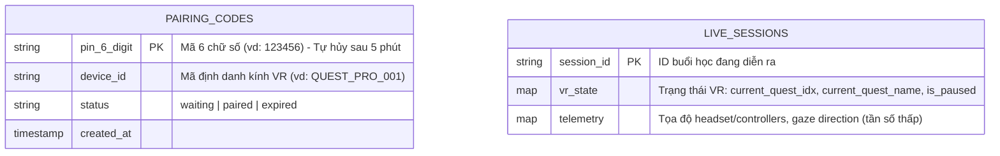

# 🗄️ Kiến trúc Database & Hệ thống dữ liệu (VR-Autism Platform)

> **Mô hình Hybrid Storage**:
> 1. **Cloud Firestore**: Lưu trữ bền vững, cấu trúc tài liệu Flat Top-Level kết hợp Embedded JSON (Maps & Arrays) cho dữ liệu lâm sàng, hồ sơ người dùng, bài học, nhật ký buổi học và phân tích AI.
> 2. **Firebase Realtime Database (RTDB)**: Kênh truyền siêu tốc cho dữ liệu trạng thái tạm thời: Ghép nối mã PIN kính VR (`pairing_codes`), đồng bộ trạng thái buổi học trực tiếp (`live_sessions`).
> *(Lưu ý: Luồng video POV, audio đàm thoại hai chiều và các lệnh can thiệp thời gian thực theo giây được truyền qua kênh RTC DataPacket của LiveKit Room).*

---

## 1. Kiến trúc Cây Dữ liệu Cloud Firestore (Live Data Schema)

Hệ thống được thiết kế theo nguyên tắc **Flat Top-Level Collections with References** (12 Collections ngang hàng). Dữ liệu chi tiết các bước, câu nhắc, mục tiêu hoặc cảnh báo hành vi được nhúng trực tiếp dưới dạng **Embedded Maps / Arrays** bên trong document để tối ưu hóa chi phí đọc (Single Read Query) và tăng tốc độ xử lý cho Kính VR & Web Dashboard.

```mermaid
erDiagram
    %% ── NHÓM PHÂN QUYỀN & TÀI KHOẢN ──────────────────────────
    SYSTEM_ADMINS ||--o{ CENTERS : "tạo & quản lý"
    SYSTEM_ADMINS {
        string uid PK "Firebase Auth UID"
        string name
        string email
        string role "admin"
        string updatedAt
    }

    CENTERS ||--|{ CENTER_MANAGERS : "quản lý trung tâm"
    CENTERS ||--o{ EXPERTS : "nhân sự chuyên gia"
    CENTERS ||--o{ PARENTS : "phụ huynh đăng ký"
    CENTERS ||--o{ CHILD_PROFILES : "quản lý hồ sơ trẻ"
    CENTERS {
        string centerId PK "Mã trung tâm (vd: CT-TQMDC)"
        string name "Tên trung tâm"
        string email
        string address
        string phone
        string ownerUid "UID người tạo"
        array managerUids "Danh sách UID quản lý"
        int totalChildren "Tổng số trẻ"
        int expertCount "Số chuyên gia"
        int sessionCount "Số buổi học"
        string status "Active | Inactive"
        string createdAt
        string updatedAt
    }

    CENTER_MANAGERS {
        string uid PK "Firebase Auth UID"
        string name
        string email
        string centerId FK "Trỏ về centers"
        string role "center"
        string updatedAt
    }

    EXPERTS ||--o{ CHILD_PROFILES : "được phân công phụ trách"
    EXPERTS {
        string uid PK "Firebase Auth UID"
        string name
        string email
        string centerId FK "Trỏ về centers"
        string specialization "Chuyên môn"
        string role "expert"
        string status "Active | Inactive"
        string createdAt
        string updatedAt
    }

    PARENTS ||--o{ CHILD_PROFILES : "liên kết theo dõi con"
    PARENTS {
        string uid PK "Firebase Auth UID"
        string name
        string email
        string centerId FK "Trỏ về centers"
        string role "parent"
        string status "Active | Inactive"
        string createdAt
        string updatedAt
    }

    %% ── HỒ SƠ LÂM SÀNG & BÀI HỌC ────────────────────────────
    CHILD_PROFILES ||--o{ SESSIONS : "lịch sử buổi học"
    CHILD_PROFILES ||--o{ SCHEDULES : "lịch hẹn trị liệu"
    CHILD_PROFILES ||--o{ AI_RECOMMENDATIONS : "gợi ý bài học AI"
    CHILD_PROFILES ||--o{ PARENT_AI_INSIGHTS : "báo cáo tổng hợp phụ huynh"
    CHILD_PROFILES {
        string id PK "Profile Document ID"
        string name "Tên của trẻ"
        int age "Tuổi"
        string gender "male | female"
        string condition "Tình trạng (vd: ASD - Mức độ 1)"
        string centerId FK "Thuộc trung tâm"
        string expertUid FK "Chuyên gia phụ trách chính"
        array expertUids "Danh sách chuyên gia được phân quyền"
        string parentUid FK "UID phụ huynh liên kết"
        string linkCode "Mã 6 ký tự để phụ huynh liên kết"
        string linkCodeExpires "Thời hạn mã liên kết"
        boolean linkCodeUsed "Trạng thái đã liên kết"
        string diagnosis_notes "Ghi chú chẩn đoán lâm sàng"
        int sound_sensitivity "Độ nhạy cảm âm thanh (1-5)"
        int attention_span_min "Khả năng tập trung (phút)"
        float height_cm "Chiều cao (cm) định cỡ VR"
        float weight_kg "Cân nặng (kg)"
        array anxiety_triggers "Tác nhân gây lo âu/kích thích"
        map default_lesson_params "Cấu hình VR (actions, quiz, exploration)"
        map quick_phrases "Câu nhắc nhanh phân theo bài học & quest"
        array goals "Mục tiêu trị liệu (Embedded Objects)"
        int sessionCount "Tổng số buổi đã thực hiện"
        string lastSessionAt "Ngày học gần nhất"
        string status "Active | Inactive"
        string createdAt
        string updatedAt
    }

    LESSONS ||--o{ SESSIONS : "nội dung thực hiện"
    LESSONS {
        string lesson_id PK "Mã bài học (vd: WashingHand_1, Farm_Quiz_1)"
        string lesson_name "Tên bài học"
        string level_name "Tên cấp độ"
        int lesson_index "Thứ tự bài học"
        int level_index "Thứ tự cấp độ"
        string level_id "ID cấp độ"
        string type "theoretical | practical"
        string scene_name "Tên Scene trong Unity"
        string scenario "Kịch bản"
        string description "Mô tả chi tiết"
        int min_age "Độ tuổi tối thiểu"
        int duration_min "Thời lượng dự kiến (phút)"
        string thumbnail_url "Ảnh đại diện"
        string difficulty_level "Dễ | Trung bình | Khó"
        string prerequisites "Điều kiện tiên quyết"
        array target_skills "Các kỹ năng rèn luyện"
        array quests "Danh sách quest định nghĩa (Embedded Objects)"
        string updatedAt
    }

    %% ── NHẬT KÝ & TRUYỀN THÔNG ──────────────────────────────
    SESSIONS {
        string session_id PK "ID buổi học"
        string child_profile_id FK "Trỏ về child_profiles"
        string hosted_by FK "Trỏ về experts (UID người host)"
        string lesson_id FK "Trỏ về lessons"
        string lesson_name "Tên bài học"
        string level_name "Tên cấp độ"
        int level_index "Index cấp độ"
        string device_id "Mã kính VR (vd: QUEST_PRO_001)"
        string type "practical | theoretical"
        int score "Điểm số đạt được"
        float duration "Thời lượng (giây)"
        string start_time "ISO 8601"
        string finish_time "ISO 8601"
        string completion_status "success | aborted | timeout"
        string video_url "Link video ghi hình (nếu có)"
        string evaluation "Đánh giá của chuyên gia"
        array quest_logs "Nhật ký từng bước quest (Embedded Objects)"
        array auto_alerts "Cảnh báo hành vi phát hiện tự động (Embedded)"
        array behavior_logs "Nhật ký hành vi ghi nhận thêm"
        string updatedAt
    }

    SCHEDULES {
        string scheduleId PK
        string childId FK "Trỏ về child_profiles"
        string expertUid FK "Trỏ về experts"
        string lessonId FK "Trỏ về lessons"
        int dayOfWeek "Ngày trong tuần (0-6)"
        int startHour "Giờ bắt đầu"
        int startMinute "Phút bắt đầu"
        int durationMinutes "Thời lượng (phút)"
        string color "Mã màu hiển thị lịch"
        string createdAt
        string updatedAt
    }

    MESSAGES {
        string messageId PK
        string roomId "ID phòng chat"
        array participants "UID các bên tham gia [expertUid, parentUid]"
        string senderId FK
        string receiverId FK
        string childId FK "Trỏ về child_profiles liên quan"
        string content "Nội dung tin nhắn"
        string timestamp "ISO 8601"
        boolean read "Trạng thái đã đọc"
    }

    AI_RECOMMENDATIONS {
        string childId PK "Trỏ về child_profiles (1:1)"
        string model "Mô hình AI (vd: gemini-2.5-flash)"
        string summary "Tóm tắt đánh giá tổng quan"
        array recommendations "Danh sách bài học đề xuất (Embedded)"
        array basedOnSessionIds "Danh sách Session IDs làm căn cứ"
        string status "draft | approved"
        boolean insufficientData "Trạng thái chưa đủ dữ liệu"
        boolean isDemo "Chế độ chạy Demo"
        string generatedAt "ISO 8601"
        string generatedBy "UID hoặc hệ thống"
    }

    PARENT_AI_INSIGHTS {
        string childId PK "Trỏ về child_profiles"
        string goodNews "Điểm sáng, tiến bộ của con"
        string areasOfConcern "Điểm cần lưu ý và hỗ trợ"
        array basedOnSessionIds "Session IDs dùng để phân tích"
        boolean isDemo
        string generatedAt "ISO 8601"
    }
```



---

## 2. Chi tiết Cấu trúc Tầng Lồng Dữ liệu (Deep Nested Schema)

### 2.1. Cấu trúc `quick_phrases` (trong `child_profiles`)
Map theo từng bài học chứa danh sách các câu nhắc thoại nhanh mà chuyên gia có thể bấm trên Web Dashboard để kính VR phát audio:

```json
{
  "quick_phrases": {
    "general": [
      {
        "quest_name": "General",
        "phrases": [
          "Bé làm tốt lắm!",
          "Cố lên con nhé!",
          "Nhìn theo hướng này này con."
        ]
      }
    ],
    "WashingHand_1": [
      {
        "quest_name": "Bật vòi nước",
        "phrases": [
          "Con hãy chạm tay vào cần gạt vòi nước nhé.",
          "Mở nước ra nào con."
        ]
      },
      {
        "quest_name": "Lấy xà phòng",
        "phrases": [
          "Nhấn nút lấy xà phòng đi con.",
          "Xoa đều bọt xà phòng lên tay nhé."
        ]
      }
    ],
    "Farm_Quiz_1": [
      {
        "quest_name": "Quiz_Q1",
        "phrases": [
          "Con nhìn xem đây là con gì nào.",
          "Chỉ vào con vật đúng đi con."
        ]
      }
    ]
  }
}
```

### 2.2. Cấu trúc `default_lesson_params` (trong `child_profiles`)
Tham số hiệu chỉnh môi trường VR riêng cho từng trẻ:

```json
{
  "default_lesson_params": {
    "actions": {
      "enable_auto_hint": true,
      "enable_visual_guidance": true,
      "enable_bubble_hints": true,
      "speech_silence_timeout": -1,
      "action_reminder_cycle": 10,
      "gaze_cone_angle": 10
    },
    "quiz": {
      "quiz_intro_delay": -1,
      "quiz_sound_gap": -1,
      "quiz_end_delay": -1
    },
    "exploration": {
      "camera_move_speed": 4,
      "sound_to_description_gap": -1
    }
  }
}
```

### 2.3. Cấu trúc `quest_logs` & `auto_alerts` (trong `sessions`)
Dữ liệu chi tiết từng Quest và cảnh báo được kính VR ghi nhận và đồng bộ lên Cloud khi kết thúc buổi:

```json
{
  "quest_logs": [
    {
      "index": 0,
      "quest_name": "Bật vòi nước",
      "response_time": 7.55,
      "response_time_from_hint": -1.0,
      "hints_verbal": 1,
      "hints_visual": 0,
      "hints_physical": 0,
      "completion_status": "success"
    }
  ],
  "auto_alerts": [
    {
      "id": "stimming_1778418060748",
      "type": "stimming",
      "group": "distraction",
      "quest_index": 0,
      "severity": "high",
      "time_offset": 4.1,
      "duration_sec": 2.0,
      "message": "Lắc đầu mạnh (Stimming / Meltdown)",
      "auto_detected": true,
      "suppressed": false,
      "note": ""
    }
  ]
}
```

### 2.4. Cấu trúc `recommendations` (trong `ai_recommendations`)
Danh sách bài học được Gemini AI phân tích dựa trên lịch sử buổi học:

```json
{
  "recommendations": [
    {
      "lessonId": "Farm_Quiz_1",
      "lessonTitle": "Nhận biết động vật nông trại",
      "levelName": "Cơ bản",
      "type": "theoretical",
      "targetSkill": "Nhận thức con vật, Phản hồi câu hỏi",
      "priority": "high",
      "confidence": 0.95,
      "reason": "Trẻ đã hoàn thành tốt bài khám phá, cần bài kiểm tra nhận biết để củng cố phản xạ.",
      "expectedBenefit": "Rèn luyện khả năng lựa chọn và phản hồi câu hỏi.",
      "specialistNotes": "Theo dõi độ nhạy âm thanh khi phát câu hỏi.",
      "thumbnailUrl": "https://firebasestorage.googleapis.com/...",
      "sceneName": "Farm-Quiz",
      "difficultyLevel": "Trung bình"
    }
  ]
}
```

---

## 3. Firebase Realtime Database (RTDB – Dữ liệu Tạm thời / Volatile)

Firebase Realtime Database chỉ phụ trách lưu giữ các trạng thái tạm thời có tần suất đọc/ghi cao và xóa tự động:



> **Lưu ý Kiến trúc RTC**: Mọi luồng truyền Video POV (720p 30fps), Audio đàm thoại AI NPC, và các gói tin sự kiện Quest thời gian thực (`SET_ACTIVE_QUEST`, `QUEST_MATCHED`, `VERBAL_HINT`, `SPEAK_SCRIPT`, `ON_REMINDER`, `QUEST_STATUS`) được truyền trực tiếp qua **LiveKit RTC Room DataChannel**, không đẩy qua RTDB để đảm bảo độ trễ dưới 50ms.

---

## 4. Luồng Phân quyền & Khởi tạo Tài khoản (Provisioning Flow)

Hệ thống hoạt động theo mô hình B2B phân cấp chặt chẽ:

```mermaid
sequenceDiagram
    autonumber
    actor Admin as System Admin
    actor Manager as Center Manager
    actor Expert as Chuyên gia / GV
    actor Parent as Phụ huynh
    participant Auth as Firebase Auth
    participant FS as Cloud Firestore

    Note over Admin,FS: 1. Khởi tạo Trung tâm & Quản lý
    Admin->>FS: Tạo Document trong centers (centerId)
    Admin->>Auth: Tạo tài khoản Manager + Gán Claims {role: "center", centerId}
    Admin->>FS: Tạo Document trong center_managers

    Note over Manager,FS: 2. Cấp phát Nhân sự & Hồ sơ trẻ
    Manager->>Auth: Tạo tài khoản Expert + Gán Claims {role: "expert", centerId}
    Manager->>FS: Tạo Document trong experts
    Manager->>FS: Tạo Hồ sơ trong child_profiles (sinh linkCode)

    Note over Manager,FS: 3. Phụ huynh liên kết hồ sơ
    Manager->>Auth: Tạo tài khoản Phụ huynh + Gán Claims {role: "parent"}
    Manager->>FS: Tạo Document trong parents
    Parent->>FS: Nhập linkCode để liên kết parentUid vào child_profiles

    Note over Expert,FS: 4. Phân công & Vận hành buổi học
    Manager->>FS: Gán expertUid/expertUids vào child_profiles
    Expert->>FS: Đọc hồ sơ trẻ được phân công, cấu hình quick_phrases & bắt đầu Session
