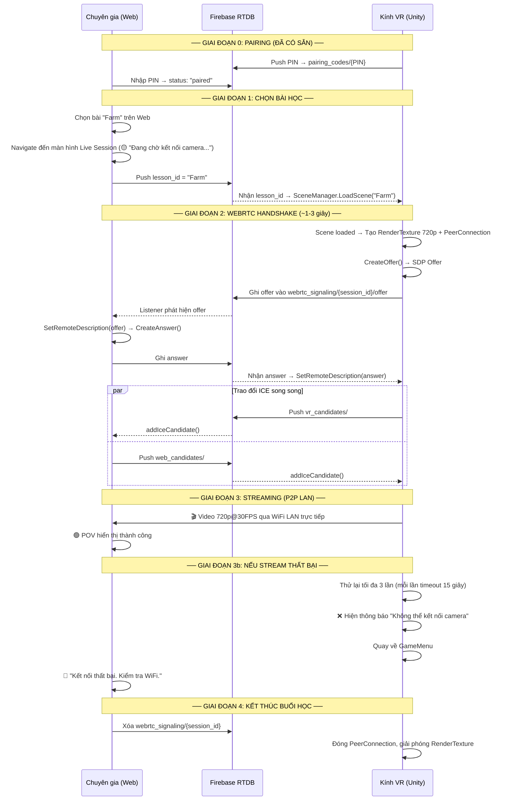

# 🎬 Thiết kế Hệ thống POV Stream — WebRTC P2P

> **Trạng thái:** Đã validate qua Brainstorming, sẵn sàng implement  
> **Ngày tạo:** 2026-05-14  
> **Phạm vi áp dụng:** VR App (Unity) + Web Dashboard (Next.js/React)  
> **Phụ thuộc:** Task 2.1 Pairing đã hoàn thành ✅

---

## 1. Tóm tắt Đích đến (Understanding Summary)

- **Sản phẩm:** Hệ thống truyền phát Video góc nhìn người thứ nhất (POV) từ Kính VR lên Web Dashboard theo chuẩn WebRTC Peer-to-Peer.
- **Lý do tồn tại:** Chuyên gia cần nhìn thấy chính xác những gì trẻ đang thấy trong kính VR theo thời gian thực để ra quyết định can thiệp lâm sàng chính xác.
- **Đối tượng phục vụ:** Chuyên gia trị liệu sử dụng Web Dashboard trên Laptop/Tablet, ngồi cạnh trẻ (Co-located).
- **Ràng buộc cốt lõi:**
  - Video đi đường **LAN P2P trực tiếp** (không qua Internet sau khi bắt tay).
  - Không được phép làm giảm FPS của kính VR gây Motion Sickness cho trẻ.
  - **Stream là điều kiện bắt buộc** — Nếu stream thất bại, bài học không được phép bắt đầu, VR quay về GameMenu.
- **Không bao gồm (Non-goals):**
  - Không truyền âm thanh (Audio) — Chuyên gia ngồi cạnh, nghe trực tiếp.
  - Không hướng tới độ phân giải cao (1080p+) — Mục đích giám sát, không phải trải nghiệm.
  - Không xây dựng Signaling Server riêng — Tận dụng Firebase RTDB đã có.

---

## 2. Giả định (Assumptions)

| # | Assumption |
|---|-----------|
| A1 | Kính VR và Laptop của chuyên gia luôn kết nối chung một mạng WiFi (LAN) |
| A2 | Tín hiệu Signaling (SDP + ICE) rất nhẹ (~10-12 lần ghi tổng cộng), Firebase RTDB Spark Plan gánh thoải mái |
| A3 | Package `com.unity.webrtc` hỗ trợ Quest 2/3 (Android ARM64) với Hardware Encoder H264 |
| A4 | RenderTexture 720p@30FPS trên Quest 2/3 không ảnh hưởng đáng kể tới FPS chính (vốn đang render 72-90Hz) |
| A5 | Mỗi buổi học chỉ có duy nhất 1 Kính VR kết nối với 1 Web Dashboard (1:1, không phải 1:N) |

---

## 3. Nhật ký Quyết định (Decision Log)

| # | Vấn đề | Quyết định | Thay thế đã xem xét | Lý do chọn |
|---|--------|-----------|---------------------|-----------| 
| D1 | **Signaling Server** | **Firebase RTDB** | Local WebSocket Server (phải biết IP), Managed Service (tốn tiền + cần Internet) | Tận dụng hạ tầng đã có, cực kỳ nhanh, không cần setup thêm server |
| D2 | **Cấp độ Package** | **`com.unity.webrtc` (cấp thấp)** | `com.unity.renderstreaming` (cấp cao, kèm HTTP Server thừa), Agora/LiveKit (vi phạm LAN P2P) | Toàn quyền kiểm soát codec/bitrate/resolution; không kéo thêm dependency thừa; khớp với Firebase RTDB |
| D3 | **Độ phân giải & FPS** | **720p @ 30FPS, H264, max 1.5 Mbps** | 480p (quá mờ), 1080p (quá nặng cho Quest) | Cân bằng giữa chất lượng giám sát và tài nguyên kính VR |
| D4 | **Audio** | **Tắt hoàn toàn** | Bật Audio track (tốn thêm CPU encode + bandwidth) | Chuyên gia ngồi cạnh trẻ, nghe trực tiếp. Tiết kiệm tối đa tài nguyên |
| D5 | **Stream là bắt buộc hay tùy chọn?** | **Bắt buộc — Không stream = Không học** | Tùy chọn (stream lỗi vẫn cho học tiếp) | Nguyên tắc lâm sàng: Để trẻ tự kỷ ở trong VR mà không có giám sát là rủi ro. Nhất quán với triết lý Thin Client |
| D6 | **Tách nhánh ICE Candidates** | **`vr_candidates/` và `web_candidates/` riêng biệt** | Gộp chung 1 nhánh `candidates` | Mỗi bên chỉ lắng nghe nhánh của bên kia, tránh nhận lại candidate của chính mình |

---

## 4. Kiến trúc Tổng thể

### 4.1 Schema Signaling trên Firebase RTDB

Nhánh mới `webrtc_signaling` nằm song song với `pairing_codes`, `live_sessions`, `behavior_snapshots`:

```
webrtc_signaling/
  {session_id}/
    offer              ← VR đẩy SDP Offer (JSON string, 1 lần duy nhất)
    answer             ← Web đẩy SDP Answer (JSON string, 1 lần duy nhất)
    vr_candidates/
      {push_id}        ← VR đẩy từng ICE Candidate (~3-5 cái)
    web_candidates/
      {push_id}        ← Web đẩy từng ICE Candidate (~3-5 cái)
```

**Vòng đời dữ liệu:**
- Được tạo ngay sau khi VR load Scene bài học thành công.
- Được **xóa sạch** khi buổi học kết thúc (cùng lúc với `live_sessions` và `behavior_snapshots`).

**Tổng lượng ghi Firebase:** ~10-12 lần ghi cho toàn bộ quá trình bắt tay. Sau đó Firebase không liên quan.

---

### 4.2 Giải thích WebRTC cho người mới

WebRTC cần 2 giai đoạn:

**Giai đoạn 1 — Bắt tay (Signaling, ~1-3 giây, qua Firebase RTDB):**
- **SDP (Session Description Protocol):** Hai bên trao đổi "bản lý lịch" — mô tả khả năng (codec, resolution) của mình.
- **ICE Candidate (Interactive Connectivity Establishment):** Hai bên trao đổi "danh sách địa chỉ mạng" của mình (IP LAN, IP công cộng). WebRTC tự động chọn đường nhanh nhất (ưu tiên LAN).

**Giai đoạn 2 — Truyền video (P2P trực tiếp, qua WiFi LAN):**
- Sau khi bắt tay xong, video đi thẳng từ Kính → Laptop qua mạng WiFi nội bộ.
- Firebase RTDB **hoàn toàn không liên quan** trong giai đoạn này.

```
Bắt tay:     VR ──→ Firebase RTDB ──→ Web    (~10 lần ghi, xong trong 1-3 giây)
Streaming:   VR ◄══════════════════► Web     (P2P qua LAN, 30 FPS liên tục)
```

---

## 5. Thiết kế Chi tiết (Component Design)

### 5.1 Phía Unity (Kính VR) — 2 Component mới

#### `WebRTCSignaling.cs`
**Trách nhiệm:** Đọc/Ghi tín hiệu bắt tay qua Firebase RTDB. Không biết gì về Video.

**API chính:**
```
+ InitiateSignaling(sessionId: string)
    → Ghi SDP Offer lên RTDB
    → Lắng nghe Answer từ Web
    → Lắng nghe web_candidates/
    → Push ICE Candidates của VR lên vr_candidates/

+ Cleanup()
    → Xóa nhánh webrtc_signaling/{session_id}
    → Ngắt tất cả listener

Events:
  → OnAnswerReceived(sdpAnswer)       // Chuyển cho WebRTCStreamer
  → OnIceCandidateReceived(candidate) // Chuyển cho WebRTCStreamer
  → OnSignalingFailed()               // Timeout, không nhận được Answer
```

#### `WebRTCStreamer.cs`
**Trách nhiệm:** Bắt hình ảnh từ Camera VR, tạo kết nối P2P, truyền Video. Không biết gì về Firebase.

**API chính:**
```
+ StartStreaming(camera: Camera)
    → Tạo RenderTexture 720p
    → Gắn RenderTexture vào Camera (targetTexture)
    → Tạo VideoStreamTrack từ RenderTexture
    → Tạo RTCPeerConnection (ICE config: STUN Google làm fallback)
    → Thêm VideoTrack vào PeerConnection
    → CreateOffer() → trả SDP Offer cho Signaling

+ SetRemoteAnswer(sdpAnswer)
    → SetRemoteDescription(answer)

+ AddIceCandidate(candidate)
    → peerConnection.AddIceCandidate(candidate)

+ StopStreaming()
    → Đóng PeerConnection
    → Giải phóng RenderTexture
    → Gỡ targetTexture khỏi Camera

Events:
  → OnLocalIceCandidate(candidate)    // Chuyển cho WebRTCSignaling
  → OnStreamConnected()               // P2P thành công
  → OnStreamDisconnected()            // Mất kết nối
```

**Cấu hình Encoder:**
- Codec: H264 (Hardware Encoder trên Quest)
- Resolution: 1280×720
- Frame Rate: 30 FPS
- Max Bitrate: 1.5 Mbps

---

### 5.2 Phía Web Dashboard (React/Next.js) — 2 Module mới

#### `useWebRTCSignaling` (Custom React Hook)
**Trách nhiệm:** Phản hồi tín hiệu bắt tay từ Firebase RTDB.

```typescript
useWebRTCSignaling(sessionId: string) → {
  signalingState: 'idle' | 'waiting_offer' | 'exchanging' | 'done' | 'failed',
  sendAnswer: (sdp: RTCSessionDescription) => void,
  sendIceCandidate: (candidate: RTCIceCandidate) => void,
  onOfferReceived: callback,
  onIceCandidateReceived: callback,
  cleanup: () => void,
}
```

- Lắng nghe `webrtc_signaling/{session_id}/offer` — khi xuất hiện thì gọi callback.
- Lắng nghe `vr_candidates/` — mỗi candidate mới gọi callback.
- Ghi Answer lên nhánh `answer`.
- Push ICE Candidates của Web lên `web_candidates/`.

#### `POVStreamViewer` (React Component)
**Trách nhiệm:** Nhận luồng video P2P và hiển thị.

```
┌──────────────────────────────────────┐
│  🔴 Live POV Stream                 │
│  ┌────────────────────────────────┐  │
│  │                                │  │
│  │     <video autoPlay muted />   │  │
│  │                                │  │
│  └────────────────────────────────┘  │
│  Status: 🟢 Connected | 720p 30FPS  │
└──────────────────────────────────────┘
```

**3 trạng thái UI:**

| Trạng thái | Icon | Mô tả |
|------------|------|--------|
| `connecting` | 🟡 | "Đang chờ kết nối camera..." (Hiện khi vừa vào màn hình Live Session) |
| `connected` | 🟢 | Video đang stream bình thường |
| `disconnected` | 🔴 | "Kết nối thất bại. Kiểm tra WiFi." |

---

## 6. Luồng Kết nối Toàn diện (End-to-End Flow)



---

## 7. Xử lý Lỗi & Edge Cases

| Tình huống | Phát hiện bằng | Xử lý |
|------------|---------------|-------|
| **WiFi rớt giữa chừng** | `oniceconnectionstatechange` → `disconnected` | Web: ⚠️ "Đang kết nối lại...". WebRTC tự ICE Restart trong 30s. VR: Tiếp tục bài học bình thường (stream mất nhưng bài vẫn chạy vì trẻ đang học). Nếu reconnect thành công → stream tiếp |
| **VR tắt app đột ngột** | `connectionState` → `failed` | Web: ❌ "Kính VR đã ngắt kết nối". Cleanup listener trên RTDB |
| **Web đóng tab** | Unity phát hiện `connectionState` → `disconnected` | VR: Dừng encode video để tiết kiệm CPU. Bài học vẫn chạy. Khi Web mở lại → bắt tay lại |
| **Signaling timeout** | VR gửi Offer nhưng 15s không nhận Answer | VR: Xóa Offer cũ, tạo Offer mới, thử lại tối đa 3 lần. Sau 3 lần → quay về GameMenu |
| **Scene load thất bại** | Unity `SceneManager` error | VR: Không khởi tạo WebRTC. Hiện lỗi → quay về GameMenu |

**Lưu ý quan trọng:** Stream là điều kiện bắt buộc để **bắt đầu** bài học. Nhưng nếu stream rớt **giữa chừng** khi trẻ đang học, VR không nên dừng bài đột ngột (gây sốc cho trẻ). VR sẽ tiếp tục bài học và cố gắng reconnect.

---

## 8. Ước tính Hiệu năng & Tài nguyên

### Trên Kính VR (Quest 2/3)
| Hạng mục | Giá trị | Đánh giá |
|----------|---------|---------| 
| RenderTexture phụ | 1280×720 | ~3.5 MB VRAM — chấp nhận được |
| CPU Encode (H264 HW) | ~2-5% CPU | Hardware Encoder, không ảnh hưởng game thread |
| Bandwidth LAN | 1.5 Mbps max | WiFi 2.4GHz gánh dễ dàng |

### Trên Firebase RTDB (Signaling)
| Hạng mục | Giá trị |
|----------|---------|
| Số lần ghi / session | ~10-12 lần (chỉ khi bắt tay) |
| Dung lượng / session | < 5 KB (SDP + ICE candidates) |
| Sau bắt tay | Firebase không liên quan — video đi P2P |

---

## 9. Kế hoạch Triển khai (Implementation Priority)

### 📁 Bản đồ File (File Map)

#### 🎮 Project Unity — `d:\Lab\VR-Autism\`

| Hành động | Đường dẫn | Mô tả |
|-----------|----------|-------|
| **📦 CÀI ĐẶT** | `Packages/manifest.json` | Thêm `com.unity.webrtc` vào dependencies |
| **🆕 TẠO MỚI** | `Assets/Project/Scripts/Cloud/RTDB/WebRTCSignaling.cs` | Signaling qua Firebase RTDB (Offer/Answer/ICE). Nằm cạnh `PairingManager.cs`, `TelemetryUploader.cs` — cùng layer RTDB |
| **🆕 TẠO MỚI** | `Assets/Project/Scripts/Core/Telemetry/WebRTCStreamer.cs` | RenderTexture capture + PeerConnection + VideoStreamTrack. Nằm cạnh `SensorHarvester.cs`, `TelemetryStreamer.cs` — cùng layer cảm biến/stream |
| **✏️ SỬA** | `Assets/Project/Scripts/Cloud/RTDB/LiveSessionReporter.cs` | Thêm logic gọi `WebRTCSignaling.InitiateSignaling()` sau khi Scene load xong. Thêm cleanup WebRTC khi kết thúc session |
| **✏️ SỬA** | `Assets/Project/Scripts/Cloud/FirebasePaths.cs` | Thêm hằng số đường dẫn RTDB: `WebRTCSignaling/{sessionId}/offer`, `answer`, `vr_candidates`, `web_candidates` |
| **✏️ SỬA** | Scene GameMenu (UI) | Thêm UI text thông báo lỗi kết nối camera khi WebRTC handshake thất bại |

#### 🌐 Project Web — `d:\Lab\VRA-web\`

| Hành động | Đường dẫn | Mô tả |
|-----------|----------|-------|
| **🆕 TẠO MỚI** | `src/app/dashboard/expert/_hooks/useWebRTCSignaling.ts` | Custom hook: Lắng nghe Offer, trao đổi Answer + ICE qua Firebase RTDB. Nằm cạnh `useLiveTelemetry.ts` — cùng layer hooks |
| **🆕 TẠO MỚI** | `src/app/dashboard/expert/_hooks/useWebRTCViewer.ts` | Custom hook: Quản lý RTCPeerConnection, nhận remote stream, expose trạng thái kết nối. Tách logic WebRTC thuần khỏi Firebase logic |
| **✏️ SỬA** | `src/app/dashboard/expert/session/_components/POVMonitor.tsx` | Thay thế ảnh placeholder Unsplash bằng `<video>` element nhận luồng P2P thật. Thêm 3 trạng thái UI (connecting/connected/disconnected) |
| **✏️ SỬA** | `src/lib/firebase/rtdb.ts` | Thêm các hàm signaling: `pushWebRTCAnswer()`, `pushWebRTCCandidate()`, `subscribeToWebRTCOffer()`, `subscribeToVRCandidates()`, `cleanupWebRTCSignaling()` |
| **✏️ SỬA** | `src/app/dashboard/expert/session/[id]/page.tsx` | Tích hợp hook `useWebRTCSignaling` + `useWebRTCViewer` vào trang Live Session. Truyền stream xuống `POVMonitor` |

---

### 🔨 Thứ tự Triển khai

#### Bước 1 — Unity: WebRTC Foundation
1. Cài đặt package `com.unity.webrtc` → `Packages/manifest.json`
2. Thêm hằng số đường dẫn RTDB → `FirebasePaths.cs`
3. Tạo `WebRTCStreamer.cs` — RenderTexture capture + PeerConnection + VideoStreamTrack
4. Tạo `WebRTCSignaling.cs` — Firebase RTDB signaling logic (Offer/Answer/ICE)
5. Sửa `LiveSessionReporter.cs` — Tích hợp vào luồng Scene Load: Scene loaded → Handshake → Stream hoặc Fail → GameMenu

#### Bước 2 — Web Dashboard: Viewer
6. Thêm hàm signaling vào `rtdb.ts`
7. Tạo `useWebRTCSignaling.ts` hook — Lắng nghe Offer, trao đổi Answer + ICE qua Firebase
8. Tạo `useWebRTCViewer.ts` hook — RTCPeerConnection + MediaStream
9. Sửa `POVMonitor.tsx` — Thay placeholder bằng `<video>` thật + 3 trạng thái UI
10. Sửa `session/[id]/page.tsx` — Kết nối hooks vào trang Live Session

#### Bước 3 — Tích hợp End-to-End
11. Test LAN: Kính Quest ↔ Laptop trên cùng WiFi
12. Test Edge Cases: Rớt WiFi, đóng tab, tắt app VR
13. Đo hiệu năng: FPS kính VR trước/sau khi bật stream (Unity Profiler)

---

## 10. Câu hỏi Mở (Open Questions)

- Quest 2 dùng Hardware Encoder H264 hay phải fallback về VP8 software encode? (Cần test thực tế)
- Nếu WiFi rớt giữa chừng, thời gian chờ reconnect tối đa bao lâu trước khi Web hiện cảnh báo cho chuyên gia? (Đề xuất: 30 giây)
- Có cần bổ sung nút "Bật/Tắt Stream" trên Web cho trường hợp chuyên gia muốn tạm ngưng xem để tiết kiệm tài nguyên kính? (Đề xuất: Không cần cho V1)
